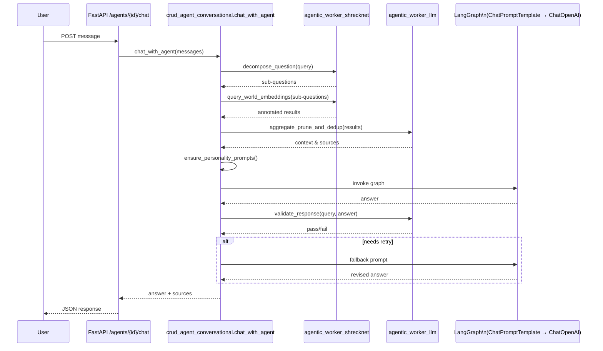

# Conversational Agent Flow

This diagram outlines the flow of a chat request through the backend conversational agent and highlights the primary classes involved.

* **crud_agent_conversational.chat_with_agent** orchestrates the conversation pipeline.
* **agentic_worker_shrecknet** resolves context from the world and **agentic_worker_llm** refines results and validates the model output.
* **ChatPromptTemplate**, **ChatOpenAI**, and **LangGraph** compose the LLM call.
