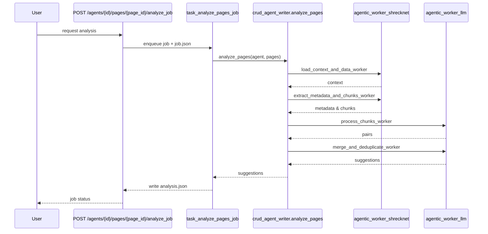
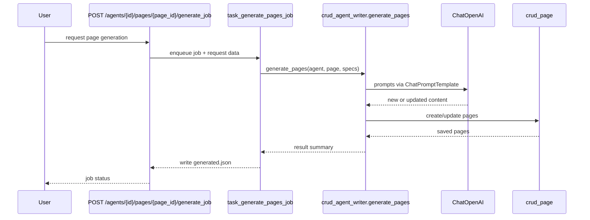

# Writer Agent Flow

These diagrams outline how the writer agent analyzes existing pages and generates new or updated pages within a world.

## Analyze Pages Job

## Generate Pages Job

* **task_analyze_pages_job** and **task_generate_pages_job** run in Celery workers and call into `crud_agent_writer`.
* **agentic_worker_shrecknet** and **agentic_worker_llm** provide context extraction and LLM utilities.
* **ChatOpenAI** produces page text which is persisted via `crud_page`.
