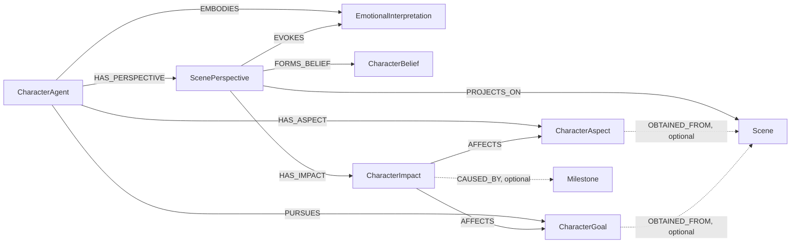

# CharacterAgent

## Definition

A `CharacterAgent` is a graph-backed simulation identity embodied by one
`EntityInstance`. It combines a background story, eight directional dispositions, a separate STEADINESS estimate, active aspects, active goals, and subjective projections of
canonical scenes. It is distinct from the
SQL-backed Elder, Librarian, Architect, and Novelist agent configuration.

The CharacterAgent domain is stored in Neo4j. `ontology_id` scopes every agent,
aspect, and goal; it is a node property rather than a relationship to an
ontology node. `created_by_user_id` records the SQL user that created an agent,
but there is no Neo4j relationship to a user.

All CharacterAgent graph creation and mutation is administrator-only.
Administrators exclusively create and maintain CharacterAgents, their aspect
assignments, and their goal pursuits. Every agent has a `visibility` of
`private` or `public`. It defaults to `private`, and legacy graph nodes without
the property are also treated as private. Any authenticated user may list,
retrieve, and query public agents and may read their assigned aspects and goals.
Administrators retain access to both visibility levels. Private agents return
`404` to non-administrators so their existence is not disclosed.

## `CharacterAgent` node schema

Label: `CharacterAgent`

| Property | Type | Required | Rules and meaning |
| --- | --- | --- | --- |
| `id` | string | yes | Service-generated UUID; globally unique among `CharacterAgent` nodes. |
| `ontology_id` | integer | yes | Ontology scope; minimum `1`. The embodied entity, assigned aspects, and pursued goals must have the same ontology scope. |
| `embodied_entity_instance_id` | string | yes | Identifier of the embodied `EntityInstance`; globally unique among CharacterAgents. The API accepts this as `entity_instance_id` and returns both names for compatibility. |
| `name` | string | yes | 1–255 characters. An omitted create value is derived from `EntityInstance.alias`, then the entity identifier. |
| `subtitle` | string or null | no | Editable identity label, epithet, role, or reputation, maximum 255 characters. Generated only when grounded evidence supports it. |
| `background_story` | string | yes | Nonblank character history and grounding context. An omitted value is derived from `EntityInstance.text`, `EntityInstance.autogenerated_text`, then `name`. |
| `image_url` | string or null | no | Maximum 2,048 characters. An omitted value is derived from the entity avatar or the first configured image property when available. |
| `status` | string enum | yes | `active` or `archived`; defaults to `active`. Only active agents may be queried. |
| `visibility` | string enum | yes for new nodes | `private` or `public`; defaults to `private`. Missing legacy values are read and authorized as `private`. |
| `trait_profile` | JSON string | yes | Eight directional estimates, separate STEADINESS, evidence metadata, and audited manual overrides. Returned as a typed object; see [Dispositional traits](Dispositional%20Traits.md), including extraction and query pipelines. |
| `created_by_user_id` | integer | yes | SQL user ID of the administrator that created the node. |
| `created_at` | datetime string | yes | UTC ISO-8601 creation timestamp. |
| `updated_at` | datetime string | yes | UTC ISO-8601 timestamp changed by agent updates. |

An agent cannot change `ontology_id`, its embodied entity, `id`,
`created_by_user_id`, or `created_at` through the update contract.

## Chronological identity revisions

Embodiment extracts a provisional authored baseline or preserves unknown values
in Revision 0. Chronological source chunks contain up to ten scenes and run
sequentially. Each chunk uses its actual starting identity for batched
ScenePerspectives, then accumulates diagnostic observations before one profile
update. Its resulting revision becomes the next chunk's starting identity.

`CharacterIdentityRevision` stores the profile snapshot and newly introduced
trait evidence, including evidence that did not change a score.
`CharacterIdentityChange` records trait, steadiness, subtitle, aspect, and goal
changes with provenance. `ScenePerspective-[:GENERATED_WITH]->CharacterIdentityRevision`
identifies the actual starting revision. Manual point edits preserve history and
record their actor and reason. See [Dispositional traits](Dispositional%20Traits.md)
for constructs, scales, eligibility, consistency, and chronology limitations.

## `CharacterAspect` node schema

Label: `CharacterAspect`

A CharacterAspect is a reusable piece of identity, role, state, capability,
knowledge, preference, attitude, history, or physical characterization.
Multiple CharacterAgents in the same ontology may share one aspect definition;
assignment-specific strength and notes belong to the `HAS_ASPECT` relationship.

| Property | Type | Required | Rules and meaning |
| --- | --- | --- | --- |
| `id` | string | yes | Service-generated UUID; globally unique among `CharacterAspect` nodes. |
| `ontology_id` | integer | yes | Ontology scope; minimum `1`. |
| `name` | string | yes | Nonblank display name, maximum 255 characters. |
| `normalized_name` | string | yes | Derived by trimming, collapsing whitespace, and Unicode case-folding `name`. The pair (`ontology_id`, `normalized_name`) is unique. |
| `category` | string enum | yes | One of `identity`, `role`, `status`, `physical`, `capability`, `knowledge`, `preference`, `attitude`, or `history`. |
| `description` | string or null | no | Free-form definition. |
| `status` | string enum | yes | `active` or `inactive`; defaults to `active`. |
| `justification` | string or null | no | Embodiment explanation for generated definitions. |
| `confidence` | number or null | no | Embodiment confidence from `0` through `1`. |
| `evidence_ids` | JSON string | no | Stable source evidence IDs for generated definitions; returned by the API as a string array. |
| `generated_by_embodiment_draft_id` | string or null | no | Draft that originally generated the definition. |
| `created_at` | datetime string | yes | UTC ISO-8601 creation timestamp. |
| `updated_at` | datetime string | yes | UTC ISO-8601 timestamp changed by definition updates. |

`obtained_from_scene_id`, when present in the API contract, is derived from the
optional `OBTAINED_FROM` relationship. It is not stored as a
`CharacterAspect` node property.

## `CharacterGoal` node schema

Label: `CharacterGoal`

A CharacterGoal is a reusable desire, objective, ambition, obligation,
avoidance, or survival aim. Multiple CharacterAgents in the same ontology may
pursue the same goal definition.

| Property | Type | Required | Rules and meaning |
| --- | --- | --- | --- |
| `id` | string | yes | Service-generated UUID; globally unique among `CharacterGoal` nodes. |
| `ontology_id` | integer | yes | Ontology scope; minimum `1`. |
| `title` | string | yes | Nonblank display title, maximum 255 characters. |
| `description` | string or null | no | Free-form goal definition. |
| `goal_type` | string enum | yes | One of `desire`, `objective`, `ambition`, `obligation`, `avoidance`, or `survival`. |
| `status` | string enum | yes | `active`, `completed`, `abandoned`, or `superseded`; defaults to `active`. |
| `priority` | integer | yes | Importance from `0` through `100`; defaults to `50`. |
| `commitment` | integer | yes | Character commitment from `0` through `100`; defaults to `50`. |
| `justification` | string or null | no | Embodiment explanation for generated goals. |
| `confidence` | number or null | no | Embodiment confidence from `0` through `1`. |
| `basis` | string or null | no | `explicit` or `inferred` for generated goals. |
| `evidence_ids` | JSON string | no | Stable source evidence IDs for generated goals; returned by the API as a string array. |
| `generated_by_embodiment_draft_id` | string or null | no | Draft that originally generated the goal. |
| `created_at` | datetime string | yes | UTC ISO-8601 creation timestamp. |
| `updated_at` | datetime string | yes | UTC ISO-8601 timestamp changed by definition updates. |

`obtained_from_scene_id`, when present in the API contract, is derived from the
optional `OBTAINED_FROM` relationship. It is not stored as a `CharacterGoal`
node property.

## Scene perspective projection

A `Scene` is canonical world memory and is never rewritten by a character.
A `ScenePerspective` is one CharacterAgent's subjective projection of that
scene: what the character experienced, understood, and remembers. Exactly one
perspective may exist for each (`character_agent_id`, `scene_id`) pair.

A scene is eligible when it directly connects to the embodied `EntityInstance`
through `DERIVED_FROM` or `RELATES_TO`, or when one of its contained
`Milestone` nodes does. The agent, embodied entity, and scene must share
`ontology_id` and `instance_id`. Perspectives may be created manually or generated through embodiment. Architect
can append perspectives for newly created scenes using the same profile rules.

### `ScenePerspective`

| Property | Type | Required | Rules and meaning |
| --- | --- | --- | --- |
| `id` | string | yes | Service-generated globally unique UUID. |
| `ontology_id` | integer | yes | Immutable ontology scope copied from the owning agent. |
| `character_agent_id` | string | yes | Immutable indexed ownership reference. |
| `scene_id` | string | yes | Immutable indexed canonical-scene reference. |
| `source_type` | enum | yes | `participated`, `witnessed`, `heard_about`, `read_about`, `inferred`, or `unknown`. |
| `awareness_level` | integer | yes | Awareness of the canonical scene, `0..100`. |
| `confidence` | integer | yes | Certainty in the perspective, `0..100`. |
| `summary` | string | yes | Nonblank remembered account of what happened. |
| `interpretation` | string | yes | Nonblank character-specific meaning. |
| `character_reflection` | string or null | no | Expressive first-person presentation text; excluded from psychological evidence and downstream profile reasoning. |
| `memory_strength` | integer | yes | Availability of the memory, `0..100`. |
| `importance` | integer | yes | Longitudinal relevance, `1..5`. |
| `status` | enum | yes | `active`, `superseded`, or `forgotten`; defaults to `active`. |
| `created_at` | datetime string | yes | UTC creation timestamp. |
| `updated_at` | datetime string | yes | UTC timestamp of the last semantic update. |

### Perspective-owned interpretations

Each interpretation node belongs to exactly one perspective:

| Label and relationship | Properties and rules |
| --- | --- |
| `ScenePerspective-[:EVOKES]->EmotionalInterpretation` | Unique `id`, `ontology_id`, `arousal` `0..100`, `valence` `0..100`, nonblank `description`, `created_at`, and `updated_at`. Valence uses `0` as maximally negative, `50` as neutral, and `100` as maximally positive. |
| `ScenePerspective-[:FORMS_BELIEF]->CharacterBelief` | Unique `id`, `ontology_id`, nonblank `statement`, `confidence` `0..100`, status `suspected`, `believed`, `confirmed`, `doubted`, `disproven`, or `superseded`, and timestamps. A belief can differ from canonical scene truth. |
| `ScenePerspective-[:HAS_IMPACT]->CharacterImpact` | Unique `id`, `ontology_id`, `impact_type`, `direction`, `magnitude` `0..100`, nonblank `description`, and timestamps. |

Every `CharacterImpact` has exactly one `AFFECTS` target that was assigned to
the owning character when the impact was created. `goal_change` impacts target
a `CharacterGoal` and use `advanced` or `threatened`. `aspect_change` impacts
a `CharacterAspect` and use `created`, `reinforced`, or `invalidated`.
An optional `CAUSED_BY` target must be a `Milestone` contained by the projected
scene. Deleting that milestone removes the optional edge without deleting the
impact.

## Relationship schema

| Pattern | Cardinality and scope | Relationship properties | Meaning |
| --- | --- | --- | --- |
| `(:CharacterAgent)-[:EMBODIES]->(:EntityInstance)` | Exactly one relationship is created for each agent. An entity can be embodied by at most one CharacterAgent under the supported write path, enforced by unique `embodied_entity_instance_id`. Both nodes must have the requested `ontology_id`. | None. | Binds the simulation identity to its canonical world entity. |
| `(:CharacterAgent)-[:HAS_ASPECT]->(:CharacterAspect)` | Zero or more per agent. The same aspect may be used by multiple agents. Duplicate agent-to-aspect assignments and cross-ontology assignments are rejected. | `importance`: integer `1..5`; `intensity`: integer `0..100` or null; `notes`: string or null; `status`: `active` or `inactive`; `created_at`: UTC ISO-8601 datetime; `updated_at`: UTC ISO-8601 datetime. | Assigns an aspect with character-specific strength, state, and notes. |
| `(:CharacterAgent)-[:PURSUES]->(:CharacterGoal)` | Zero or more per agent. The same goal may be pursued by multiple agents. Duplicate agent-to-goal pursuits and cross-ontology pursuits are rejected. | `created_at`: UTC ISO-8601 datetime. | Marks a goal as pursued by the character. Priority, commitment, and lifecycle status live on the goal node rather than the relationship. |
| `(:CharacterAspect)-[:OBTAINED_FROM]->(:Scene)` | Optional; the service maintains at most one provenance scene per aspect. The scene must have the same `ontology_id`. | None. | Records the scene from which the aspect was obtained. |
| `(:CharacterGoal)-[:OBTAINED_FROM]->(:Scene)` | Optional; the service maintains at most one provenance scene per goal. The scene must have the same `ontology_id`. | None. | Records the scene from which the goal was obtained. |
| `(:CharacterAgent)-[:HAS_PERSPECTIVE]->(:ScenePerspective)` | Zero or more perspectives; each perspective has exactly one owning agent. | None. | Owns subjective scene memory. |
| `(:ScenePerspective)-[:PROJECTS_ON]->(:Scene)` | Exactly one canonical scene per perspective. | None. | Selects the objective event being interpreted. |
| `(:ScenePerspective)-[:EVOKES\|FORMS_BELIEF\|HAS_IMPACT]->(interpretation)` | Zero or more children; each child belongs to exactly one perspective. | None. | Owns emotional, belief, and causal consequences. |
| `(:CharacterImpact)-[:AFFECTS]->(:CharacterGoal\|:CharacterAspect)` | Exactly one same-character identity target. | None. | Records the identity-layer consequence. |
| `(:CharacterImpact)-[:CAUSED_BY]->(:Milestone)` | Zero or one milestone contained by the projected scene. | None. | Adds optional precise causal provenance. |

## Graph invariants and indexes

Neo4j initialization creates these idempotent constraints and indexes:

- Unique `CharacterAgent.id`.
- Unique `CharacterAgent.embodied_entity_instance_id`.
- Unique `CharacterAspect.id`.
- Unique (`CharacterAspect.ontology_id`, `CharacterAspect.normalized_name`).
- Unique `CharacterGoal.id`.
- Scope indexes on `ontology_id` for all three labels.
- An aspect lookup index on (`ontology_id`, `normalized_name`).
- Unique IDs for `ScenePerspective`, `EmotionalInterpretation`,
  `CharacterBelief`, and `CharacterImpact`.
- Unique (`ScenePerspective.character_agent_id`, `ScenePerspective.scene_id`).
- Perspective scope and owner/scene indexes, plus scope indexes for child labels.

Application startup also extends the PostgreSQL `auditentitytype` enum with the
four perspective aggregate audit labels. Neo4j constraints and this SQL enum
migration are idempotent; rollback requires removing perspective data before
removing their graph constraints or audit enum usage.

The service also enforces these rules:

- CharacterAgents can embody only an existing `EntityInstance` in the requested
  ontology.
- Aspect and goal definitions may connect only to CharacterAgents in the same
  ontology.
- Provenance scenes must be in the definition's ontology.
- A directly deleted aspect or goal must have no current assignments; otherwise
  deletion returns `409`.
- Unassigning an aspect or goal deletes the definition when that was its last
  CharacterAgent relationship.
- Deleting a CharacterAgent removes its relationships and deletes any formerly
  assigned aspects or goals that no other CharacterAgent uses. Shared
  definitions remain.
- Deleting a perspective deletes all of its owned interpretations.
- Deleting a CharacterAgent deletes its perspective aggregates before normal
  aspect and goal cleanup.
- Deleting a canonical Scene cascades every projecting perspective aggregate.
- Aspect and goal definitions referenced by `CharacterImpact` cannot be
  directly deleted. Unassignment retains an otherwise-unused definition while
  an impact still references it.

## Query projection

Identity-grounded queries use two normal LLM calls: affordance-based framing and
deliberation. The backend hydrates only selected directional traits from the
registry with their estimates, construct, poles, and relevance. STEADINESS is
supplied separately when directional dispositions apply. Unknown remains unknown;
dispositions bias decisions probabilistically. Aspects, goals, and supplied
context remain relevant. Generic mode receives no identity data.

Queries preserve asynchronous submission/polling, response-schema validation,
and one optional final repair. Caller `generation.temperature` remains independent
of personality. See [CharacterAgent Query](Query/Query.md).

## Evidence-grounded embodiment

See [Dispositional traits](Dispositional%20Traits.md) for the complete current
personality and embodiment contract, including four calls per source chunk,
initial authored evidence, checkpoints, revision ownership, and breaking release
operations. The registry is the authoritative definition source; SDKs and UI
consumers can request it through `/character-agents/trait-definitions`.

## Related documentation

- [CharacterAgent endpoints](CharacterAgent%20-%20Endpoints.md)
- [Dispositional traits](Dispositional%20Traits.md)
- [CharacterAgent Query](Query/Query.md)
