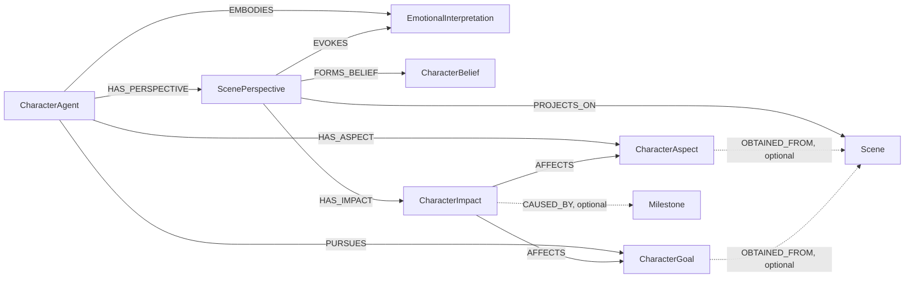

# CharacterAgent

## Definition

A `CharacterAgent` is a graph-backed simulation identity embodied by one
`EntityInstance`. It combines a background story, eight behavioural axes,
`trait_adherence`, active aspects, active goals, and subjective projections of
canonical scenes. It is distinct from the
SQL-backed Elder, Librarian, Architect, and Novelist agent configuration.

The CharacterAgent domain is stored in Neo4j. `ontology_id` scopes every agent,
aspect, and goal; it is a node property rather than a relationship to an
ontology node. `created_by_user_id` records the SQL user that created an agent,
but there is no Neo4j relationship to a user.

All CharacterAgent graph creation and mutation is administrator-only.
Administrators exclusively create and maintain CharacterAgents, their aspect
assignments, and their goal pursuits. Every agent has a `visibility` of
`private` or `public`. It defaults to `private`, and legacy graph nodes without
the property are also treated as private. Any authenticated user may list,
retrieve, and query public agents and may read their assigned aspects and goals.
Administrators retain access to both visibility levels. Private agents return
`404` to non-administrators so their existence is not disclosed.

## `CharacterAgent` node schema

Label: `CharacterAgent`

| Property | Type | Required | Rules and meaning |
| --- | --- | --- | --- |
| `id` | string | yes | Service-generated UUID; globally unique among `CharacterAgent` nodes. |
| `ontology_id` | integer | yes | Ontology scope; minimum `1`. The embodied entity, assigned aspects, and pursued goals must have the same ontology scope. |
| `embodied_entity_instance_id` | string | yes | Identifier of the embodied `EntityInstance`; globally unique among CharacterAgents. The API accepts this as `entity_instance_id` and returns both names for compatibility. |
| `name` | string | yes | 1–255 characters. An omitted create value is derived from `EntityInstance.alias`, then the entity identifier. |
| `subtitle` | string or null | no | Editable identity label, epithet, role, or reputation, maximum 255 characters. Generated only when grounded evidence supports it. |
| `background_story` | string | yes | Nonblank character history and grounding context. An omitted value is derived from `EntityInstance.text`, `EntityInstance.autogenerated_text`, then `name`. |
| `image_url` | string or null | no | Maximum 2,048 characters. An omitted value is derived from the entity avatar or the first configured image property when available. |
| `status` | string enum | yes | `active` or `archived`; defaults to `active`. Only active agents may be queried. |
| `visibility` | string enum | yes for new nodes | `private` or `public`; defaults to `private`. Missing legacy values are read and authorized as `private`. |
| `calm_aggressive` | integer | yes | Behavioural axis from `0` (calm) to `100` (aggressive); defaults to `50`. |
| `cautious_reckless` | integer | yes | Behavioural axis from `0` (cautious) to `100` (reckless); defaults to `50`. |
| `compassionate_ruthless` | integer | yes | Behavioural axis from `0` (compassionate) to `100` (ruthless); defaults to `50`. |
| `trusting_suspicious` | integer | yes | Behavioural axis from `0` (trusting) to `100` (suspicious); defaults to `50`. |
| `honest_deceptive` | integer | yes | Behavioural axis from `0` (honest) to `100` (deceptive); defaults to `50`. |
| `patient_impulsive` | integer | yes | Behavioural axis from `0` (patient) to `100` (impulsive); defaults to `50`. |
| `humble_proud` | integer | yes | Behavioural axis from `0` (humble) to `100` (proud); defaults to `50`. |
| `cooperative_dominating` | integer | yes | Behavioural axis from `0` (cooperative) to `100` (dominating); defaults to `50`. |
| `trait_adherence` | integer | yes for new nodes | Strength with which generation follows the behavioural axes, from `0` through `100`; defaults to `80`. Missing legacy values are read as `80`. |
| `created_by_user_id` | integer | yes | SQL user ID of the administrator that created the node. |
| `created_at` | datetime string | yes | UTC ISO-8601 creation timestamp. |
| `updated_at` | datetime string | yes | UTC ISO-8601 timestamp changed by agent updates. |

An agent cannot change `ontology_id`, its embodied entity, `id`,
`created_by_user_id`, or `created_at` through the update contract.

## Chronological identity revisions

Embodiment creates Revision 0 from canonical `EntityInstance` evidence only.
Related Scenes are grouped by their required `DERIVED_FROM` entity and processed
in deterministic `created_at` order. Each source produces ScenePerspectives
against the generation-start profile snapshot, followed by a conservative
atomic update of axes, aspects, and goals against the latest chronological
profile. An optional subtitle change comes from source observations. Later
evidence is never projected into an earlier Scene.

`CharacterIdentityRevision` preserves the complete identity snapshot.
`CharacterIdentityChange` records axis, subtitle, aspect, and goal deltas with
source provenance. `ScenePerspective-[:GENERATED_WITH]->
CharacterIdentityRevision` records which identity generated a perspective.
Manual identity edits create a new revision instead of modifying history.

## `CharacterAspect` node schema

Label: `CharacterAspect`

A CharacterAspect is a reusable piece of identity, role, state, capability,
knowledge, preference, attitude, history, or physical characterization.
Multiple CharacterAgents in the same ontology may share one aspect definition;
assignment-specific strength and notes belong to the `HAS_ASPECT` relationship.

| Property | Type | Required | Rules and meaning |
| --- | --- | --- | --- |
| `id` | string | yes | Service-generated UUID; globally unique among `CharacterAspect` nodes. |
| `ontology_id` | integer | yes | Ontology scope; minimum `1`. |
| `name` | string | yes | Nonblank display name, maximum 255 characters. |
| `normalized_name` | string | yes | Derived by trimming, collapsing whitespace, and Unicode case-folding `name`. The pair (`ontology_id`, `normalized_name`) is unique. |
| `category` | string enum | yes | One of `identity`, `role`, `status`, `physical`, `capability`, `knowledge`, `preference`, `attitude`, or `history`. |
| `description` | string or null | no | Free-form definition. |
| `status` | string enum | yes | `active` or `inactive`; defaults to `active`. |
| `justification` | string or null | no | Embodiment explanation for generated definitions. |
| `confidence` | number or null | no | Embodiment confidence from `0` through `1`. |
| `evidence_ids` | JSON string | no | Stable source evidence IDs for generated definitions; returned by the API as a string array. |
| `generated_by_embodiment_draft_id` | string or null | no | Draft that originally generated the definition. |
| `created_at` | datetime string | yes | UTC ISO-8601 creation timestamp. |
| `updated_at` | datetime string | yes | UTC ISO-8601 timestamp changed by definition updates. |

`obtained_from_scene_id`, when present in the API contract, is derived from the
optional `OBTAINED_FROM` relationship. It is not stored as a
`CharacterAspect` node property.

## `CharacterGoal` node schema

Label: `CharacterGoal`

A CharacterGoal is a reusable desire, objective, ambition, obligation,
avoidance, or survival aim. Multiple CharacterAgents in the same ontology may
pursue the same goal definition.

| Property | Type | Required | Rules and meaning |
| --- | --- | --- | --- |
| `id` | string | yes | Service-generated UUID; globally unique among `CharacterGoal` nodes. |
| `ontology_id` | integer | yes | Ontology scope; minimum `1`. |
| `title` | string | yes | Nonblank display title, maximum 255 characters. |
| `description` | string or null | no | Free-form goal definition. |
| `goal_type` | string enum | yes | One of `desire`, `objective`, `ambition`, `obligation`, `avoidance`, or `survival`. |
| `status` | string enum | yes | `active`, `completed`, `abandoned`, or `superseded`; defaults to `active`. |
| `priority` | integer | yes | Importance from `0` through `100`; defaults to `50`. |
| `commitment` | integer | yes | Character commitment from `0` through `100`; defaults to `50`. |
| `justification` | string or null | no | Embodiment explanation for generated goals. |
| `confidence` | number or null | no | Embodiment confidence from `0` through `1`. |
| `basis` | string or null | no | `explicit` or `inferred` for generated goals. |
| `evidence_ids` | JSON string | no | Stable source evidence IDs for generated goals; returned by the API as a string array. |
| `generated_by_embodiment_draft_id` | string or null | no | Draft that originally generated the goal. |
| `created_at` | datetime string | yes | UTC ISO-8601 creation timestamp. |
| `updated_at` | datetime string | yes | UTC ISO-8601 timestamp changed by definition updates. |

`obtained_from_scene_id`, when present in the API contract, is derived from the
optional `OBTAINED_FROM` relationship. It is not stored as a `CharacterGoal`
node property.

## Scene perspective projection

A `Scene` is canonical world memory and is never rewritten by a character.
A `ScenePerspective` is one CharacterAgent's subjective projection of that
scene: what the character experienced, understood, and remembers. Exactly one
perspective may exist for each (`character_agent_id`, `scene_id`) pair.

A scene is eligible when it directly connects to the embodied `EntityInstance`
through `DERIVED_FROM` or `RELATES_TO`, or when one of its contained
`Milestone` nodes does. The agent, embodied entity, and scene must share
`ontology_id` and `instance_id`. Perspectives are created manually in this
version; scenes are not backfilled automatically.

### `ScenePerspective`

| Property | Type | Required | Rules and meaning |
| --- | --- | --- | --- |
| `id` | string | yes | Service-generated globally unique UUID. |
| `ontology_id` | integer | yes | Immutable ontology scope copied from the owning agent. |
| `character_agent_id` | string | yes | Immutable indexed ownership reference. |
| `scene_id` | string | yes | Immutable indexed canonical-scene reference. |
| `source_type` | enum | yes | `participated`, `witnessed`, `heard_about`, `read_about`, `inferred`, or `unknown`. |
| `awareness_level` | integer | yes | Awareness of the canonical scene, `0..100`. |
| `confidence` | integer | yes | Certainty in the perspective, `0..100`. |
| `summary` | string | yes | Nonblank remembered account of what happened. |
| `interpretation` | string | yes | Nonblank character-specific meaning. |
| `character_reflection` | string or null | no | Expressive first-person presentation text; excluded from psychological evidence and downstream profile reasoning. |
| `memory_strength` | integer | yes | Availability of the memory, `0..100`. |
| `importance` | integer | yes | Longitudinal relevance, `1..5`. |
| `status` | enum | yes | `active`, `superseded`, or `forgotten`; defaults to `active`. |
| `created_at` | datetime string | yes | UTC creation timestamp. |
| `updated_at` | datetime string | yes | UTC timestamp of the last semantic update. |

### Perspective-owned interpretations

Each interpretation node belongs to exactly one perspective:

| Label and relationship | Properties and rules |
| --- | --- |
| `ScenePerspective-[:EVOKES]->EmotionalInterpretation` | Unique `id`, `ontology_id`, `arousal` `0..100`, `valence` `0..100`, nonblank `description`, `created_at`, and `updated_at`. Valence uses `0` as maximally negative, `50` as neutral, and `100` as maximally positive. |
| `ScenePerspective-[:FORMS_BELIEF]->CharacterBelief` | Unique `id`, `ontology_id`, nonblank `statement`, `confidence` `0..100`, status `suspected`, `believed`, `confirmed`, `doubted`, `disproven`, or `superseded`, and timestamps. A belief can differ from canonical scene truth. |
| `ScenePerspective-[:HAS_IMPACT]->CharacterImpact` | Unique `id`, `ontology_id`, `impact_type`, `direction`, `magnitude` `0..100`, nonblank `description`, and timestamps. |

Every `CharacterImpact` has exactly one `AFFECTS` target that was assigned to
the owning character when the impact was created. `goal_change` impacts target
a `CharacterGoal` and use `advanced` or `threatened`. `aspect_change` impacts
a `CharacterAspect` and use `created`, `reinforced`, or `invalidated`.
An optional `CAUSED_BY` target must be a `Milestone` contained by the projected
scene. Deleting that milestone removes the optional edge without deleting the
impact.

## Relationship schema

| Pattern | Cardinality and scope | Relationship properties | Meaning |
| --- | --- | --- | --- |
| `(:CharacterAgent)-[:EMBODIES]->(:EntityInstance)` | Exactly one relationship is created for each agent. An entity can be embodied by at most one CharacterAgent under the supported write path, enforced by unique `embodied_entity_instance_id`. Both nodes must have the requested `ontology_id`. | None. | Binds the simulation identity to its canonical world entity. |
| `(:CharacterAgent)-[:HAS_ASPECT]->(:CharacterAspect)` | Zero or more per agent. The same aspect may be used by multiple agents. Duplicate agent-to-aspect assignments and cross-ontology assignments are rejected. | `importance`: integer `1..5`; `intensity`: integer `0..100` or null; `notes`: string or null; `status`: `active` or `inactive`; `created_at`: UTC ISO-8601 datetime; `updated_at`: UTC ISO-8601 datetime. | Assigns an aspect with character-specific strength, state, and notes. |
| `(:CharacterAgent)-[:PURSUES]->(:CharacterGoal)` | Zero or more per agent. The same goal may be pursued by multiple agents. Duplicate agent-to-goal pursuits and cross-ontology pursuits are rejected. | `created_at`: UTC ISO-8601 datetime. | Marks a goal as pursued by the character. Priority, commitment, and lifecycle status live on the goal node rather than the relationship. |
| `(:CharacterAspect)-[:OBTAINED_FROM]->(:Scene)` | Optional; the service maintains at most one provenance scene per aspect. The scene must have the same `ontology_id`. | None. | Records the scene from which the aspect was obtained. |
| `(:CharacterGoal)-[:OBTAINED_FROM]->(:Scene)` | Optional; the service maintains at most one provenance scene per goal. The scene must have the same `ontology_id`. | None. | Records the scene from which the goal was obtained. |
| `(:CharacterAgent)-[:HAS_PERSPECTIVE]->(:ScenePerspective)` | Zero or more perspectives; each perspective has exactly one owning agent. | None. | Owns subjective scene memory. |
| `(:ScenePerspective)-[:PROJECTS_ON]->(:Scene)` | Exactly one canonical scene per perspective. | None. | Selects the objective event being interpreted. |
| `(:ScenePerspective)-[:EVOKES\|FORMS_BELIEF\|HAS_IMPACT]->(interpretation)` | Zero or more children; each child belongs to exactly one perspective. | None. | Owns emotional, belief, and causal consequences. |
| `(:CharacterImpact)-[:AFFECTS]->(:CharacterGoal\|:CharacterAspect)` | Exactly one same-character identity target. | None. | Records the identity-layer consequence. |
| `(:CharacterImpact)-[:CAUSED_BY]->(:Milestone)` | Zero or one milestone contained by the projected scene. | None. | Adds optional precise causal provenance. |

## Graph invariants and indexes

Neo4j initialization creates these idempotent constraints and indexes:

- Unique `CharacterAgent.id`.
- Unique `CharacterAgent.embodied_entity_instance_id`.
- Unique `CharacterAspect.id`.
- Unique (`CharacterAspect.ontology_id`, `CharacterAspect.normalized_name`).
- Unique `CharacterGoal.id`.
- Scope indexes on `ontology_id` for all three labels.
- An aspect lookup index on (`ontology_id`, `normalized_name`).
- Unique IDs for `ScenePerspective`, `EmotionalInterpretation`,
  `CharacterBelief`, and `CharacterImpact`.
- Unique (`ScenePerspective.character_agent_id`, `ScenePerspective.scene_id`).
- Perspective scope and owner/scene indexes, plus scope indexes for child labels.

Application startup also extends the PostgreSQL `auditentitytype` enum with the
four perspective aggregate audit labels. Neo4j constraints and this SQL enum
migration are idempotent; rollback requires removing perspective data before
removing their graph constraints or audit enum usage.

The service also enforces these rules:

- CharacterAgents can embody only an existing `EntityInstance` in the requested
  ontology.
- Aspect and goal definitions may connect only to CharacterAgents in the same
  ontology.
- Provenance scenes must be in the definition's ontology.
- A directly deleted aspect or goal must have no current assignments; otherwise
  deletion returns `409`.
- Unassigning an aspect or goal deletes the definition when that was its last
  CharacterAgent relationship.
- Deleting a CharacterAgent removes its relationships and deletes any formerly
  assigned aspects or goals that no other CharacterAgent uses. Shared
  definitions remain.
- Deleting a perspective deletes all of its owned interpretations.
- Deleting a CharacterAgent deletes its perspective aggregates before normal
  aspect and goal cleanup.
- Deleting a canonical Scene cascades every projecting perspective aggregate.
- Aspect and goal definitions referenced by `CharacterImpact` cannot be
  directly deleted. Unassignment retains an otherwise-unused definition while
  an impact still references it.

## Query projection

`POST /character-agents/{character_agent_id}/query` creates a background job.
The worker loads the complete active identity in one Neo4j operation, then
normally performs two LLM calls: compact task/identity framing followed by
deliberation and rendering. The final call receives only identity selected
during framing. Invalid final JSON or schema-invalid content may receive one
repair attempt through the shared `model_agents_repair_json` target.

When `use_character_identity=false`, the same two-stage shape is retained.
Neutral framing receives only the original query and caller context and must
return empty trait, aspect, and goal selectors. Generic deliberation receives
the validated neutral frame, system instruction, and output contract. No
CharacterAgent identity or profile information enters either call.

The snapshot contains:

- The agent's `name`, `background_story`, eight behavioural axes, and
  `trait_adherence`.
- Aspects whose node status and `HAS_ASPECT.status` are both active.
- Goals whose node status is active.

Perspectives, emotions, beliefs, and impacts are intentionally not part of the
current query snapshot.

Aspects are ordered by assignment importance, intensity, then ID. Goals are
ordered by priority, commitment, status, then ID. The background story and
backend CharacterAgent identifier are omitted from the framing prompt and all
later query stages.

The caller's `system_instruction` controls the task, tone, constraints, and
output shape below the immutable service rules. It cannot replace the identity,
request internal reasoning, override security, or authorize external actions.

Trait names must use the fixed axes. Aspect and goal IDs must come from the
snapshot. Missing information remains uncertainty. Final output is validated
deterministically and may use at most one shared JSON-repair LLM call.

The query stages use `model_character_agent_framing` and
`model_character_agent_deliberation`, exposed through the existing config API.
JSON repair uses the global `model_agents_repair_json` target rather than a
CharacterAgent-specific model target.
All CharacterAgent model targets default to an empty `provider` and `name`.
They remain unselected during pre-provider startup and must be populated by an
administrator or by model reconciliation when AI agents are enabled.

Visibility does not replace lifecycle status. Public archived agents remain
readable but cannot be queried; query requires `status=active`. Publishing and
unpublishing are graph property updates and do not copy or move an agent.

### Future perspective-aware query projection

A later query revision may select perspective aggregates dynamically and allow
the caller to include or omit perspectives, emotions, beliefs, and impacts for
a particular task. That future projection must preserve the distinction
between canonical scene facts and subjective character claims.

## Related documentation

- [Query contract](Query/Query.md)
- [Endpoints](CharacterAgent%20-%20Endpoints.md)
## Evidence-grounded embodiment

Administrators can generate an initial profile without writing an unreviewed
CharacterAgent to Neo4j. `POST /character-agents/embodiment-drafts` creates a SQL
generation result and a `character_agent_embodiment` background job. The worker
deterministically collects the selected entity's canonical alias, ontology type
name and description, resolved properties, authored text, explicitly marked
autogenerated text, and directly related Scenes.

Every identity field, property, text source, and Scene has a stable evidence ID.
Scenes are ordered from earliest to latest by `Scene.created_at`, with Scene ID
as a deterministic tie-breaker. The interpretation prompt treats this order as
temporal: later Scenes may change, complete, contradict, or supersede earlier
behaviour, relationships, knowledge, and goals. Evidence packing uses a
provider-neutral limit of ten characters per configured
`character_agent_embodiment_evidence_tokens` token.
All Neo4j temporal values in canonical properties and nested evidence provenance
are converted to ISO-8601 strings before evidence is serialized, stored, or sent
to the model.

Each chronological `DERIVED_FROM` source group makes exactly four normal LLM
calls. Character incorporation first returns one ordered perspective and
presentation-only `character_reflection` per Scene. Psychological enrichment
then returns zero or more emotions, beliefs, and impacts on stable existing
goal/aspect IDs. Cross-scene observations consume canonical Scene facts,
structured interpretations, and enrichment—but never reflections. One atomic
profile-update call then returns sparse behavioural-axis deltas plus aspect and
goal operations. Unchanged axes are omitted.

The first three calls use the profile snapshot captured when draft generation
starts. Snapshot analysis runs concurrently across source groups, bounded by
`character_agent_embodiment_source_concurrency` (default `4`). Profile updates
remain strictly chronological: source N receives the cumulative profile
produced by sources 1 through N-1. The worker may begin the earliest ready
ordered update while later source analyses continue. Set concurrency to `1`
to minimize provider load; snapshot semantics remain unchanged.

The backend validates exact Scene order, stable impact targets, observation and
update evidence IDs, unique sparse axis updates, and configured list limits.
Each returned axis delta must be an integer from `-5` through `-1` or `1`
through `5`; zero-delta entries are invalid and unchanged axes are omitted.
The backend clamps `current + delta` to `0..100`, rejects ineffective
boundary deltas, and converts the result to the absolute values used by the
timeline and final proposal. Prompts receive
an explicit source-local `allowed_evidence_ids` list. Bare Scene IDs are
canonicalized to `scene:<id>`; invented and cross-source references are rejected.
When structurally valid output contains invalid references, the worker may make
`character_agent_embodiment_semantic_correction_attempts` targeted correction
calls (default `1`). A correction receives the rejected output, exact offending
and allowed IDs, and the unchanged output contract. Invalid claims are never
silently removed.

Each validated analysis stage is stored in
`character_embodiment_checkpoints`, keyed by draft revision, source position,
prompt version, model targets, profile snapshot, and source evidence. Retrying a
failed revision reuses only matching checkpoints and resumes at the first
missing stage. Profile updates are deliberately not reused because their input
depends on every prior chronological update. A changed revision, prompt, model,
profile, or evidence snapshot produces a different cache key and ignores stale
rows. Old drafts without checkpoints simply regenerate from the first stage.

Transport, JSON/schema, and semantic-reference failures are categorized
separately. Failed job details expose the failed stage/source, attempt,
retryability, and offending/allowed IDs. Logs contain those identifiers and
model metadata, but not full prompts. Canonical Scene
nodes are never changed by embodiment. The final `name` is copied from the entity alias,
`image_url` from the entity avatar or image property, and `background_story`
from authored entity text, falling back to autogenerated text and then alias.
No LLM call generates these final identity fields.
When an aspect or goal was active for an earlier source bundle but is absent
from the accepted final profile, acceptance retains its definition and agent
assignment with `status=inactive`. This preserves revision snapshots and lets
earlier `CharacterImpact` nodes keep their historically valid `AFFECTS` target
without reactivating that target in the final profile.
Any optional subtitle revision is recorded in the identity timeline and proposal;
it is not part of the strict `observations` payload returned for an embodiment
draft.

All four system prompts document their complete input object and expected output
object directly, including field meanings, allowed enums, numeric ranges, and
identifier provenance rules. The generated Pydantic JSON Schema is also supplied
as `required_output` and remains the authoritative validation contract. The
proposal prompt states each behavioural axis direction explicitly: `0` is the
left-hand pole and `100` is the right-hand pole, and the numeric value must agree
with its justification. Every proposed behavioural axis, aspect, and goal has a
required `justification` and `confidence`; evidence IDs retain deterministic
source provenance separately.
`model_character_agent_character_incorporation`,
`model_character_agent_scene_interpretation`, and
`model_character_agent_update` are empty by default. The first handles
perspectives/reflections, the second handles enrichment and observations, and
the third handles the atomic persistent-profile update call.
At API startup, configured targets on operational ShreckLLM providers receive
one lightweight generation warm-up per unique provider/model pair. Normal jobs
read ShreckLLM's cached provider status before submission; they do not repeat
the functional provider ping performed during ShreckLLM startup validation.
Generation logs include total wall time and accumulated per-stage LLM time for
latency diagnosis without changing the embodiment draft API.

The frontend copies the proposal into its normal CharacterAgent creation form.
All editing and removal of suggestions happens locally in that form. Submitting
the edited form to `POST /character-agents` creates the agent, `EMBODIES`,
embedded aspects and `HAS_ASPECT` assignments, and embedded goals and `PURSUES`
relationships in one Neo4j transaction. A generated result alone never modifies
the graph.

The optional `embodiment_draft_id` on creation preserves generation provenance
and makes a retried submission idempotent. Omitting it preserves the original
manual creation contract. Starting generation again replaces the prior
unconsumed result for that entity.
