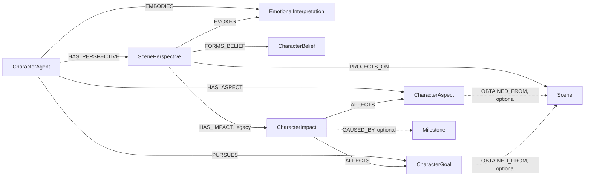

# CharacterAgent

## Definition

A `CharacterAgent` is a graph-backed simulation identity embodied by one
`EntityInstance`. It combines a background story, eight directional dispositions, a separate STEADINESS estimate, active aspects, active goals, and subjective projections of
canonical scenes. It is distinct from the
SQL-backed Elder, Librarian, Architect, and Novelist agent configuration.

The CharacterAgent domain is stored in Neo4j. `ontology_id` scopes every agent,
aspect, and goal; it is a node property rather than a relationship to an
ontology node. `created_by_user_id` records the SQL user that created an agent,
but there is no Neo4j relationship to a user.

```mermaid
flowchart LR
    A[CharacterAgent] -->|EMBODIES| E[EntityInstance]
    A -->|HAS_ASPECT| X[CharacterAspect]
    A -->|PURSUES| G[CharacterGoal]
    A -->|HAS_PERSPECTIVE| P[ScenePerspective]
    P -->|PROJECTS_ON| S
    P -->|EVOKES| E[EmotionalInterpretation]
    P -->|FORMS_BELIEF| B[CharacterBelief]
    P -->|HAS_IMPACT, legacy| I[CharacterImpact]
    I -->|AFFECTS| X
    I -->|AFFECTS| G
    I -.->|CAUSED_BY, optional| M[Milestone]
    X -.->|OBTAINED_FROM, optional| S[Scene]
    G -.->|OBTAINED_FROM, optional| S
```

All CharacterAgent graph creation and mutation is administrator-only.
Administrators exclusively create and maintain CharacterAgents, their aspect
assignments, and their goal pursuits. Every agent has a `visibility` of
`private` or `public`. It defaults to `private`, and legacy graph nodes without
the property are also treated as private. Any authenticated user may list,
retrieve, and query public agents and may read their assigned aspects and goals.
Administrators retain access to both visibility levels. Private agents return
`404` to non-administrators so their existence is not disclosed.

### Legacy graph nodes

Nodes may retain unrelated retired personality properties; public projection
omits them. A missing `trait_profile` projects to the current all-unknown point
profile. An old z-formatted `trait_profile` is invalid and requires regeneration
from source material before the agent can be read or queried under the new
contract. Missing `visibility` remains private. Creation and updates accept only
the current fields.

## `CharacterAgent` node schema

Label: `CharacterAgent`

| Property | Type | Required | Rules and meaning |
| --- | --- | --- | --- |
| `id` | string | yes | Service-generated UUID; globally unique among `CharacterAgent` nodes. |
| `ontology_id` | integer | yes | Ontology scope; minimum `1`. The embodied entity, assigned aspects, and pursued goals must have the same ontology scope. |
| `embodied_entity_instance_id` | string | yes | Identifier of the embodied `EntityInstance`; globally unique among CharacterAgents. The API accepts this as `entity_instance_id` and returns both names for compatibility. |
| `name` | string | yes | 1–255 characters. An omitted create value is derived from `EntityInstance.alias`, then the entity identifier. |
| `subtitle` | string or null | no | Editable identity label, epithet, role, or reputation, maximum 255 characters. Generated only when grounded evidence supports it. |
| `background_story` | string | yes | Nonblank character history and grounding context. An omitted value is derived from `EntityInstance.text`, `EntityInstance.autogenerated_text`, then `name`. |
| `identity_description` | JSON string or absent | no | Persistent narrative foundation with `identity_summary`, `psychological_summary`, and `personality_traits` (`trait`, `description`). Generated/reused once before scene processing and refreshed once after embodiment; contains no numerical scores. |
| `image_url` | string or null | no | Maximum 2,048 characters. An omitted value is derived from the entity avatar or the first configured image property when available. |
| `status` | string enum | yes | `active` or `archived`; defaults to `active`. Only active agents may be queried. |
| `visibility` | string enum | yes for new nodes | `private` or `public`; defaults to `private`. Missing legacy values are read and authorized as `private`. |
| `trait_profile` | JSON string | yes | Eight directional estimates, separate STEADINESS, evidence metadata, and audited manual overrides. Returned as a typed object; see [Dispositional traits](Dispositional%20Traits.md), including extraction and query pipelines. |
| `created_by_user_id` | integer | yes | SQL user ID of the administrator that created the node. |
| `created_at` | datetime string | yes | UTC ISO-8601 creation timestamp. |
| `updated_at` | datetime string | yes | UTC ISO-8601 timestamp changed by agent updates. |

An agent cannot change `ontology_id`, its embodied entity, `id`,
`created_by_user_id`, or `created_at` through the update contract.

## Chronological identity revisions

Embodiment loads the persisted `identity_description`, generating one from the
entity name/type/descriptor/text/properties and current goals, aspects, and trait
definitions/values only when none exists. It grounds perspective extraction,
psychological analysis, and scene trait interpretation across all chunks. Trait
interpretation considers canonical scene facts through the character's grounded
perspective and may contradict the narrative foundation. The perspective is
shaped by established personality, values, fears, motivations, and beliefs, and
captures supported internal changes as well as immediate reactions. After
processing, embodiment refreshes and persists the description
from the final identity state. An accepted draft carries this refreshed value to
the CharacterAgent. Narrative descriptions do not initialize numerical trait
points; new characters remain unknown until scene behavior supplies evidence.
The identity synthesis input is a compact object containing the entity name,
type and descriptor, authored and autogenerated text, named properties, current
goals, aspects, and eight trait name/value pairs. The prior description is not
sent to this synthesis call; if one exists, the orchestration reuses it to ground
the scene stages. The final refresh uses the same compact input with accumulated
state. The output has `identity_summary`, `psychological_summary`, and
`personality_traits` entries with established trait keys and narrative descriptions.
Trait interpretation does not receive the persisted `identity_description` or
its `personality_traits`, avoiding feedback from earlier narrative summaries.
It receives only the canonical scene and the authoritative trait descriptions
from `IDENTITY_TRAIT_DESCRIPTION_CONTRACT`; generated perspectives are not sent
to trait interpretation.
All scenes from a `DERIVED_FROM` source form one chronological
source bundle and yield one source-level revision. The worker partitions each
source's ordered scenes into chunks of at most five. All Perspective calls finish
before Psychological analysis and Trait interpretation run in parallel for each
chunk. Psychological analysis receives each canonical scene's name and
description together with the preceding interpretation's `source_type` and
`perspective`. Trait interpretation receives only each canonical scene and the
character alias; the backend binds its ordered outputs to the validated
perspective IDs after generation.
ShreckLLM owns provider concurrency. The backend merges chunk results
and collects enrichment events. One optional Stage 4 consolidation call then
reconciles those events with the latest profile for the source bundle. Trait
aggregation remains deterministic and independent. No LLM receives a cumulative
scene history. Source bundles run sequentially, so the resulting revision becomes
the next source bundle's starting identity. Only current focus is capped: ten
active aspects and ten active goals. Historical records remain available.

Every embodiment LLM request, including a JSON-repair request, has a maximum
completion budget of 10,000 tokens. This is a cost and failure safeguard, not
an expected output size. A provider response with `finish_reason: "length"` is never parsed or
persisted. Character Incorporation alone receives one compact replacement
request; a second truncated response is rejected. Psychological analysis uses a
separate bounded, model-only contract: it returns exactly one position-bound
enrichment per supplied perspective, with capped lists and explanatory text, and
never writes scene, evidence, episode, availability, or persistent target IDs.
The backend attaches those references after validation. If psychological output
truncates, only that already-incorporated perspective batch is split into smaller
contiguous batches and retried; completed incorporation and successful analysis
work are retained for the active task attempt. A singleton truncation fails with
the original categorized provider error.

`CharacterIdentityRevision` stores the profile snapshot and newly introduced
trait evidence, including evidence that did not change a score.
`CharacterIdentityChange` records trait, steadiness, subtitle, aspect, and goal
changes with provenance. `ScenePerspective-[:GENERATED_WITH]->CharacterIdentityRevision`
identifies the actual starting revision. Manual point edits preserve history and
record their actor and reason. See [Dispositional traits](Dispositional%20Traits.md)
for constructs, scales, eligibility, consistency, and chronology limitations.

Timeline display references are structured draft and API data. They are not
written as `ScenePerspective` node properties because Neo4j properties support
only scalar values or arrays of scalar values. Scene projections, emotions,
beliefs are persisted through the relationships shown above; legacy impacts remain readable. Trait
interpretation receives canonical scene context and the same grounded subjective
interpretation; the pipeline does not extract or persist a separate
`behavioral_evidence` field. Legacy graph nodes carrying that retired property
are projected through the current schema, which omits it; no migration is needed
because the field was never persisted as a Neo4j node property. Previously saved
draft timelines are also read compatibly by dropping that retired field before
the current strict projection schema is applied.

## `CharacterAspect` node schema

Label: `CharacterAspect`

A CharacterAspect is a reusable piece of identity, role, state, capability,
knowledge, preference, attitude, history, or physical characterization.
Multiple CharacterAgents in the same ontology may share one aspect definition;
character-specific status and focus belong to the `HAS_ASPECT` relationship.

| Property | Type | Required | Rules and meaning |
| --- | --- | --- | --- |
| `id` | string | yes | Service-generated UUID; globally unique among `CharacterAspect` nodes. |
| `ontology_id` | integer | yes | Ontology scope; minimum `1`. |
| `name` | string | yes | Nonblank display name, maximum 255 characters. |
| `normalized_name` | string | yes | Derived by trimming, collapsing whitespace, and Unicode case-folding `name`. The pair (`ontology_id`, `normalized_name`) is unique. |
| `category` | string enum | yes | One of `identity`, `role`, `status`, `physical`, `capability`, `knowledge`, `preference`, `attitude`, or `history`. |
| `description` | string or null | no | Free-form definition. |
| `evidence_ids` | JSON string | no | Stable source evidence IDs for generated definitions; returned by the API as a string array. |
| `generated_by_embodiment_draft_id` | string or null | no | Draft that originally generated the definition. |
| `created_at` | datetime string | yes | UTC ISO-8601 creation timestamp. |
| `updated_at` | datetime string | yes | UTC ISO-8601 timestamp changed by definition updates. |

`obtained_from_scene_id`, when present in the API contract, is derived from the
optional `OBTAINED_FROM` relationship. It is not stored as a
`CharacterAspect` node property.

## `CharacterGoal` node schema

Label: `CharacterGoal`

A CharacterGoal is a reusable desire, objective, ambition, obligation,
avoidance, or survival aim. Multiple CharacterAgents in the same ontology may
pursue the same goal definition.

| Property | Type | Required | Rules and meaning |
| --- | --- | --- | --- |
| `id` | string | yes | Service-generated UUID; globally unique among `CharacterGoal` nodes. |
| `ontology_id` | integer | yes | Ontology scope; minimum `1`. |
| `title` | string | yes | Nonblank display title, maximum 255 characters. |
| `description` | string or null | no | Free-form goal definition. |
| `goal_type` | string enum | yes | One of `desire`, `objective`, `ambition`, `obligation`, `avoidance`, or `survival`. |
| `evidence_ids` | JSON string | no | Stable source evidence IDs for generated goals; returned by the API as a string array. |
| `generated_by_embodiment_draft_id` | string or null | no | Draft that originally generated the goal. |
| `created_at` | datetime string | yes | UTC ISO-8601 creation timestamp. |
| `updated_at` | datetime string | yes | UTC ISO-8601 timestamp changed by definition updates. |

`obtained_from_scene_id`, when present in the API contract, is derived from the
optional `OBTAINED_FROM` relationship. It is not stored as a `CharacterGoal`
node property.

## Scene perspective projection

A `Scene` is canonical world memory and is never rewritten by a character.
A `ScenePerspective` is one CharacterAgent's subjective projection of that
scene: what the character experienced, understood, and remembers. Exactly one
perspective may exist for each (`character_agent_id`, `scene_id`) pair.

A scene is eligible when it directly connects to the embodied `EntityInstance`
through `DERIVED_FROM` or `RELATES_TO`, or when one of its contained
`Milestone` nodes does. The agent, embodied entity, and scene must share
`ontology_id` and `instance_id`. Perspectives may be created manually or generated through embodiment. Architect
can append perspectives for newly created scenes using the same profile rules.

### `ScenePerspective`

Perspectives are standalone scene records. `generated_with_revision_id` records
which CharacterIdentityRevision informed generated content; it does not version
the perspective or create perspective revisions. Legacy nodes are projected on
read by combining their old `interpretation` and `character_reflection` values;
the old fields are not returned by the API. On application startup, a Neo4j
migration stores that combined text as `perspective` (falling back to old
`summary`), removes the retired properties, and clears derived memory caches so
they are rebuilt from the simplified contract.

| Property | Type | Required | Rules and meaning |
| --- | --- | --- | --- |
| `id` | string | yes | Service-generated globally unique UUID. |
| `ontology_id` | integer | yes | Immutable ontology scope copied from the owning agent. |
| `character_agent_id` | string | yes | Immutable indexed ownership reference. |
| `scene_id` | string | yes | Immutable indexed canonical-scene reference. |
| `source_type` | enum | yes | `participated`, `witnessed`, `heard_about`, `read_about`, `inferred`, or `unknown`. |
| `perspective` | string | yes | Nonblank psychologically distinctive account of what the experience means to this character, shaped by established personality, values, fears, motivations, and beliefs; includes supported internal change and distinguishes knowledge from uncertainty. |
| `created_at` | datetime string | yes | UTC creation timestamp. |
| `updated_at` | datetime string | yes | UTC timestamp of the last semantic update. |

### Perspective-owned interpretations

Each interpretation node belongs to exactly one perspective:

| Label and relationship | Properties and rules |
| --- | --- |
| `ScenePerspective-[:EVOKES]->EmotionalInterpretation` | Unique `id`, `ontology_id`, `arousal` `0..100`, `valence` `0..100`, nonblank `description`, `created_at`, and `updated_at`. Valence uses `0` as maximally negative, `50` as neutral, and `100` as maximally positive. Legacy generated signed values are converted to this scale when read; all new generation and writes use the canonical scale. |
| `ScenePerspective-[:FORMS_BELIEF]->CharacterBelief` | Unique `id`, `ontology_id`, nonblank `statement`, `confidence` `0..100`, and timestamps. A belief is a historical snapshot and can differ from canonical scene truth; contradictory beliefs from different scenes coexist and are interpreted chronologically. |
| `ScenePerspective-[:HAS_IMPACT]->CharacterImpact` | Legacy historical records only. New embodiment does not create impacts. |

Every `CharacterImpact` has exactly one `AFFECTS` target that was assigned to
the owning character when the impact was created. `goal_change` impacts target
a `CharacterGoal` and use `advanced` or `threatened`. `aspect_change` impacts
a `CharacterAspect` and use `created`, `reinforced`, or `invalidated`.
An optional `CAUSED_BY` target must be a `Milestone` contained by the projected
scene. Legacy records remain readable; the new embodiment pipeline does not
write impacts.

## Relationship schema

| Pattern | Cardinality and scope | Relationship properties | Meaning |
| --- | --- | --- | --- |
| `(:CharacterAgent)-[:EMBODIES]->(:EntityInstance)` | Exactly one relationship is created for each agent. An entity can be embodied by at most one CharacterAgent under the supported write path, enforced by unique `embodied_entity_instance_id`. Both nodes must have the requested `ontology_id`. | None. | Binds the simulation identity to its canonical world entity. |
| `(:CharacterAgent)-[:HAS_ASPECT]->(:CharacterAspect)` | Zero or more per agent. The same definition may be assigned to multiple agents. Duplicate and cross-ontology assignments are rejected. | `status`: `active` or `inactive`; `in_focus`: boolean; backend-managed provenance and UTC timestamps. At most ten active assignments may be in focus. | Stores character-specific aspect lifecycle and current focus. Leaving focus never changes status or deletes history. |
| `(:CharacterAgent)-[:PURSUES]->(:CharacterGoal)` | Zero or more per agent. The same definition may be pursued by multiple agents. Duplicate and cross-ontology pursuits are rejected. | `status`: `active`, `completed`, `abandoned`, or `superseded`; `in_focus`: boolean; backend-managed evidence and UTC timestamps. At most ten active goals may be in focus. | Stores character-specific goal lifecycle and current focus. Out-of-focus unresolved goals remain active and historical. |
| `(:CharacterAspect)-[:OBTAINED_FROM]->(:Scene)` | Optional; the service maintains at most one provenance scene per aspect. The scene must have the same `ontology_id`. | None. | Records the scene from which the aspect was obtained. |
| `(:CharacterGoal)-[:OBTAINED_FROM]->(:Scene)` | Optional; the service maintains at most one provenance scene per goal. The scene must have the same `ontology_id`. | None. | Records the scene from which the goal was obtained. |
| `(:CharacterAgent)-[:HAS_PERSPECTIVE]->(:ScenePerspective)` | Zero or more perspectives; each perspective has exactly one owning agent. | None. | Owns subjective scene memory. |
| `(:ScenePerspective)-[:PROJECTS_ON]->(:Scene)` | Exactly one canonical scene per perspective. | None. | Selects the objective event being interpreted. |
| `(:ScenePerspective)-[:EVOKES\|FORMS_BELIEF\|HAS_IMPACT]->(interpretation)` | Zero or more children; each child belongs to exactly one perspective. | None. | Owns emotional, belief, and causal consequences. |
| `(:CharacterImpact)-[:AFFECTS]->(:CharacterGoal\|:CharacterAspect)` | Exactly one same-character identity target. | None. | Records the identity-layer consequence. |
| `(:CharacterImpact)-[:CAUSED_BY]->(:Milestone)` | Zero or one milestone contained by the projected scene. | None. | Adds optional precise causal provenance. |

## Graph invariants and indexes

Neo4j initialization creates these idempotent constraints and indexes:

- Unique `CharacterAgent.id`.
- Unique `CharacterAgent.embodied_entity_instance_id`.
- Unique `CharacterAspect.id`.
- Unique (`CharacterAspect.ontology_id`, `CharacterAspect.normalized_name`).
- Unique `CharacterGoal.id`.
- Scope indexes on `ontology_id` for all three labels.
- An aspect lookup index on (`ontology_id`, `normalized_name`).
- Unique IDs for `ScenePerspective`, `EmotionalInterpretation`,
  `CharacterBelief`, and `CharacterImpact`.
- Unique (`ScenePerspective.character_agent_id`, `ScenePerspective.scene_id`).
- Perspective scope and owner/scene indexes, plus scope indexes for child labels.

Application startup also extends the PostgreSQL `auditentitytype` enum with the
four perspective aggregate audit labels. Neo4j constraints and this SQL enum
migration are idempotent; rollback requires removing perspective data before
removing their graph constraints or audit enum usage.

The service also enforces these rules:

- CharacterAgents can embody only an existing `EntityInstance` in the requested
  ontology.
- Aspect and goal definitions may connect only to CharacterAgents in the same
  ontology.
- Provenance scenes must be in the definition's ontology.
- A directly deleted aspect or goal must have no current assignments; otherwise
  deletion returns `409`.
- Unassigning an aspect or goal deletes the definition when that was its last
  CharacterAgent relationship.
- Deleting a CharacterAgent removes its relationships and deletes any formerly
  assigned aspects or goals that no other CharacterAgent uses. Shared
  definitions remain.
- Deleting a perspective deletes all of its owned interpretations.
- Deleting a CharacterAgent deletes its perspective aggregates before normal
  aspect and goal cleanup.
- Deleting a canonical Scene cascades every projecting perspective aggregate.
- Aspect and goal definitions referenced by `CharacterImpact` cannot be
  directly deleted. Unassignment retains an otherwise-unused definition while
  an impact still references it.

## Query projection

Identity-grounded queries use two normal LLM calls: affordance-based framing and
deliberation. The backend hydrates only selected directional traits from the
registry with their estimates, construct, poles, and relevance. STEADINESS is
supplied separately when directional dispositions apply. Unknown remains unknown;
dispositions bias decisions probabilistically. Aspects, goals, and supplied
context remain relevant. Generic mode receives no identity data.

Queries preserve asynchronous submission/polling, response-schema validation,
and one optional final repair. Caller `generation.temperature` remains independent
of personality. See [CharacterAgent Query](Query/Query.md).

## Evidence-grounded embodiment

See [Dispositional traits](Dispositional%20Traits.md) for the trait contract.
This page documents psychological enrichment, source-level consolidation,
relationship-owned aspect/goal state, and historical scene memories.

### Background jobs

`character_agent.generate_embodiment` generates a reviewable embodiment draft.
It creates or reuses identity description, processes source bundles in
chronological order, and processes each source's scene chunks in parallel.
Each chunk runs perspective extraction, then psychological enrichment and trait
interpretation in parallel. After all chunks for a source finish, Stage 4 makes
one consolidation call if any profile events were found; otherwise it is
skipped. Trait aggregation remains deterministic. Thus one source uses
`3n + (events ? 1 : 0)` scene-stage calls for `n` chunks, plus identity calls
and bounded recovery/correction calls. Consolidation receives the current
profile and source-local events, not cumulative scene history. The resulting
revision updates the working profile for the next source.

Stage 2 returns scene-owned emotions and beliefs plus sparse profile events.
It does not produce final aspects/goals or lifecycle statuses. Stage 4 may add,
materially update, reinforce, deactivate/reactivate aspects, resolve/reactivate
goals, and refresh focus. It preserves history and never resolves an item only
because it is old or unmentioned. Focus contains at most ten active aspects and
ten active goals; focus changes do not alter lifecycle status. See the
[redesign implementation record](Psychological%20Enrichment%20and%20Consolidation%20Redesign%20Plan.md)
for the migration and verification details.

`character_agent.query` is the Celery task for asynchronous identity-grounded or
generic queries. It reloads the applicable graph identity, reports the
`loading_identity`, `framing`, `deliberating`, `repairing`, and `validating`
stages through the background job, and records either a typed result or a safe
error. See [CharacterAgent Query](Query/Query.md) for its request, polling, and
output contracts.

## Related documentation

- [CharacterAgent endpoints](CharacterAgent%20-%20Endpoints.md)
- [Dispositional traits](Dispositional%20Traits.md)
- [CharacterAgent Query](Query/Query.md)
