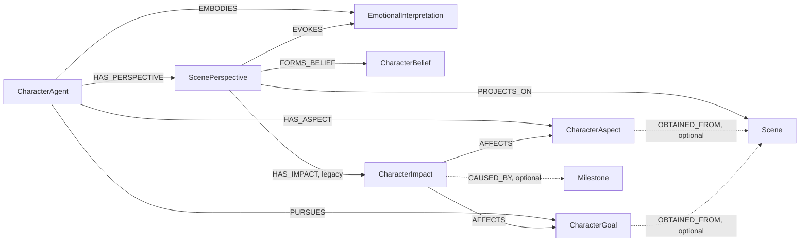

# CharacterAgent

## Definition

A `CharacterAgent` is a graph-backed simulation identity embodied by one
`EntityInstance`. It combines a background story, eight directional dispositions, a separate STEADINESS estimate, active aspects, active goals, and subjective projections of
canonical scenes. It is distinct from the
SQL-backed Elder, Librarian, Architect, and Novelist agent configuration.

The CharacterAgent domain is stored in Neo4j. `ontology_id` scopes every agent,
aspect, and goal; it is a node property rather than a relationship to an
ontology node. `created_by_user_id` records the SQL user that created an agent,
but there is no Neo4j relationship to a user.

Embodiment review drafts are stored in SQL and are owned by the administrator
who started them. Administrators may delete their `ready` or `failed` drafts;
queued, generating, and accepted drafts cannot be deleted through the draft
endpoint. Deleting a draft does not delete its background-job history. See the
[CharacterAgent endpoint contract](CharacterAgent%20-%20Endpoints.md) for the
route and response behavior.

```mermaid
flowchart LR
    A[CharacterAgent] -->|EMBODIES| E[EntityInstance]
    A -->|HAS_ASPECT| X[CharacterAspect]
    A -->|PURSUES| G[CharacterGoal]
    A -->|HAS_PERSPECTIVE| P[ScenePerspective]
    P -->|PROJECTS_ON| S
    P -->|EVOKES| E[EmotionalInterpretation]
    P -->|FORMS_BELIEF| B[CharacterBelief]
    P -->|HAS_IMPACT, legacy| I[CharacterImpact]
    I -->|AFFECTS| X
    I -->|AFFECTS| G
    I -.->|CAUSED_BY, optional| M[Milestone]
    X -.->|OBTAINED_FROM, optional| S[Scene]
    G -.->|OBTAINED_FROM, optional| S
```

All CharacterAgent graph creation and mutation is administrator-only.
Administrators exclusively create and maintain CharacterAgents, their aspect
assignments, and their goal pursuits. Every agent has a `visibility` of
`private` or `public`. It defaults to `private`, and legacy graph nodes without
the property are also treated as private. Any authenticated user may list,
retrieve, and query public agents and may read their assigned aspects and goals.
Administrators retain access to both visibility levels. Private agents return
`404` to non-administrators so their existence is not disclosed.

### Legacy graph nodes

Nodes may retain unrelated retired personality properties; public projection
omits them. A missing `trait_profile` projects to the current all-unknown point
profile. An old z-formatted `trait_profile` is invalid and requires regeneration
from source material before the agent can be read or queried under the new
contract. Missing `visibility` remains private. Creation and updates accept only
the current fields.

## `CharacterAgent` node schema

Label: `CharacterAgent`

| Property | Type | Required | Rules and meaning |
| --- | --- | --- | --- |
| `id` | string | yes | Service-generated UUID; globally unique among `CharacterAgent` nodes. |
| `ontology_id` | integer | yes | Ontology scope; minimum `1`. The embodied entity, assigned aspects, and pursued goals must have the same ontology scope. |
| `embodied_entity_instance_id` | string | yes | Identifier of the embodied `EntityInstance`; globally unique among CharacterAgents. The API accepts this as `entity_instance_id` and returns both names for compatibility. |
| `name` | string | yes | 1–255 characters. An omitted create value is derived from `EntityInstance.alias`, then the entity identifier. |
| `subtitle` | string or null | no | Editable identity label, epithet, role, or reputation, maximum 255 characters. Generated only when grounded evidence supports it. |
| `background_story` | string | yes | Nonblank character history and grounding context. An omitted value is derived from `EntityInstance.text`, `EntityInstance.autogenerated_text`, then `name`. |
| `identity_description` | JSON string or absent | no | Persistent narrative foundation with `identity_summary`, `psychological_summary`, and `personality_traits` (`trait`, `description`). Generated/reused once before scene processing and refreshed once after embodiment; contains no numerical scores. |
| `image_url` | string or null | no | Maximum 2,048 characters. An omitted value is derived from the entity avatar or the first configured image property when available. |
| `status` | string enum | yes | `active` or `archived`; defaults to `active`. Only active agents may be queried. |
| `visibility` | string enum | yes for new nodes | `private` or `public`; defaults to `private`. Missing legacy values are read and authorized as `private`. |
| `trait_profile` | JSON string | yes | Eight directional estimates, separate STEADINESS, evidence metadata, and audited manual overrides. Returned as a typed object; see [Dispositional traits](Dispositional%20Traits.md) for extraction and audit. It is not sent to decision making. |
| `created_by_user_id` | integer | yes | SQL user ID of the administrator that created the node. |
| `created_at` | datetime string | yes | UTC ISO-8601 creation timestamp. |
| `updated_at` | datetime string | yes | UTC ISO-8601 timestamp changed by agent updates. |

An agent cannot change `ontology_id`, its embodied entity, `id`,
`created_by_user_id`, or `created_at` through the update contract.

## Chronological identity revisions

Embodiment loads the persisted `identity_description`, generating one from the
entity name/type/descriptor/text/properties and current goals, aspects, and trait
definitions/values only when none exists. It grounds perspective extraction,
psychological analysis, and scene trait interpretation across all chunks. Trait
interpretation considers canonical scene facts through the character's grounded
perspective and may contradict the narrative foundation. The perspective is
shaped by established personality, values, fears, motivations, and beliefs, and
captures supported internal changes as well as immediate reactions. After
processing, embodiment refreshes and persists the description
from the final identity state. An accepted draft carries this refreshed value to
the CharacterAgent. Narrative descriptions do not initialize numerical trait
points; new characters remain unknown until scene behavior supplies evidence.
The identity synthesis input is a compact object containing the entity name,
type and descriptor, authored and autogenerated text, named properties, current
goals, aspects, and eight trait name/value pairs. The prior description is not
sent to this synthesis call; if one exists, the orchestration reuses it to ground
the scene stages. The final refresh uses the same compact input with accumulated
state. The output has `identity_summary`, `psychological_summary`, and
`personality_traits` entries with established trait keys and narrative descriptions.
Trait interpretation receives `identity_summary` and `psychological_summary`
from the persisted `identity_description` as context, but excludes its
`personality_traits`. Trait evidence must come from canonical scenes; generated
perspectives are not sent to trait interpretation. The prompt includes the
authoritative trait descriptions from `IDENTITY_TRAIT_DESCRIPTION_CONTRACT`.
All scenes from a `DERIVED_FROM` source form one chronological
source bundle and yield one source-level revision. The worker partitions each
source's ordered scenes into chunks of at most five. All Perspective calls finish
before Psychological analysis and Trait interpretation run in parallel for each
chunk. Psychological analysis receives each canonical scene's name and
description together with the preceding interpretation's `source_type` and
`perspective`. Trait interpretation receives each canonical scene, the character
alias, and the two narrative summaries; the backend binds its ordered outputs to
the validated perspective IDs after generation.
ShreckLLM owns provider concurrency. The backend merges chunk results
and collects enrichment events. One optional Stage 4 consolidation call then
reconciles those events with the latest profile for the source bundle. Trait
aggregation remains deterministic and independent. No LLM receives a cumulative
scene history. Source bundles run sequentially, so the resulting revision becomes
the next source bundle's starting identity. Only current focus is capped: ten
active aspects and ten active goals. Historical records remain available.
The backend assigns each event a source-local ID such as `event-001`.
Consolidation cites these strings; aspect operations may cite only aspect events,
and goal operations only goal events. Stored draft/timeline `event_references`
remain numeric positions. Existing operation targets use only
`{"scope":"existing","index":1}` for a one-based position in the supplied
profile table. New aspects and goals are self-contained objects in `new_aspects`
and `new_goals`; chronological `changes` are nested inside each item, so no
synthetic reference is needed. Focus arrays may reference only pre-existing
profile items. Each new item's `in_focus` field is its final focus preference;
the backend excludes it if its final status is resolved or inactive. The backend
materializes an add followed by each nested transition in order, preserving each
step in history. Canonical target IDs, new stable IDs, scene IDs, and evidence
provenance are backend-owned. Renaming an item preserves its ID; slug
collisions with existing items or other additions are rejected, including
collisions caused by punctuation or non-ASCII labels. The prepared operation
collection is typed (`AspectUpdateData` and `GoalUpdateData`) throughout; reducers
consume those models directly while mutating only profile-state dictionaries.
Programming errors in reference binding or reduction remain backend failures and
do not enter the invalid-model replacement loop.

`consolidation.py` contains typed existing-item operations and self-contained
new-item contracts with nested lifecycle changes, then binds them into the existing `AspectUpdateData`/`GoalUpdateData` objects.
It contains no lifecycle state engine. Validation, application, and timeline
replay all use `_apply_aspect_ops` and `_apply_goal_ops` in `profile.py`; these
reducers apply to copies and publish state only when the requested update is
valid. Aspect status allows `active`/`inactive`; goal status allows
`active`/`completed`/`abandoned`/`superseded`. Explicit status operations may move
between these statuses, including reactivation. Additions start active. Content
updates and reinforcements cannot set status. Add then status preserves a goal
introduced and completed in one source. Focus selects at most ten unique final
active items per kind and never deletes history or changes lifecycle implicitly.

### Embodiment validation and recovery

Every embodiment stage uses `_call()` for complete-document parsing, schema
validation, exact scene cardinality, trait uniqueness, and applicable reference,
conversion, and lifecycle checks before acceptance. Lists may be empty when the
contract permits; malformed members are never silently dropped. Whitespace,
enclosing JSON fences, and unambiguous position-bound collection wrappers are
accepted. Incomplete outer documents, nested partial recovery, duplicate keys,
multiple documents, trailing prose, and nonstandard numeric values are rejected.
Reference existence and lifecycle validity do not prove that natural-language
scene evidence supports a psychological conclusion; the prompt must still ground
that interpretation in the supplied events.

`character_agent_embodiment_validation_retries` controls one shared replacement
budget for JSON, schema, empty response, and semantic failures per generation
unit. Default `1` means an initial generation plus at most one replacement; `0`
fails immediately; the accepted range is `0`–`3`. Replacement receives original
context, rejected output, precise errors, and the same output contract. Every
attempt receives the same empty-body/truncation/schema/domain checks. There is no
separate embodiment LLM JSON repair. Query repair is unchanged.

The deprecated `character_agent_embodiment_semantic_correction_attempts` name is
accepted as an input alias for this compatibility release, including config seed
files, `PUT /config/`, and direct `Settings` construction. If both names occur in
one input, the new name wins. Existing persisted legacy values migrate to the
canonical key before its default is seeded; migration removes the legacy key.
Legacy updates write the canonical value, and config reads/schema advertise only
the new name. The old prefixed environment name and `semantic_correction_attempts`
job constructor argument remain temporary aliases; explicit canonical values win.
The same numeric value now covers every invalid-output category. Removing these
aliases requires a later documented compatibility change.

Provider transport/unavailable/timeout failures are categorized separately and
never trigger content regeneration. Native-format fallback requires an explicit
structured-output incompatibility; unrelated unsupported-model or malformed-schema
errors do not trigger fallback. Terminal validation failures retain their actual
category, attempt and source/stage details, with `retryable: false`. Existing
`semantic_corrections` diagnostics count semantic replacements specifically.
Usage/debug records include replacement outputs and attempt metadata.

Every embodiment generation or replacement request has a maximum
completion budget of 10,000 tokens. This is a cost and failure safeguard, not
an expected output size. A provider response with `finish_reason: "length"` is never parsed or
persisted. Character Incorporation alone receives one compact replacement
request; a second truncated response is rejected. Psychological analysis uses a
separate bounded, model-only contract: it returns exactly one position-bound
enrichment per supplied perspective, with capped lists and explanatory text, and
never writes scene, evidence, episode, availability, or persistent target IDs.
The backend attaches those references after validation. If psychological output
truncates, only that already-incorporated perspective batch is split into smaller
contiguous batches and retried; completed incorporation and successful analysis
work are retained for the active task attempt. A singleton truncation fails with
the original categorized provider error. Each split is a separate generation
unit with its own validation budget. For an enrichment batch of `n` scenes,
recursive splitting produces at most `2n - 1` units; each unit makes at most
`1 + character_agent_embodiment_validation_retries` generations. An explicit
native-format incompatibility can add one fallback request per generation.
Incorporation has at most two units (normal and compact recovery); other stages
have one. Truncated partial outputs are never used.

`CharacterIdentityRevision` stores the profile snapshot and newly introduced
trait evidence, including evidence that did not change a score.
`CharacterIdentityChange` records trait, steadiness, subtitle, aspect, and goal
changes with provenance. `ScenePerspective-[:GENERATED_WITH]->CharacterIdentityRevision`
identifies the actual starting revision. Manual point edits preserve history and
record their actor and reason. See [Dispositional traits](Dispositional%20Traits.md)
for constructs, scales, eligibility, consistency, and chronology limitations.

Timeline display references are structured draft and API data. They are not
written as `ScenePerspective` node properties because Neo4j properties support
only scalar values or arrays of scalar values. Scene projections, emotions,
beliefs are persisted through the relationships shown above; legacy impacts remain readable. Trait
interpretation receives canonical scene context and the same grounded subjective
interpretation; the pipeline does not extract or persist a separate
`behavioral_evidence` field. Legacy graph nodes carrying that retired property
are projected through the current schema, which omits it; no migration is needed
because the field was never persisted as a Neo4j node property. Previously saved
draft timelines are also read compatibly by dropping that retired field before
the current strict projection schema is applied.

## `CharacterAspect` node schema

Label: `CharacterAspect`

A CharacterAspect is a reusable piece of identity, role, state, capability,
knowledge, preference, attitude, history, or physical characterization.
Multiple CharacterAgents in the same ontology may share one aspect definition;
character-specific status and focus belong to the `HAS_ASPECT` relationship.

| Property | Type | Required | Rules and meaning |
| --- | --- | --- | --- |
| `id` | string | yes | Service-generated UUID; globally unique among `CharacterAspect` nodes. |
| `ontology_id` | integer | yes | Ontology scope; minimum `1`. |
| `name` | string | yes | Nonblank display name, maximum 255 characters. |
| `normalized_name` | string | yes | Derived by trimming, collapsing whitespace, and Unicode case-folding `name`. The pair (`ontology_id`, `normalized_name`) is unique. |
| `category` | string enum | yes | One of `identity`, `role`, `status`, `physical`, `capability`, `knowledge`, `preference`, `attitude`, or `history`. |
| `description` | string or null | no | Free-form definition. |
| `evidence_ids` | JSON string | no | Stable source evidence IDs for generated definitions; returned by the API as a string array. |
| `generated_by_embodiment_draft_id` | string or null | no | Draft that originally generated the definition. |
| `created_at` | datetime string | yes | UTC ISO-8601 creation timestamp. |
| `updated_at` | datetime string | yes | UTC ISO-8601 timestamp changed by definition updates. |

`obtained_from_scene_id`, when present in the API contract, is derived from the
optional `OBTAINED_FROM` relationship. It is not stored as a
`CharacterAspect` node property.

## `CharacterGoal` node schema

Label: `CharacterGoal`

A CharacterGoal is a reusable desire, objective, ambition, obligation,
avoidance, or survival aim. Multiple CharacterAgents in the same ontology may
pursue the same goal definition.

| Property | Type | Required | Rules and meaning |
| --- | --- | --- | --- |
| `id` | string | yes | Service-generated UUID; globally unique among `CharacterGoal` nodes. |
| `ontology_id` | integer | yes | Ontology scope; minimum `1`. |
| `title` | string | yes | Nonblank display title, maximum 255 characters. |
| `description` | string or null | no | Free-form goal definition. |
| `goal_type` | string enum | yes | One of `desire`, `objective`, `ambition`, `obligation`, `avoidance`, or `survival`. |
| `evidence_ids` | JSON string | no | Stable source evidence IDs for generated goals; returned by the API as a string array. |
| `generated_by_embodiment_draft_id` | string or null | no | Draft that originally generated the goal. |
| `created_at` | datetime string | yes | UTC ISO-8601 creation timestamp. |
| `updated_at` | datetime string | yes | UTC ISO-8601 timestamp changed by definition updates. |

`obtained_from_scene_id`, when present in the API contract, is derived from the
optional `OBTAINED_FROM` relationship. It is not stored as a `CharacterGoal`
node property.

## Scene perspective projection

A `Scene` is canonical world memory and is never rewritten by a character.
A `ScenePerspective` is one CharacterAgent's subjective projection of that
scene: what the character experienced, understood, and remembers. Exactly one
perspective may exist for each (`character_agent_id`, `scene_id`) pair.

A scene is eligible when it directly connects to the embodied `EntityInstance`
through `DERIVED_FROM` or `RELATES_TO`, or when one of its contained
`Milestone` nodes does. The agent, embodied entity, and scene must share
`ontology_id` and `instance_id`. Perspectives may be created manually or generated through embodiment. Architect
can append perspectives for newly created scenes using the same profile rules.

### `ScenePerspective`

Perspectives are standalone scene records. `generated_with_revision_id` records
which CharacterIdentityRevision informed generated content; it does not version
the perspective or create perspective revisions. Legacy nodes are projected on
read by combining their old `interpretation` and `character_reflection` values;
the old fields are not returned by the API. On application startup, a Neo4j
migration stores that combined text as `perspective` (falling back to old
`summary`), removes the retired properties, and clears derived memory caches so
they are rebuilt from the simplified contract.

| Property | Type | Required | Rules and meaning |
| --- | --- | --- | --- |
| `id` | string | yes | Service-generated globally unique UUID. |
| `ontology_id` | integer | yes | Immutable ontology scope copied from the owning agent. |
| `character_agent_id` | string | yes | Immutable indexed ownership reference. |
| `scene_id` | string | yes | Immutable indexed canonical-scene reference. |
| `source_type` | enum | yes | `participated`, `witnessed`, `heard_about`, `read_about`, `inferred`, or `unknown`. |
| `perspective` | string | yes | Nonblank psychologically distinctive account of what the experience means to this character, shaped by established personality, values, fears, motivations, and beliefs; includes supported internal change and distinguishes knowledge from uncertainty. |
| `created_at` | datetime string | yes | UTC creation timestamp. |
| `updated_at` | datetime string | yes | UTC timestamp of the last semantic update. |

### Perspective-owned interpretations

Each interpretation node belongs to exactly one perspective:

| Label and relationship | Properties and rules |
| --- | --- |
| `ScenePerspective-[:EVOKES]->EmotionalInterpretation` | Unique `id`, `ontology_id`, `arousal` `0..100`, `valence` `0..100`, nonblank `description`, `created_at`, and `updated_at`. Valence uses `0` as maximally negative, `50` as neutral, and `100` as maximally positive. Legacy generated signed values are converted to this scale when read; all new generation and writes use the canonical scale. |
| `ScenePerspective-[:FORMS_BELIEF]->CharacterBelief` | Unique `id`, `ontology_id`, nonblank `statement`, `confidence` `0..100`, and timestamps. A belief is a historical snapshot and can differ from canonical scene truth; contradictory beliefs from different scenes coexist and are interpreted chronologically. |
| `ScenePerspective-[:HAS_IMPACT]->CharacterImpact` | Legacy historical records only. New embodiment does not create impacts. |

Every `CharacterImpact` has exactly one `AFFECTS` target that was assigned to
the owning character when the impact was created. `goal_change` impacts target
a `CharacterGoal` and use `advanced` or `threatened`. `aspect_change` impacts
a `CharacterAspect` and use `created`, `reinforced`, or `invalidated`.
An optional `CAUSED_BY` target must be a `Milestone` contained by the projected
scene. Legacy records remain readable; the new embodiment pipeline does not
write impacts.

## Relationship schema

| Pattern | Cardinality and scope | Relationship properties | Meaning |
| --- | --- | --- | --- |
| `(:CharacterAgent)-[:EMBODIES]->(:EntityInstance)` | Exactly one relationship is created for each agent. An entity can be embodied by at most one CharacterAgent under the supported write path, enforced by unique `embodied_entity_instance_id`. Both nodes must have the requested `ontology_id`. | None. | Binds the simulation identity to its canonical world entity. |
| `(:CharacterAgent)-[:HAS_ASPECT]->(:CharacterAspect)` | Zero or more per agent. The same definition may be assigned to multiple agents. Duplicate and cross-ontology assignments are rejected. | `status`: `active` or `inactive`; `in_focus`: boolean; backend-managed provenance and UTC timestamps. At most ten active assignments may be in focus. | Stores character-specific aspect lifecycle and current focus. Leaving focus never changes status or deletes history. |
| `(:CharacterAgent)-[:PURSUES]->(:CharacterGoal)` | Zero or more per agent. The same definition may be pursued by multiple agents. Duplicate and cross-ontology pursuits are rejected. | `status`: `active`, `completed`, `abandoned`, or `superseded`; `in_focus`: boolean; backend-managed evidence and UTC timestamps. At most ten active goals may be in focus. | Stores character-specific goal lifecycle and current focus. Out-of-focus unresolved goals remain active and historical. |
| `(:CharacterAspect)-[:OBTAINED_FROM]->(:Scene)` | Optional; the service maintains at most one provenance scene per aspect. The scene must have the same `ontology_id`. | None. | Records the scene from which the aspect was obtained. |
| `(:CharacterGoal)-[:OBTAINED_FROM]->(:Scene)` | Optional; the service maintains at most one provenance scene per goal. The scene must have the same `ontology_id`. | None. | Records the scene from which the goal was obtained. |
| `(:CharacterAgent)-[:HAS_PERSPECTIVE]->(:ScenePerspective)` | Zero or more perspectives; each perspective has exactly one owning agent. | None. | Owns subjective scene memory. |
| `(:ScenePerspective)-[:PROJECTS_ON]->(:Scene)` | Exactly one canonical scene per perspective. | None. | Selects the objective event being interpreted. |
| `(:ScenePerspective)-[:EVOKES\|FORMS_BELIEF\|HAS_IMPACT]->(interpretation)` | Zero or more children; each child belongs to exactly one perspective. | None. | Owns emotional, belief, and causal consequences. |
| `(:CharacterImpact)-[:AFFECTS]->(:CharacterGoal\|:CharacterAspect)` | Exactly one same-character identity target. | None. | Records the identity-layer consequence. |
| `(:CharacterImpact)-[:CAUSED_BY]->(:Milestone)` | Zero or one milestone contained by the projected scene. | None. | Adds optional precise causal provenance. |

## Graph invariants and indexes

Neo4j initialization creates these idempotent constraints and indexes:

- Unique `CharacterAgent.id`.
- Unique `CharacterAgent.embodied_entity_instance_id`.
- Unique `CharacterAspect.id`.
- Unique (`CharacterAspect.ontology_id`, `CharacterAspect.normalized_name`).
- Unique `CharacterGoal.id`.
- Scope indexes on `ontology_id` for all three labels.
- An aspect lookup index on (`ontology_id`, `normalized_name`).
- Unique IDs for `ScenePerspective`, `EmotionalInterpretation`,
  `CharacterBelief`, and `CharacterImpact`.
- Unique (`ScenePerspective.character_agent_id`, `ScenePerspective.scene_id`).
- Perspective scope and owner/scene indexes, plus scope indexes for child labels.

Application startup also extends the PostgreSQL `auditentitytype` enum with the
four perspective aggregate audit labels. Neo4j constraints and this SQL enum
migration are idempotent; rollback requires removing perspective data before
removing their graph constraints or audit enum usage.

The service also enforces these rules:

- CharacterAgents can embody only an existing `EntityInstance` in the requested
  ontology.
- Aspect and goal definitions may connect only to CharacterAgents in the same
  ontology.
- Provenance scenes must be in the definition's ontology.
- A directly deleted aspect or goal must have no current assignments; otherwise
  deletion returns `409`.
- Unassigning an aspect or goal deletes the definition when that was its last
  CharacterAgent relationship.
- Deleting a CharacterAgent removes its relationships and deletes any formerly
  assigned aspects or goals that no other CharacterAgent uses. Shared
  definitions remain.
- Deleting a perspective deletes all of its owned interpretations.
- Deleting a CharacterAgent deletes its perspective aggregates before normal
  aspect and goal cleanup.
- Deleting a canonical Scene cascades every projecting perspective aggregate.
- Aspect and goal definitions referenced by `CharacterImpact` cannot be
  directly deleted. Unassignment retains an otherwise-unused definition while
  an impact still references it.

## Query projection

Identity-grounded decision making uses one normal LLM deliberation call. It
supplies the persistent `identity_description` as its sole personality source,
the caller's decision situation, and up to five owner-scoped subjective memories
selected against the query and context alone. It does not send authored background,
numerical traits, STEADINESS, active aspects, or goals. Generic mode receives no
identity data. Submit through
`POST /character-agents/{character_agent_id}/decision-making` and poll
`GET /character-agents/{character_agent_id}/decision-making-jobs/{job_id}`.

Decision requests preserve asynchronous submission/polling, response-schema validation,
and one optional final repair. Caller `generation.temperature` remains independent
of personality. See [CharacterAgent Decision Making](Query/Query.md).

## Evidence-grounded embodiment

See [Dispositional traits](Dispositional%20Traits.md) for the trait contract.
This page documents psychological enrichment, source-level consolidation,
relationship-owned aspect/goal state, and historical scene memories.

### Background jobs

`character_agent.generate_embodiment` generates a reviewable embodiment draft.
It creates or reuses identity description, processes source bundles in
chronological order, and processes each source's scene chunks in parallel.
Each chunk runs perspective extraction, then psychological enrichment and trait
interpretation in parallel. After all chunks for a source finish, Stage 4 makes
one consolidation call if any profile events were found; otherwise it is
skipped. Trait aggregation remains deterministic. Thus one source uses
`3n + (events ? 1 : 0)` scene-stage calls for `n` chunks, plus identity calls
and bounded recovery/correction calls. Consolidation receives the current
profile and source-local events, not cumulative scene history. The resulting
revision updates the working profile for the next source.

Each successful chunk's validated Stage 1 perspectives and Stage 2/3 analysis
are stored in the draft-local checkpoint before the next recovery boundary. A
retry reuses each chunk only when its source-start profile/evidence, assigned
scenes and positions, identity description, prompt version, chunk size, and model
targets match. If one chunk fails, completed chunks remain reusable; if Stage 2
or 3 fails, that chunk's validated perspectives remain reusable. Once all chunks
pass, their merged analysis is also checkpointed before Stage 4. A consolidation
retry reloads the current CharacterAgent profile and reuses that merged analysis
only when the complete source and upstream profile fingerprint still match.
Checkpoint records are validated against the current Pydantic contracts and
scene order. A mismatch or corrupt record is ignored. Profile operations and the
timeline revision are produced in source order, so a failed chunk or
consolidation does not publish a partial source revision.

Stage 2 returns scene-owned emotions and beliefs plus evidence-grounded profile
events, with at most one aspect event and one goal event per scene. It selects
one primary emotion and belief when supported, adding a second only for a
distinct, significant reaction or conclusion. Empty lists are valid; two is a
maximum, never a target. Arousal, valence, and belief confidence remain integers
in `0..100` (valence: `0` negative, `50` neutral, `100` positive).

The persistent profile uses these admission boundaries:

| Component | Question it answers | Admission rule |
| --- | --- | --- |
| Traits | How does this character tend to behave? | Evidence of a behavioral tendency interpreted through the existing trait definitions; a temporary reaction or isolated outcome is insufficient by itself. One diagnostic voluntary choice may supply evidence without establishing a settled trait. |
| Aspects | Who or what is this character? | A supported, relatively persistent, character-defining property: appearance, identity, enduring fear, commitment, relationship, significant circumstance, or established capability. |
| Goals | What does this character want to achieve? | A supported, personally meaningful outcome with a recognizable completion condition; ordinary actions and instrumental steps do not qualify by themselves. |

Persistence does not mean permanence. One explicit revelation can establish an
aspect without repeated scenes. Short-term goals can qualify when accomplishing
them matters independently beyond advancing another objective. Different
completion conditions alone do not establish that significance. There are no
minimum profile counts. The existing trait definitions, scoring, and aggregation
remain authoritative; see [Dispositional traits](Dispositional%20Traits.md).

`PROFILE_ADMISSION_CONTRACT` supplies the same aspect/goal rules to Stage 2 and
Stage 4. Stage 2 emits qualifying candidates and supported significant progress
or resolution of existing goals. Event descriptions preserve explicit completion,
failure, or abandonment when supported. Stage 4 independently checks admission
before comparison and operations, and may omit weak Stage 2 proposals entirely.
Rejected candidates are not reclassified. Admission decisions do not rewrite
scene perspectives, emotions, or beliefs; their generation contracts are unchanged.

Stage 4 compares intended outcomes and completion conditions before merging
qualifying goals. Shared motivation alone does not make them equivalent:
entering the Shadow City and discovering who made Ernst may remain separate
goals when each is independently significant. Entering the city merely to reach
the next clue is instead an instrumental step. Paraphrases such as identifying
one's maker and discovering who created oneself reinforce or update the same
goal. Do not invent a broader objective to absorb scene actions.

Boundary examples for extraction review:

| Evidence | Expected admission decision |
| --- | --- |
| Explicit golden hair, enduring fear of deep water, or manufactured origins | Qualifying aspect; no repeated-scene requirement. |
| Accepting the dollmaker's confession or learning a ritual clue | No aspect from that information alone. |
| One deception or one successful negotiation | Insufficient to establish an enduring conviction or capability. |
| An established refusal to be controlled or established ritual expertise | Qualifying aspect when defining and supported. |
| Generic curiosity | No aspect merely duplicating the curiosity trait. A distinctive enduring fixation may qualify. |
| Examining photographs or following a clue | Usually no new goal; may evidence progress toward an existing goal. |
| Entering the Shadow City as a significant undertaking in its own right | May qualify as a separate goal, even if related to another motivation. |
| A significant goal explicitly introduced and achieved in one source | Retain its supported completed history; do not leave it active. |
| An old or unmentioned active goal | No inferred completion; focus may change independently. |

Stage 2 checks aspects independently of emotions, beliefs, and goals. Canonical
scene evidence may establish or reinforce an enduring fact even when it already
appears in `identity_description`; the identity description alone cannot justify
an event. Aspect events retain concrete defining facts rather than only a generic
reaction to them.

Stage 4 merges aspects only when they assert the same specific proposition,
comparing the existing name and description. A shared theme or category does not
make aspects equivalent. For example, being a manufactured doll with implanted
memories is an origin fact, while refusing to be a pawn is a conviction. Both can
coexist as `identity` aspects. Repeated doll/vessel revelations consolidate into
one origin aspect that retains the concrete origin and memory facts. Established
ritual expertise is also distinct from a conviction about agency; merely learning
a ritual's consequences does not establish that expertise. The `knowledge`
category remains compatible, but its label does not bypass aspect admission.
A reinforcement with null content is appropriate only when the existing text
already represents the fact; evidence links and justifications do not substitute
for keeping it in the aspect text. A refinement may update the same proposition;
an independent qualifying fact requires a separate aspect. Updates must not append
independent facts to an existing description simply to avoid new aspects. New
additions have no existing-item index; repeated evidence for a new aspect belongs
in its `event_references`. This semantic decision belongs
to the consolidation prompt; backend validators check references, provenance,
shape, and lifecycle, but cannot prove natural-language equivalence.

Stage 3 uses one flat candidate object with six required keys: `trait`,
`diagnostic_situation`, `relationship`, `stakes`, `polarity`, and `justification`.
The provider schema constrains trait/polarity/context enums, text length, and
extra keys without trait-discriminated object unions or context-object branches.
Python validates diagnostic membership against `TRAIT_BY_KEY` and requires the
three context values to be either all populated or all null. Nullable field
schemas remain ordinary string-or-null alternatives.

Malformed profile event candidates and duplicate same-kind candidates are dropped individually;
other valid scene enrichments remain usable. Stage 3 accepts up to three
well-formed trait candidates per scene and drops malformed or duplicate trait
candidates individually. A scene with no valid candidates yields an empty list.
It does not produce final aspects/goals or lifecycle statuses. Stage 4 may add,
materially update, reinforce, deactivate/reactivate aspects, resolve/reactivate
goals, and refresh focus. It preserves history and never resolves an item only
because it is old or unmentioned. Focus contains at most ten active aspects and
ten active goals; focus changes do not alter lifecycle status. See the
[redesign implementation record](Psychological%20Enrichment%20and%20Consolidation%20Redesign%20Plan.md)
for the migration and verification details.

Prompt version `character-embodiment-v37-profile-admission` participates
in source and chunk checkpoint fingerprints, so retries do not reuse outputs
from older prompt versions. These generation rules do not change public API/SDK
payloads or persisted node shapes and require no database migration. Previously
stored perspectives and profiles remain unchanged; reviewing updated extraction
for existing characters requires regeneration through the existing embodiment
workflow. Deploy matching application/task worker code. Rolling back generation
code does not rewrite accepted records; changed fingerprints invalidate affected
cached analyses on retry.

`character_agent.decision_making` is the Celery task for asynchronous
identity-grounded or generic decision making. It reloads the applicable graph
identity and reports `loading_identity`, `retrieving_memories`, `deliberating`,
`repairing`, and `validating` stages. The former `/query` and `/query-jobs/`
routes remain compatibility aliases. See [CharacterAgent Decision Making](Query/Query.md)
for request, polling, and output contracts.

## Related documentation

- [CharacterAgent endpoints](CharacterAgent%20-%20Endpoints.md)
- [Dispositional traits](Dispositional%20Traits.md)
- [CharacterAgent Decision Making](Query/Query.md)

### Reliability deployment and compatibility

The LLM wire contract uses `character-embodiment-v32-typed-trait-context`.
Public drafts, reviewed create/update requests, numeric event positions, stored
stable IDs, timeline projections, and SDK models retain their existing shapes.
No graph/database backfill is required. The configuration-key migration above is
automatic; an existing custom retry limit is preserved. Completed source
analyses and individually validated chunk outputs are checkpointed in the SQL
draft and reused only while their source, chunk, and upstream profile
fingerprints remain valid. A failed chunk is regenerated independently; a failed
consolidation runs again against the freshly loaded profile without repeating
valid scene analysis.

Drain active embodiment tasks and restart API/workers with matching code and
prompts. Old intermediate LLM output is rejected by the checkpoint version and
per-stage fingerprints. Existing completed reviewable drafts remain usable. Roll back code and prompts
together and regenerate failed in-flight work. The legacy configuration input
alias remains accepted by this release; when rolling back to older code, restore
the old configuration key with the desired limit before restarting, since older
code does not recognize the new canonical key. Do not rewrite persisted IDs.

A failed source contributes no accepted profile update. Its validated scene and
chunk analysis checkpoints may remain available for a compatible retry, but no
consolidated profile update or timeline revision is accepted until the source
finishes. Draft generation publishes
its reviewable result after all sources succeed. Scene append commits each
successful source run separately: failure of a later source or the final identity
refresh does not roll back earlier valid revisions. The legacy internal
`observations_unavailable` marker retains its no-change compatibility behavior;
active generation never sets it to accept a malformed stage response.
