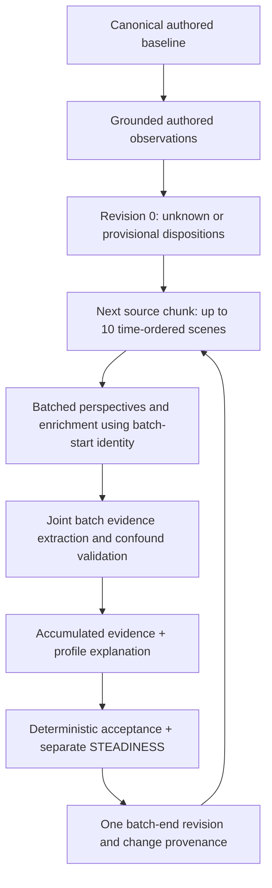

# CharacterAgent dispositional traits: historical implementation plan

> **Historical record — not the current embodiment contract.** This plan records
> the earlier four-stage, chunked design considered on 2026-09-21. The implemented
> pipeline is now the three-stage scene-centric flow documented in
> [current contracts](Dispositional%20Traits.md): incorporation, per-scene
> enrichment/candidate extraction, and cumulative profile update. In particular,
> this plan's references to a joint/cross-scene observation LLM call, a four-call
> budget, source splitting, and `character_agent_embodiment_scene_batch_size` do
> not describe deployed behavior. Do not use this document as an operational or
> API contract.

This historical plan was written to replace the personality layer described in
[CharacterAgent](CharacterAgent.md), its [HTTP contracts](CharacterAgent%20-%20Endpoints.md),
and its [query pipeline](Query/Query.md). Those pages, together with the
[current dispositional-traits contract](Dispositional%20Traits.md), describe the
implemented behavior.

## Scope and decisions

- Deliver the supplied eight directional dispositions plus STEADINESS end to end: narrative extraction, accumulation, persistence, revisions, embodiment, queries, API, SDK, tests, and documentation.
- This is a breaking replacement. Existing agents will be deleted and regenerated. No old-to-new trait conversion, compatibility aliases, or questionnaire subsystem.
- Remove `trait_adherence` from psychological identity. Keep the independent caller-controlled query temperature; STEADINESS never controls temperature.
- **Confirmed by the user:** use bounded z values for administrator edits, with explicit manual provenance and audit history.
- **User-directed batching:** retain source-based scene grouping, with chronological chunks of up to 10 scenes processed sequentially rather than in parallel. Send each chunk together to the LLM, extract scene-attributed evidence jointly, and carry its resulting identity and accumulated evidence into the next chunk. Do not introduce mandatory per-scene LLM calls.
- Numeric inference thresholds below are proposed, versioned engineering policy, not findings from the personality study or validated psychometric estimates.

## Findings from the repository

| Area | Current behavior and affected owners |
| --- | --- |
| Public contracts | `shrecknet/app/schemas/character_agent.py` contains flat personality fields, neutral defaults, proposals, observations, timeline snapshots, changes, and atomic job outputs. |
| Embodiment | `jobs/character_agent/embody_agent.py` runs incorporation, enrichment, observations, and profile update. Its prompts request bounded personality deltas from the current source's observations. |
| Orchestration | `tasks/character_embodiment.py` runs analysis concurrently against a generation-start snapshot, applies profile updates in source order, builds timelines, and stores SQL checkpoints. |
| Input preparation | `services/character_embodiment_service.py` loads canonical identity, scenes, existing identity, and draft payloads. A new agent starts with all axes at 50; the task rejects an entity without scenes. |
| Initial authored evidence | The input loader loads authored biography text, but `EmbodyAgent.analyze()` selects an identity subset that omits it. There is no proper authored-disposition initialization step in this path. |
| Persistence | `services/character_agent_service.py` owns Neo4j writes, draft acceptance, manual edits, snapshots, revision/change history, and deletion. Revisions already serialize nested data as JSON strings. |
| Revision provenance | Analysis uses one starting snapshot, while `_build_timeline()` assigns advancing `starting_revision_number` values that persistence uses for `GENERATED_WITH`. These can describe a different profile from the one actually supplied to the model. |
| Additional writer | `tasks/architect_generation.py` automatically embodies newly generated scenes for existing characters. It duplicates profile/timeline construction, uses local revision numbers, and skips by source identity. It must use the same new accumulation and append rules. |
| Query | `jobs/character_agent/{schemas,prompts,query}.py` selects trait names and hydrates a separate explanation dictionary. `load_query_snapshot()` duplicates the field list and defaults. |
| HTTP | `api/routers/character_agents.py` exposes creation, editing, draft generation/read, revisions, changes, queries, and polling. The change filter explicitly accepts the old personality change category. |
| SDK | `python_sdk/shrecknet_client/{models,resources}.py`, SDK tests, and `python_sdk/docs/character_agents.md` cover affected contracts. SDK agent reads currently tolerate extra fields instead of explicitly typing personality. |
| UI | No tracked React/Vue/Svelte components or `package.json` were found in this checkout. Frontend integration requires a separate consumer handoff; do not claim UI implementation here. |

The exact old keys occur in 14 files across backend, tests, SDK, and canonical documentation. Broader terminology also occurs in query documentation. Emotional intensity, belief confidence, aspect intensity, and goal priority have separate scales: they must not be changed by a blanket replacement of 0–100 values.

## 1. One authoritative specification

Add a focused schema/definition module, proposed `app/schemas/character_traits.py`. It owns canonical keys, frozen trait metadata, trait kinds, diagnostic situation enums, verbal anchors, and scale conversion. It has no persistence or orchestration dependencies.

Each specification contains `key`, `display_name`, `kind`, `construct`, `definition`, `low_pole`, `high_pole`, `diagnostic_situations`, and `boundary_notes`. Carry the complete supplied meanings into this registry; the following table is only a design summary.

| Key | Construct | Low → high; critical distinction |
| --- | --- | --- |
| `integrity` | HEXACO Honesty-Humility | Exploits available advantage → refuses unfair advantage; not giving or generosity. |
| `caution` | HEXACO Emotionality | Low fear/dependence/sentimentality → threat sensitivity, guarantees, support, attachment; not simply risk-taking. |
| `presence` | HEXACO Extraversion | Avoids visibility/company → approaches company and takes the floor; not dominance or kindness. |
| `forbearance` | HEXACO Agreeableness | Retaliates/holds grudges → forgives/compromises after provocation; not initial exploitation or compassion. |
| `diligence` | HEXACO Conscientiousness | Cuts corners/abandons obligations → persists and finishes properly; not competence or success. |
| `curiosity` | HEXACO Openness | Prefers the familiar → investigates unfamiliar things; not intelligence. |
| `sharing` | Social Value Orientation | Favors own allocation → favors the other or joint benefit; not integrity. |
| `restlessness` | Schwartz Openness-to-Change versus Conservation | Security/tradition/order → autonomy/stimulation/change; recurring values, not one act of exploration. |
| `steadiness` | Behavioral consistency / within-character spread | Greater variation → similar behavior in comparable circumstances; not a directional predictor or moral quality. |

Generate prompt metadata and API metadata from this registry. Generate the documentation's reference table from it, with a drift check; keep explanatory prose in canonical docs. The independent SDK consumes metadata through the API rather than importing backend modules or maintaining a second semantic dictionary.

## 2. Profile and scale contracts

Use `trait_profile` with `dispositional_traits` containing exactly the eight directional keys, and a separate `steadiness` estimate. Every read includes all nine slots; absence of evidence is explicit.

An estimate contains:

- `z: number | null`, the authoritative stored value;
- `z: number -1.9..1.9 | null`, the only numeric response value;
- `status: unknown | provisional | supported | contested | manual`;
- qualifying observation count and supporting trait-observation IDs;
- concise uncertainty notes; no invented percentage probability of correctness.

Unknown means `z=null`. An evidenced midpoint is `z=0`. A contested prior estimate may retain its last accepted value while exposing the disagreement. The evidence metadata, rather than the numeric score, communicates certainty.

The current implementation persists bounded inferred z precision rather than
forcing every source update to a display anchor. The LLM supplies evidence
direction/intensity and explanation; the backend averages that source's fixed
contributions and applies the resulting bounded z delta. Administrator inputs
continue to use bounded z values.

| Point | 1 | 2 | 3 | 4 | 5 | 6 | 7 | 8 | 9 |
| --- | --- | --- | --- | --- | --- | --- | --- | --- | --- |
| z | -1.9 | -1.2 | -0.7 | -0.3 | 0 | 0.3 | 0.7 | 1.2 | 1.9 |
| Supplied general-human percentile | 3 | 12 | 24 | 38 | 50 | 62 | 76 | 88 | 97 |

Reject booleans, nonfinite z values, and values outside -1.9..1.9. Do not silently clamp malformed API input. Omit percentile from normal profile responses initially; include the supplied mapping and its **general human population** reference in metadata. Narrative estimates are not validated population measurements.

Creation/PATCH inputs accept bounded z selections, explicit clearing, and a justification, evidence counts, or inferred confidence. Omitted PATCH entries mean retain. A manual selection sets `status=manual`, records actor/reason and previous/new estimates, and stays effective until explicitly cleared or replaced. Evidence continues accumulating underneath it. Clearing the override restores the evidence-derived estimate, which may be unknown. This also permits an explicitly authored STEADINESS selection without falsely claiming it was inferred from a single scene.

During draft acceptance, identical submitted points retain generated provenance. Differences from the generated proposal become a final manual revision; never rewrite earlier inferred revisions to match form edits.

## 3. Structured trait evidence

Extend observations with validated `trait_evidence`. A proposed record has:

```text
id                          backend-assigned stable observation ID
trait                       one of eight directional keys, never steadiness
evidence_kind               behavior | authored_disposition
situation_type              registry-defined diagnostic affordance
direction                   low | midpoint | high
expression_z                -1.9..1.9, or null if not estimable
diagnosticity, confidence   bounded 0..1 engineering judgments
behavior                    concise description of what the character did
justification               why this is diagnostic of this construct
evidence_ids                nonempty canonical provenance references
episode_id                  canonical scene/milestone occurrence identity
source_group_id             original narrative source
chronological_position     backend-assigned position in this run
conditions                  knowledge, capability, options, freedom
comparison_context         stakes, relationship, role, available choices
eligibility, exclusions     backend result and reasons
```

The expression z describes the observed expression, not a final personality verdict. The condition fields use `supported | contradicted | unknown` plus grounded explanations. A supported condition may be established directly or reasonably supported by the narrative. For the initial conservative policy, an unknown or contradicted required condition makes behavioral evidence ineligible for numeric updates; preserve it for inspection and uncertainty. Do not invent probabilities to compensate for missing choice.

Validate trait–situation compatibility, direction/z consistency, source ownership, ontology/instance scope, cutoff, and exact allowed provenance. Behavior cannot become evidence solely because a generated reflection, adjective, belief, or earlier model inference says it occurred. Keep `character_reflection` excluded. Explicit authored stable dispositions have their own evidence kind and lower evidential status; they do not masquerade as observed choices.

Deduplicate by canonical episode and trait, including retries and multiple derived descriptions of the same act. Multiple references or interpretations of one event are not independent observations. For the first version, conservatively cap independent support at one item per trait per canonical scene unless distinct canonical milestones establish separate episodes. Do not let an LLM invent extra episode IDs.

Retain rejected/weak observations with reasons, contradictory observations, and qualified evidence that did not move the profile. Storing only successful changes would make cumulative estimation and future audit impossible.

## 4. Accumulation and update policy

Add `app/services/character_trait_service.py` for deterministic evidence eligibility, accumulation, update acceptance, and STEADINESS. Keep job-local extraction/proposal prompts next to `EmbodyAgent`.

The profile-update LLM supplies traceable explanations from **structured cumulative
evidence**. It does not receive arbitrary scene prose and does not select trait
points or personality deltas. The deterministic backend converts validated
candidate direction/intensity into one bounded, averaged update per trait/source.
Aspects/goals may continue consuming their existing grounded observation categories
in the same stage.

Proposed starting policy, centralized and versioned:

1. Qualifying behavioral evidence requires supported choice conditions, confidence at least 0.7, and diagnosticity at least 0.7.
2. Establish a supported directional estimate only after at least three independent qualifying episodes. Before that, retain unknown. One explicit, well-grounded authored stable-disposition statement may seed a **provisional** directional z estimate; a bare adjective cannot.
3. RESTLESSNESS requires explicit value-choice evidence or recurring motivated preferences. Its supported estimate requires at least three qualifying value choices across at least two source contexts. Investigating an artifact alone is ineligible.
4. An already accepted directional estimate can move by at most one z contribution at an update, and only after at least two new independent qualifying episodes since its last accepted change. Duplicated/replayed evidence does not unlock another movement.
5. A candidate must cite accumulated eligible observation IDs and explicitly address contradictory evidence. Material opposition to both poles marks the estimate contested; it must not be silently averaged into an apparently certain midpoint. First-version conservative rule: qualifying low-pole and high-pole evidence block a new centre unless the latest three independent observations consistently support the proposed side. Retain the conflicting history and uncertainty even when a later estimate is accepted.
6. A midpoint proposal needs evidence of intermediate/balanced behavior, rather than only an average of extremes or missing information. No qualified new evidence means no numeric update.
7. Prefer behavioral evidence over authored shorthand. Author assertions can remain as provenance when contradicted; do not count them as extra behavioral episodes.

These values are reviewable starting defaults. Before release, exercise them on a small narrative fixture set and record any policy changes. Policy version, prompt version, model, and source inputs must make every accepted update inspectable. Replaying validated observations with the same accepted LLM proposal must produce the same deterministic state transition.

## 5. STEADINESS estimator

Estimate it outside ordinary trait extraction. First qualify comparability; only then measure variation.

- Require at least six eligible behavioral episodes in total, with at least two comparison groups containing at least three episodes each. Groups may concern one or more traits, but each group must share trait, affordance, and meaningfully similar choice conditions.
- Comparison groups use grounded context fields, not just matching trait names. Uncertain comparability excludes a group. Exclude authored declarations and manual overrides from behavioral variance.
- Compute spread within groups from expression z values, then pool within-group variance. Never pool unrelated trait centres: consistent retaliation and consistent generosity are compatible with high STEADINESS.
- Initial engineering mapping: for pooled standard deviation `s`, compute `1.9 - 3.8 * min(s / 1.9, 1)` directly as z. The maximum spread bound comes from the bounded expression scale; the mapping is a project heuristic, not a population-calibrated formula.
- Preserve the contributing group/observation IDs, sample counts, and uncertainty. Meeting the minimum count permits a provisional estimate, not a claim of psychometric certainty. Require two new comparable observations before updating an existing estimate and apply only the bounded source-level z update.
- Do not interpret slow chronological change of a dispositional centre as erratic behavior. Split comparison windows across accepted directional changes. If this leaves insufficient comparable evidence, mark STEADINESS insufficient rather than retaining a falsely current inference.
- One act, unrelated contexts, uncertainty about evidence, or contradictory accounts of the same event never establish low STEADINESS.

Calibration of the numeric spread mapping is a release review item. If fixtures do not support a trustworthy distinction, shipping unknown is preferable to forcing a score. Query use remains qualitative: tighter or broader expression around relevant directional centres.

## 6. Initialization and chronology

Recommended sequence:



Add a baseline extraction call for authored identity evidence, using stable entity/property provenance. Support an authored-only draft when there are no scenes; return unknowns where nothing diagnostic exists. Do not treat autogenerated biography as independently authored evidence.

Preserve the existing `DERIVED_FROM` source boundary: scenes from the same narrative source are processed together. Order scenes by the established deterministic `(created_at, scene_id)` key. Split a source into consecutive chunks of at most 10 scenes, or fewer when required by the bounded input/output budget; never silently truncate scenes or drop evidence. Process all four stages of one chunk before starting the next chunk for that character. The final partial chunk runs immediately; it does not wait for future scenes.

Source grouping must not silently reorder interleaved scene times. Build the globally ordered scene sequence, partition into contiguous runs of the same source, then split those runs by size/budget. Thus a source with noninterleaving scenes stays together; if sources interleave, the same source can have several successive runs in the timeline. Every chunk belongs to one source. Keep missing-source scenes individually identified; do not treat all unrelated orphan scenes as one narrative source. This extends the current grouping, which sorts whole source groups by their first scene and can otherwise move a later scene ahead of another source's earlier scene.

Revision 0 is the baseline. For chunk B, all perspectives use the immutable identity at the end of chunk B-1. The incorporation call receives the ordered scene array and returns exactly one perspective per supplied scene, in that order. The enrichment call likewise handles the array together. Prompts must distinguish the batch reader's knowledge from the character's knowledge at each scene: later revelations must not appear as earlier memories, beliefs, or known facts.

The joint observation call receives the chunk's canonical scenes and grounded perspectives, compares behavior across those situations, and emits individually attributed trait evidence. Every observation identifies its episode scene and exact evidence references. Cross-scene findings such as recurrence identify all supporting scenes and an `available_after_scene_id` equal to their latest contributing scene. A per-scene perspective/enrichment item also supplies grounding references, which may cite only its own scene or explicitly supplied earlier evidence. Never accept a reference to an arbitrary unsupplied scene simply because its timestamp is earlier.

The update stage combines the new evidence with the persistent ledger. Each proposed trait change cites the exact contributing observation IDs, with its justification and uncertainty; the backend retains the corresponding canonical scene references. Persist one chunk-end revision, including when only evidence/uncertainty changed. Every perspective in B links through `GENERATED_WITH` to B's actual starting revision. No additional per-scene profile-update calls are needed.

This intentionally updates personality at batch boundaries, not after every scene. The batch-end revision is effective only after its final scene; do not retrospectively assign it to earlier scenes. Batch inference may identify recurrence or contradictions across ten views, but the number of views does not manufacture independent episodes or bypass diagnosticity and STEADINESS comparability rules.

Introduce explicit batch metadata: stable `batch_id`, original `source_group_id`, ordered `scene_ids`, start/end ordering keys, starting revision, and resulting revision. Keep per-observation source IDs. Derive a batch's identity from its source, ordered scene IDs, starting revision, and input digest rather than an LLM label. Retain the timeline's source provenance, but allow multiple chunks/revisions from one source instead of assuming that processing a source once means it is complete forever.

The current data path uses scene creation timestamps, not proven in-world event time. Document this limitation and do not invent dates. Preserve deterministic handling of missing timestamps and expose an ordering warning. Undated authored facts are an explicit baseline assumption; facts demonstrably derived from later scenes cannot be fed into earlier revisions. This refactor cannot reconstruct historical entity biographies that the database does not version.

Add `character_agent_embodiment_scene_batch_size`, default 10, validated in the range 1..10 for the initial version. Persist the chosen size with the generation/checkpoint metadata so changing it cannot silently resume a different partition.

Normal call budget: **four LLM calls per source chunk**, independent of whether it contains one scene or ten: incorporation, enrichment, joint observations, and cumulative profile proposal. Backend validation, accumulation, STEADINESS, and persistence add no LLM calls. Initial generation additionally has the one-time baseline extraction call. Thus three chunks normally use 13 calls including initialization, excluding repair/retry calls. Skip the proposal call only when no profile category has eligible new information. The cost also depends on token volume; large sources may need more than one chunk.

Chronology has two different guarantees. The backend can enforce chronological chunk execution, exact scene IDs/order, allowed evidence references, each finding's availability cutoff, and no retroactive assignment of chunk-end identity to earlier perspectives. **It cannot guarantee absence of semantic hindsight inside a shared prompt**, because the model has seen the later scenes. Grounding validation catches explicit future citations; it cannot prove that prose with apparently valid citations contains no later-derived inference. Handle this through explicit per-scene knowledge instructions, rejection/correction of detected violations using the existing bounded correction mechanism, and narrative evaluation fixtures. This is the chosen batching tradeoff; do not describe it as hard input isolation or quietly reintroduce mandatory per-scene calls.

All checkpoint keys include actual batch-start profile/evidence digest, source ID, ordered scene inputs, batch size/partition, schema/specification/policy/prompt versions, and model targets. Preserve checkpoints for each of the four batch stages; validate reused results as well as fresh output. A changed earlier batch invalidates dependent later checkpoints. Progress reports source, chunk index/count, scene count, and current stage. Retire the old per-character source-concurrency setting for this path and document its removal. Independent characters may still run concurrently through existing workers.

Backdated or edited previously processed scenes must not be appended as if new chronological events. Return a regeneration-required outcome through the existing task error/reporting path. For the first release, regenerate the character rather than implementing historical replay and manual-override rebasing.

## 7. Persistence and shared writers

Use existing Neo4j ownership rather than add a new graph subsystem:

- `CharacterAgent.trait_profile`: JSON string for the current profile and override state; serialize nested objects explicitly.
- `CharacterIdentityRevision.trait_profile`: immutable JSON snapshot, including uncertainty and evidence references.
- `CharacterIdentityRevision.trait_evidence`: JSON array of observations first introduced at this revision. The ordered revision history is the durable ledger, including observations with no numeric effect.
- `CharacterIdentityChange`: replace personality `axis` changes with `trait` and `steadiness`; preserve subtitle/aspect/goal categories. Store previous/new estimate objects, triggering observation IDs, underlying source IDs, reasons, and policy version. Record uncertainty-only transitions when they change query-relevant interpretation.

No new evidence-node label or SQL evidence table is needed initially. Existing draft/checkpoint JSON columns hold the new structures; review model definitions for metadata additions, but do not add a SQL migration without a real schema need. Audit decoding strictly; malformed profile JSON must not silently become a neutral profile.

Add a focused shared embodiment coordinator under services/jobs. Move the duplicated timeline/profile application currently embedded in both Celery task paths into that owner. Keep Celery entry points responsible for job lifecycle and dependency setup. Existing graph write ownership stays in `CharacterAgentService`; do not introduce an unrelated persistence framework.

Acceptance and Architect append must validate and write evidence, revisions, changes, perspectives, and current profile atomically. Initial draft acceptance materializes the reviewed timeline in one graph transaction; incremental processing commits each completed batch atomically. Append from the latest persisted revision number instead of rebuilding local revisions 0/1. Use a transaction-level agent write lock or expected-revision check to reject stale concurrent writers. Idempotency tracks processed scene/input digests and committed batch IDs, not only source entity: the same narrative source can acquire additional scenes. A retry reuses its original partition; later Architect invocations start new batches from unprocessed scenes and never reopen a committed partial batch.

Retain existing ontology/instance boundaries, public/private access, admin mutation rules, retrieval isolation, canonical scene immutability, and shared aspect/goal deletion rules. Evidence stored on revisions is deleted with its owner; check scene deletion leaves auditable source IDs without causing future reuse of absent evidence. Whole-graph backup already serializes properties; test round-trip behavior and document that old backups require matching old software or regeneration.

## 8. Query pipeline

Keep two normal calls and existing response validation/repair behavior.

1. Framing classifies psychological affordances, then returns `relevant_traits` entries containing a directional key, situation type, and grounded relevance explanation. The backend validates each pairing against the registry. Unknown estimates can be reported as unknown; never hydrate them as midpoint values.
2. Deliberation receives selected trait points, z, uncertainty, construct, definitions/poles, and relevance from trusted backend metadata. Pass STEADINESS separately only when directional traits are relevant. It remains an uncertainty-aware consistency modifier, not an identity selector.

The frame must preserve decision-critical constraints in its context summary: what the character knows, can do, may choose, and is forced to do. The deliberation prompt explicitly describes probabilistic biases and allows aspects, goals, beliefs/context, and prior experiences to outweigh a disposition. Do not promise direct episodic retrieval: the existing two-stage query path does not retrieve all historical perspectives.

Preserve generic mode's absence of identity data, the caller response schema, public `decision_basis`, background status/polling, repair limit, and independent `generation.temperature`.

## 9. API, SDK, and consumer contracts

Update together:

- `POST /character-agents`, list/get, and PATCH: new typed profile and manual z-edit contract; old personality inputs fail validation.
- Draft generation/read: structured evidence, explicit unknowns, new proposal, chronological timeline, and schema version; acceptance validates against server-owned draft evidence.
- `GET /character-agents/{agent_id}/revisions`: new snapshots and evidence references.
- `GET /character-agents/{agent_id}/identity-changes`: new categories and previous/new estimates.
- Proposed `GET /character-agents/trait-definitions`: authenticated registry/scale metadata; register before the dynamic agent route.
- Proposed administrator-only `GET /character-agents/{agent_id}/trait-evidence`: paginated observations, filterable by trait and revision cutoff, including excluded evidence. Keep raw narrative evidence out of public profile reads; expose safe counts/status rather than adding private source text to those responses.

Use separate public revision summaries and administrator evidence reads if necessary to preserve this boundary. Update both Pydantic/OpenAPI schemas and explicit SDK models/resource methods. Add a runnable SDK example for generation, reviewed creation, manual edits, history/evidence inspection, and a query. SDK tests must detect personality schema drift rather than accept arbitrary extra fields.

Frontend handoff: render directional z values, distinguish unknown from z=0, display uncertainty/override state, use metadata for construct/poles, and submit bounded z values. The separate STEADINESS semantics should remain visible even if all nine slots share a sheet layout.

## 10. Delivery sequence and acceptance gates

| Step | Deliverable | Gate before moving on |
| --- | --- | --- |
| 1 | Registry, anchors, profile/evidence/edit schemas, representative API JSON fixtures | Every key/construct/boundary is present; unknown/midpoint/manual states are unambiguous. |
| 2 | Evidence validators, accumulation policy, separate spread estimator | Deduplication, confounds, contradictions, minimum counts, and provenance pass focused tests. |
| 3 | Baseline extraction and sequential source chunks of up to ten scenes, prompts, coordinator, checkpoints | Authored-only input works; four-call batching, scene-attributed evidence, cutoff validation, actual revision links, and retry behavior are correct. |
| 4 | Graph persistence, acceptance, manual edits, Architect append | Atomic writes, monotonic revision numbers, duplicate prevention, and concurrent-write failure paths pass. |
| 5 | Query framing/hydration/deliberation | Affordances select only valid directional traits; unknowns and STEADINESS remain separate; temperature is unchanged. |
| 6 | Routes, SDK, example, metadata/evidence inspection | API and SDK round trips agree; authorization and scope tests pass. |
| 7 | Canonical docs, release checklist, semantic evaluation | End-to-end regeneration and query review pass; old active personality semantics are absent. |

These are reviewable work units within one breaking release. Do not deploy partially converted producers and consumers.

## 11. Verification plan

Focused automated coverage:

- Registry completeness, both poles, exact anchors, inverse conversion, invalid numbers, true midpoint versus unknown, and no old keys in new runtime schemas/prompts.
- Every diagnostic mapping and every supplied discriminant case: integrity/sharing, integrity/forbearance, presence/dominance, caution/curiosity, diligence/competence, curiosity/intelligence, curiosity/restlessness.
- Failed lock opening, known fatal exploration, forbidden speech, and careful failed work; reject personality conclusions confounded by knowledge/capability/opportunity/coercion.
- Unknown, invented, cross-character, cross-instance, and future evidence references; duplicate acts and repeated checkpoints; weak/no evidence; contradictory history and actual midpoint behavior.
- Restlessness from recurring value choices; no single-act STEADINESS; comparable repeated retaliation can produce high STEADINESS despite low FORBEARANCE; unrelated contexts and disputed accounts cannot establish variability.
- Audited manual edits and clearing, draft form overrides, unchanged inferred provenance, and manual STEADINESS without fabricated empirical evidence.
- Baseline-only initialization; source-chunk boundaries for 0, 1, 9, 10, 11, and 21 scenes; budget-based splitting; globally ordered/interleaved sources; orphan scenes; partial chunks; sequential execution; shared chunk-start identity; and one revision per chunk. Assert every normal stage receives the ordered scene batch or its structured evidence output, uses four normal calls per chunk, and returns exactly the expected scene IDs without omission or duplication.
- Per-scene grounding must reject later or unsupplied evidence references. Cross-scene findings must carry the latest supporting scene's availability cutoff. Each accepted profile change must retain exact observation and canonical scene provenance. Add model-backed later-revelation fixtures to assess uncited hindsight; do not claim a deterministic citation test proves its absence.
- Batch checkpoint invalidation, changed batch size, stale draft/append conflicts, idempotent retries, appended scenes after a partial batch, and Architect updates from revision numbers greater than one. Assert later-chunk evidence never appears in a preceding chunk and chunk-end identity is not retroactively assigned to its own earlier perspectives.
- Persisted evidence with unchanged scores, JSON round trips, actual `GENERATED_WITH`, current-profile/latest-revision agreement, scoped deletion, and backup properties.
- Query affordance validation, trusted metadata hydration, no STEADINESS selector, insufficient consistency evidence, generic-mode isolation, unchanged temperature forwarding, and existing repair/polling behavior.
- HTTP/admin/public boundaries, SDK request/response agreement, metadata parity, and updated examples.

Use existing fake-LLM tests for contracts and deterministic rules. Add a small labeled narrative evaluation fixture set for real extraction quality: paraphrases, confounds, misleading adjectives, and contrast pairs. Mocked model output and prompt-string tests cannot demonstrate that an LLM makes the correct psychological distinction. Run model-backed evaluation separately against configured models, report its cost/results, and review mistakes before accepting defaults; do not make remote model calls a requirement of ordinary unit tests.

Planned commands, from their package directories:

```bash
# cwd: shrecknet/
python -m pytest tests/test_character_agents.py tests/test_character_embodiment.py tests/test_character_agent_query.py tests/test_character_retrieval_isolation.py
python -m pytest tests/test_character_traits.py tests/test_character_trait_evidence.py tests/test_architect_character_embodiment.py
python -m pytest

# cwd: python_sdk/
python -m pytest tests/test_character_agent_sdk.py tests/test_character_embodiment_sdk.py
python -m pytest
```

The three additional backend test filenames are proposed. Run new narrow policy tests first during implementation, then affected existing suites, then package suites when practical. Identify pre-existing failures separately because this working tree has substantial unrelated changes.

Search all tracked source, tests, examples, SDK docs, and `Documentation/` for the eight old keys, old axis container/type names, adherence, and personality-specific 0–100 language. A negative-contract test or explicitly historical breaking-change note may mention a removed identifier; no active example or prompt may retain its semantics. Check intended exceptions rather than hiding matches.

## 12. Documentation and release operations

Rewrite the three canonical CharacterAgent pages and SDK feature page; update endpoint examples, SDK reference/example indexes, and `Documentation/README.md`. Document all constructs/poles, diagnostic rules, uncertain values, z-only representation, policy defaults, STEADINESS, manual overrides, chronological ordering, checkpoint invalidation, call-count/concurrency impact, and query use. Update architecture ownership documentation for the shared coordinator and trait service. Add a release entry following the existing release process, without modifying unrelated changelog work.

Deployment is a coordinated breaking release:

1. Stop new CharacterAgent/Architect embodiment submissions and drain or explicitly cancel old queued/in-flight work before replacing workers.
2. Take a recoverable backup if old identities are to remain recoverable operationally.
3. Delete old CharacterAgent aggregates through the supported cleanup path; clear their old SQL drafts/checkpoints and prevent old queued jobs from writing old payloads. Do not erase canonical entities/scenes or unrelated agents.
4. Deploy backend/workers and matching SDK/consumer contracts together; create no personality conversion migration.
5. Regenerate a representative character, inspect evidence and revision history, make an audited manual edit, and run an affordance-grounded query before regenerating the remaining agents.
6. Rollback requires the matching previous application and backup, or regeneration with the chosen version; there is no reverse trait conversion.

Deleting data and deploying are future operational steps, not actions performed while preparing this plan. The existing draft-start endpoint already deletes an embodied agent when regenerating it; preserve and clearly document that behavior unless a separate lifecycle change is requested.

## Design decisions retained

Audited manual edits and sequential source-based chunks of up to ten scenes are
user-directed preferences. The normal budget is four calls per chunk plus baseline
extraction, with no mandatory per-scene calls. Engineering thresholds remain
versioned policy; provider-backed narrative evaluation is an operational release
check. See the canonical feature page for the implemented API and persistence
contract; the preceding sections retain the rationale and intended acceptance gates.
