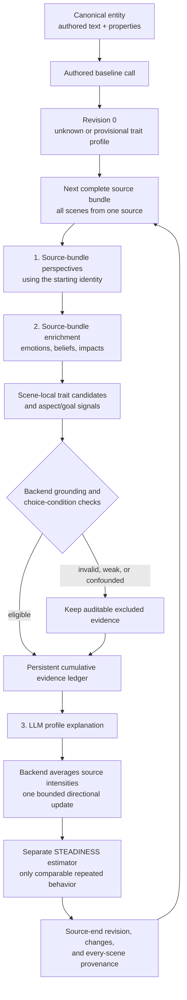
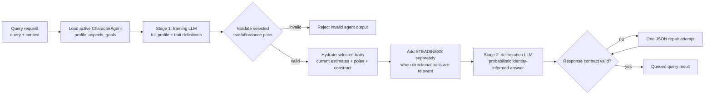

# Evidence-grounded dispositional traits

CharacterAgent personality consists of eight directional dispositions and a separate
STEADINESS estimate. The backend specification is
`app/schemas/character_traits.py`; `GET /character-agents/trait-definitions` exposes
its constructs, poles, boundaries, diagnostic situations, and display scale.
Queries use these definitions directly. The profile is a probabilistic bias, not
a rule that mandates an action.

## Constructs and boundaries

<!-- BEGIN GENERATED TRAIT DEFINITIONS -->

| Slot | Construct | Definition | Low pole | High pole | Diagnostic situations | Boundaries |
| --- | --- | --- | --- | --- | --- | --- |
| INTEGRITY | Honesty-Humility — HEXACO | Will not gain at someone else's expense even when the gain is free, safe, and untraceable. | Takes available advantage; accepts profitable exploitation and self-serving deception. | Refuses unfair advantage or untraceable exploitation, even at personal cost. | exploitation, self_serving_deception | Not taking unfairly, not giving. Generosity, compassion, friendliness, and forgiveness alone are not evidence. |
| CAUTION | Emotionality — HEXACO | Registers danger early and seeks security or guarantees before exposure or uncertain reliance. | Physically fearless, little worry or need for reassurance; less dependent and sentimental. | Threat-sensitive, anxious, seeks guarantees, protection and support; strong attachments and fear of loss. | uncertain_threat, uncertain_dependence, reliance_without_guarantees | Includes attachment and dependence, not just risk-taking. High values often seek guarantees or withdraw. Low values are not inherently virtuous courage. |
| PRESENCE | eXtraversion — HEXACO | Speaks first, stands at the front, and seeks company and social visibility. | Stays at the edge, avoids attention, and is drained by company. | Takes the floor, joins and approaches others; socially bold and energized by company. | social_visibility, social_approach, voluntary_contact | Not dominance, leadership, warmth, kindness, or cooperation. Forbidden speech is not low presence. |
| FORBEARANCE | Agreeableness — HEXACO | Absorbs insult, obstruction, or betrayal rather than retaliating. | Retaliates, holds grudges, becomes angry quickly, and refuses to bend. | Forgives, compromises, remains mild, lets provocations pass and defuses conflict. | provocation, betrayal, obstruction, retaliation | Response after being wronged, not general compassion or integrity. An honest character can consistently retaliate. |
| DILIGENCE | Conscientiousness — HEXACO | Finishes properly what nobody is checking. | Cuts corners, improvises, abandons tasks, acts impulsively, or is disorganized. | Organizes, persists, deliberates, fulfills obligations, and completes work thoroughly without supervision. | unattended_duty, delayed_payoff, cutting_corners, persistence | Not competence: careful work that fails can be strong high-pole evidence. |
| CURIOSITY | Openness — HEXACO | Goes and looks at the strange thing. | Prefers familiar routes and finds unfamiliar or unconventional things off-putting. | Investigates, seeks information, explores unfamiliar phenomena, and enjoys unconventional ideas. | novelty, exploration, puzzle, unknown_information | Not intelligence or successful understanding. Known fatal danger confounds avoidance. One investigation does not establish restlessness or low caution. |
| SHARING | Social Value Orientation — SVO | When jointly controlled resources are divided, moves the allocation toward the other party, including costless giving. | Keeps the larger share, maximizes own allocation, or values being ahead. | Divides evenly or in the other party's favor; may maximize joint benefit. | resource_allocation, spoils, rewards | Giving/allocating, not refraining from exploitation. Do not automatically infer integrity. |
| RESTLESSNESS | Openness-to-Change vs Conservation — Schwartz values | Values the new and self-chosen over the settled, traditional, and safe. | Values security, order, tradition, conformity, and stability. | Values novelty, autonomy, stimulation, self-direction, and change for its own sake. | value_conflict, recurring_value_preference | A motivational value orientation, not simple exploration. Requires explicit value choices or recurring motivated preferences. |
| STEADINESS | Behavioural consistency / spread of the behavioural distribution | Behaves similarly when genuinely comparable circumstances recur. | Broader variation around the same dispositional centres. | Narrower variation; dispositions predict behavior more tightly in comparable situations. | Repeated comparable behavior only | A second moment, not a situation predictor, morality, calmness, or model temperature. Requires repeated comparable behavior. |

<!-- END GENERATED TRAIT DEFINITIONS -->

## Representation and uncertainty

`trait_profile.dispositional_traits` contains all eight directional keys.
`trait_profile.steadiness` is separate. Every estimate exposes a bounded `z`
value, a status, evidence references/counts, and uncertainty. `z` is the only
numeric trait value returned by the API; there is no rounded 1–9 score. Unknown
is `z=null, status="unknown"`. `z=0` is an evidenced centre, not an implicit
fallback for unknown. Inferred values retain bounded fractional precision, so a
small update such as `z=0.1` remains visible to clients. Manual edits also use a
bounded z value. Invalid, boolean, nonfinite, and out-of-range z values are
rejected. The valid range is `-1.9..1.9`.

## Evidence and update policy

Canonical authored identity is processed once before scene interpretation. An
explicit stable disposition may produce a provisional estimate. Bare adjectives
are insufficient; generated biography is not treated as independent authored
support. Authored-only generation is allowed, including an all-unknown profile.

Scene observations record the directional trait, diagnostic situation, expression
z/pole, confidence, diagnosticity, behavior, justification, canonical evidence
IDs, episode ID, availability cutoff, choice conditions, and comparison context.
The backend assigns stable observation IDs, source ownership, chronological
positions, eligibility, and exclusion reasons. Repeated descriptions of one
scene/trait do not increase the evidence count. Expressive character reflections
are excluded from psychological evidence.

The character must know the relevant facts, be capable of either action, have
both options, and be free of compulsion. Unknown or contradicted conditions make
behavioral observations ineligible for score updates. Failed lock-picking is not
integrity; forbidden speech is not low presence; careful failure is not low
diligence; incorrect conclusions do not negate curiosity. Weak, excluded,
contradictory, and no-change evidence remains inspectable in the revision ledger.

The current embodiment pipeline is scene-centric and uses three LLM calls per
source bundle: incorporation, per-scene enrichment/candidate extraction, and a
cumulative profile update. There is no separate cross-scene-observation LLM
call. Incorporation alone receives objective scene text. Enrichment receives only
the corresponding grounded character perspective (without its presentation-only
reflection), and derives emotions, beliefs, trait candidates, and durable signals
from that perspective. The backend collects each enrichment result's
`trait_candidates`, validates their canonical grounding and choice conditions,
then supplies the accumulated evidence to the profile-update call.

Enrichment emits every distinct scene-local trait candidate it can identify;
there is deliberately **no hard per-scene candidate limit**. Candidates with
unknown or contradicted choice conditions remain auditable evidence but cannot
move a trait estimate. Each scene may emit at most one durable aspect signal and
one durable goal signal. Signals are evidence, never mutations: they make a
later addition possible but do not themselves create, update, or complete an
aspect or goal.

Every enrichment result explicitly contains `emotions`, `beliefs`, `impacts`,
`trait_candidates`, `aspect_signals`, and `goal_signals`. `[]` is the valid
no-evidence value; omitting any array is a structured-output contract error, not
an implicit empty result. This prevents a provider from silently dropping the
candidate and signal fields while still returning valid JSON.

Impacts are separate from candidate signals. An impact can affect only an
existing aspect or goal ID supplied in the input profile. A new aspect or goal
requires a matching durable signal and supporting canonical evidence. The final
update may add at most two aspects and one goal for a source bundle, and only
when that evidence establishes durable character development; ordinary events,
passing emotions, group actions, and assigned tasks do not qualify.

The perspective stage receives the current profile as input but not the full
trait-definition catalogue: it renders grounded perspectives and does not make
trait inferences. Psychological enrichment remains a compact per-scene contract.
An empty provider response is classified before JSON parsing; it does not trigger
JSON repair or schema correction and results in a recorded no-change source.

For a non-empty response with invalid JSON, the backend attempts JSON repair.
For valid JSON that violates the output schema—for example, by omitting a
required enrichment array—it makes one bounded schema-correction call instead.
An empty response is classified before parsing and does **not** spend repair or
correction tokens. For all malformed output, worker logs include the stage,
requested completion limit, returned response character count, provider
completion-token count and finish reason (when supplied), plus the Pydantic
validation errors. shreckLLM logs the corresponding requested limit, token usage,
finish reason, and response size for every provider call.

## Local embodiment debug artifacts

`character_agent_embodiment_debug_artifacts_enabled` is enabled by default. When
enabled, every embodiment request creates one timestamped directory under
`databases/local_test/character_embodiment/`. These files contain full prompt,
payload, raw model response, parsed response, validation error, and correction
payloads; treat them as local diagnostic data rather than application logs.

- `baseline.log` records the authored-baseline LLM call.
- One `bundle_XXX_<source>.log` is written for each source-boundary bundle. It
  contains its three LLM stage calls in order (including JSON/semantic corrections)
  and any checkpointed stage outputs reused for that bundle.
- `final_pipeline.log` captures the complete accumulated inputs and outputs after
  every bundle: observations, perspectives, trait evidence/profile, aspect and
  goal updates, subtitle, generated proposal, and timeline projection.

To make the trace complete, an enabled debug request does not reuse embodiment
checkpoints from an earlier attempt; it reruns and records every stage.

Artifact-write failures are logged and do not interrupt a draft. Because these
files can contain full scene text and model-generated explanations/justifications,
enable the flag only in a protected development environment and remove the
request directory when the investigation is complete.

In the Docker Compose deployment, `/data` is bind-mounted to the host's
`shrecknet/databases` directory, so these artifacts appear on the host at
`shrecknet/databases/local_test/character_embodiment/`. Settings are cached by
Celery workers; restart `shrecknet_worker` after changing this flag before
submitting a new embodiment request.

`app/services/character_trait_service.py` centralizes
`evidence-policy-v3-perspective-single-observation`:

- Qualifying confidence and diagnosticity are each at least 0.7.
- One eligible, individually attributed behavioral observation establishes a
  bounded directional estimate. A strong authored stable-disposition statement
  alone may only seed a provisional value.
- RESTLESSNESS still requires an explicit value choice or recurring motivated
  preference; it does not require multiple source contexts.
- A behavioral candidate carries a direction and an update intensity. Small,
  medium, and large map deterministically to ±0.05, ±0.10, and ±0.20 z; high is
  positive and low is negative. Midpoint evidence has no directional movement.
- For each trait, the backend averages all eligible contributions from the
  current source bundle and applies at most one resulting update. It never sums
  scene-level candidates, so a long source cannot produce a massive jump.
- One eligible behavioral observation establishes an estimate, and one newly
  eligible observation can move an existing centre at a later source. The backend
  records the applied source ID to make replay a no-op. STEADINESS remains
  separate and still requires repeated comparable behavior.
- Opposing low/high evidence makes the estimate contested unless the latest three
  qualifying observations consistently support one pole. Opposite extremes are
  not averaged into a falsely certain midpoint.
- An LLM may supply an evidence-grounded explanation and citation set, but it
  does not select a numeric estimate or delta. The backend derives and applies
  the transition from validated evidence.
  Aspects and goals keep their separate grounded lifecycle rules and scales.

These thresholds are engineering policy, not claims from psychological literature.
Prompt, specification, and policy versions identify the applicable contracts.

## STEADINESS

An LLM cannot extract or propose STEADINESS from a scene. The backend requires six
qualifying behavioral episodes in at least two comparable groups of three.
A group has the same trait, diagnostic situation, and explicit comparison context
(stakes, relationship, role, available choices). Missing comparability excludes
it. Authored statements and manual values are not behavioral samples.

The estimator pools within-group variance of expression z values, so different
trait centres do not themselves create variability. If pooled standard deviation
is `s`, the engineering display mapping is
`round_half_up(9 - 8 * min(s / 1.9, 1))`. The resulting estimate remains provisional
and includes its contributing observation IDs. Later updates require two new
comparable samples and move by its bounded source-level z contribution. Comparison windows restart
after accepted directional changes; insufficient remaining evidence restores
unknown rather than falsely attributing gradual development to inconsistency.

Consistent retaliation can therefore mean low FORBEARANCE and high STEADINESS.
STEADINESS never means goodness or calmness and never sets model temperature.

## Source-boundary bundles

Scenes are grouped by `DERIVED_FROM` source, then ordered by
`(created_at, scene_id)` within that source. Every scene from one source is sent
in one atomic bundle regardless of scene count: it is never silently split,
truncated, or dropped to meet a scene-count or local character budget. A scene
linked to the character through either `RELATES_TO` directly or a contained
milestone is included. Orphan scenes form one explicit `__orphan__` source
bundle.

Each source bundle runs three normal LLM stages, sequentially:

1. Incorporation: one perspective per scene, using the source-bundle-start profile.
2. Enrichment: immediate emotions, beliefs, impacts, all grounded scene-local
   trait candidates, and bounded aspect/goal candidate signals for each scene.
3. Profile proposal: cumulative structured evidence, followed by deterministic
   acceptance and separate STEADINESS computation. This creates exactly one
   identity revision associated with every scene in the bundle.

### Trait extraction pipeline

The first baseline call may infer only a provisional authored disposition. Each
later source bundle is sequential: its perspectives use the profile from the
preceding bundle, and its accepted profile becomes available only after that
source's final scene. The evidence ledger retains accepted, contradictory, excluded, and
no-change observations so later updates remain explainable.

Initialization adds one normal call. Repairs/corrections may add calls. There are
no mandatory per-scene calls. Source bundles for the same character never run in
parallel. The next bundle receives the preceding result. Identity changes take
effect only at bundle end; all its perspectives link to the actual starting
revision through `GENERATED_WITH`. One revision per bundle also preserves
evidence-only transitions.

Per-scene enrichment can cite only supplied current/earlier scenes. Validators
reject unknown IDs, duplicate/missing/reordered scene outputs, and explicit
future citations. Because the perspective and enrichment calls read the whole
source bundle, these checks **cannot prove absence of uncited semantic
hindsight**. Prompts forbid it; later-revelation fixtures must be evaluated
against the selected provider/model before deployment. Creation timestamps are
processing chronology, not guaranteed in-world dates.

Stage checkpoints include source inputs, preceding profile and evidence, model
targets, and prompt/specification/policy versions. Replayed outputs are
validated. Changed earlier inputs invalidate downstream checkpoints. Architect
uses the same timeline/profile helpers and appends from the latest revision with
a stale-writer check. Processed scene digests detect edited history; backdated,
edited, or removed processed scenes require regeneration rather than an append.

## Query pipeline

An identity-grounded query deliberately does not send every trait to the final
LLM call. The framing stage receives the complete profile and the authoritative
trait registry, then selects only directional traits whose diagnostic situation
matches the decision. This prevents unrelated dispositions from being treated as
generic personality adjectives.

The framing schema permits only the eight directional keys and checks each
selected `situation_type` against that trait's registry definition. STEADINESS
cannot be selected as a decision trait. It reaches deliberation only as a global
consistency modifier: high STEADINESS narrows expression around relevant trait
centres; low STEADINESS permits broader expression. It never changes model
temperature. Unknown estimates remain unknown rather than being presented as
z=0. Generic queries bypass the identity profile entirely.

See [CharacterAgent Query](Query/Query.md) for request and response envelopes.

Configuration:

- `character_agent_embodiment_evidence_tokens`: retained for legacy evidence-preview
  endpoints. It does not limit or split embodiment source bundles.
- `character_agent_embodiment_max_aspects` / `character_agent_embodiment_max_goals`:
  active capacities; each source bundle proposes at most two aspect and one goal operation.
- `character_agent_embodiment_semantic_correction_attempts`: existing bounded
  correction policy. Query generation retains its separate repair behavior.
- `character_agent_embodiment_debug_artifacts_enabled`: default `true`; writes
  complete local embodiment traces as described in
  [Local embodiment debug artifacts](#local-embodiment-debug-artifacts).

## Persistence, editing, and inspection

The current profile and every revision snapshot are JSON properties on their
existing Neo4j owners. Each revision stores newly introduced `trait_evidence`;
no separate evidence-node label or SQL table is needed. Changes contain old/new
estimate objects, observation IDs, canonical evidence IDs, policy version, and
justification. Manual changes additionally record the actor.

Administrator writes use `trait_edits`, for example
`{"integrity":{"z":1.2,"reason":"Authored character sheet."}}`. The backend
accepts the supplied z. Omitted entries retain their values. `z:null` clears a
manual override and restores the inferred estimate. Evidence continues developing
in `inferred_traits` while `overrides` remain effective. Manual STEADINESS is an
explicit author setting, not fabricated empirical evidence.

Draft acceptance uses the server-owned generated profile. Identical submitted
points preserve generated provenance; changed points create a final manual
revision. Creation and incremental writes commit each graph aggregate/source
bundle atomically. Retry identity is based on processed scenes/source bundles,
not just source ID.

`GET /character-agents/{agent_id}/trait-evidence` is administrator-only and supports
`trait`, `revision`, `skip`, and `limit`. Public profile/revision reads expose
estimates and references, not the raw narrative observation ledger. Existing
visibility, ontology/instance boundaries, retrieval isolation, and canonical
scene immutability remain applicable.

Timeline persistence validates consecutive revisions, matching batch provenance, and unique ordered scenes. It rechecks scene ontology/instance membership and the embodied-entity relationship in the write transaction; changed scope rejects the timeline with HTTP 409.

## Breaking deployment

No legacy trait conversion is provided. Coordinate backend, worker, SDK, and UI
consumers. Stop new embodiment submissions and drain/cancel old queued work;
back up recoverable data; delete old CharacterAgent aggregates and their old
SQL drafts/checkpoints; deploy matching versions and regenerate. Preserve canonical
entities/scenes and unrelated agents. No SQL schema migration is required for
these JSON-property contracts. Rollback requires matching software and backup or
regeneration, not reverse conversion.

See [CharacterAgent endpoints](CharacterAgent%20-%20Endpoints.md),
[query behavior](Query/Query.md), and the [design record](Dispositional%20Traits%20Plan.md).
