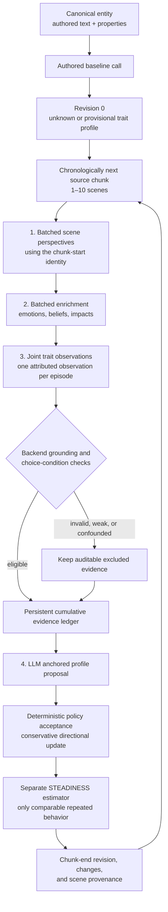
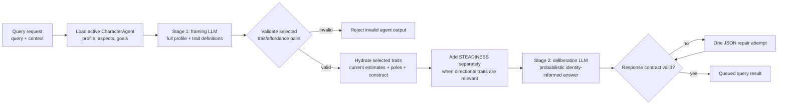

# Evidence-grounded dispositional traits

CharacterAgent personality consists of eight directional dispositions and a separate
STEADINESS estimate. The backend specification is
`app/schemas/character_traits.py`; `GET /character-agents/trait-definitions` exposes
its constructs, poles, boundaries, diagnostic situations, and display scale.
Queries use these definitions directly. The profile is a probabilistic bias, not
a rule that mandates an action.

## Constructs and boundaries

<!-- BEGIN GENERATED TRAIT DEFINITIONS -->

| Slot | Construct | Definition | Low pole | High pole | Diagnostic situations | Boundaries |
| --- | --- | --- | --- | --- | --- | --- |
| INTEGRITY | Honesty-Humility — HEXACO | Will not gain at someone else's expense even when the gain is free, safe, and untraceable. | Takes available advantage; accepts profitable exploitation and self-serving deception. | Refuses unfair advantage or untraceable exploitation, even at personal cost. | exploitation, self_serving_deception | Not taking unfairly, not giving. Generosity, compassion, friendliness, and forgiveness alone are not evidence. |
| CAUTION | Emotionality — HEXACO | Registers danger early and seeks security or guarantees before exposure or uncertain reliance. | Physically fearless, little worry or need for reassurance; less dependent and sentimental. | Threat-sensitive, anxious, seeks guarantees, protection and support; strong attachments and fear of loss. | uncertain_threat, uncertain_dependence, reliance_without_guarantees | Includes attachment and dependence, not just risk-taking. High values often seek guarantees or withdraw. Low values are not inherently virtuous courage. |
| PRESENCE | eXtraversion — HEXACO | Speaks first, stands at the front, and seeks company and social visibility. | Stays at the edge, avoids attention, and is drained by company. | Takes the floor, joins and approaches others; socially bold and energized by company. | social_visibility, social_approach, voluntary_contact | Not dominance, leadership, warmth, kindness, or cooperation. Forbidden speech is not low presence. |
| FORBEARANCE | Agreeableness — HEXACO | Absorbs insult, obstruction, or betrayal rather than retaliating. | Retaliates, holds grudges, becomes angry quickly, and refuses to bend. | Forgives, compromises, remains mild, lets provocations pass and defuses conflict. | provocation, betrayal, obstruction, retaliation | Response after being wronged, not general compassion or integrity. An honest character can consistently retaliate. |
| DILIGENCE | Conscientiousness — HEXACO | Finishes properly what nobody is checking. | Cuts corners, improvises, abandons tasks, acts impulsively, or is disorganized. | Organizes, persists, deliberates, fulfills obligations, and completes work thoroughly without supervision. | unattended_duty, delayed_payoff, cutting_corners, persistence | Not competence: careful work that fails can be strong high-pole evidence. |
| CURIOSITY | Openness — HEXACO | Goes and looks at the strange thing. | Prefers familiar routes and finds unfamiliar or unconventional things off-putting. | Investigates, seeks information, explores unfamiliar phenomena, and enjoys unconventional ideas. | novelty, exploration, puzzle, unknown_information | Not intelligence or successful understanding. Known fatal danger confounds avoidance. One investigation does not establish restlessness or low caution. |
| SHARING | Social Value Orientation — SVO | When jointly controlled resources are divided, moves the allocation toward the other party, including costless giving. | Keeps the larger share, maximizes own allocation, or values being ahead. | Divides evenly or in the other party's favor; may maximize joint benefit. | resource_allocation, spoils, rewards | Giving/allocating, not refraining from exploitation. Do not automatically infer integrity. |
| RESTLESSNESS | Openness-to-Change vs Conservation — Schwartz values | Values the new and self-chosen over the settled, traditional, and safe. | Values security, order, tradition, conformity, and stability. | Values novelty, autonomy, stimulation, self-direction, and change for its own sake. | value_conflict, recurring_value_preference | A motivational value orientation, not simple exploration. Requires explicit value choices or recurring motivated preferences. |
| STEADINESS | Behavioural consistency / spread of the behavioural distribution | Behaves similarly when genuinely comparable circumstances recur. | Broader variation around the same dispositional centres. | Narrower variation; dispositions predict behavior more tightly in comparable situations. | Repeated comparable behavior only | A second moment, not a situation predictor, morality, calmness, or model temperature. Requires repeated comparable behavior. |

<!-- END GENERATED TRAIT DEFINITIONS -->

## Representation and uncertainty

`trait_profile.dispositional_traits` contains all eight directional keys.
`trait_profile.steadiness` is separate. Each estimate exposes `z`, derived `point`,
`status`, `qualifying_count`, `observation_ids`, and `uncertainty`. Internal
`accepted_count` and `comparison_start` make conservative accumulation replayable.
Neo4j stores z anchors in JSON; it does not store the derived point.

| Point | 1 | 2 | 3 | 4 | 5 | 6 | 7 | 8 | 9 |
| --- | --- | --- | --- | --- | --- | --- | --- | --- | --- |
| z | -1.9 | -1.2 | -0.7 | -0.3 | 0 | 0.3 | 0.7 | 1.2 | 1.9 |
| General-human percentile reference | 3 | 12 | 24 | 38 | 50 | 62 | 76 | 88 | 97 |

The reference population is the **general human population**. The supplied mapping
is metadata, not a claim that narrative estimates are population-calibrated tests.
Unknown is `z=null, point=null, status="unknown"`. An evidenced midpoint is
`z=0, point=5`. Other statuses are `provisional`, `supported`, `contested`, and
`manual`. Uncertainty never silently becomes point 5. Invalid/nonfinite values
are rejected. Analytical nearest-anchor conversion breaks ties toward the midpoint.

## Evidence and update policy

Canonical authored identity is processed once before scene interpretation. An
explicit stable disposition may produce a provisional estimate. Bare adjectives
are insufficient; generated biography is not treated as independent authored
support. Authored-only generation is allowed, including an all-unknown profile.

Scene observations record the directional trait, diagnostic situation, expression
point/pole, confidence, diagnosticity, behavior, justification, canonical evidence
IDs, episode ID, availability cutoff, choice conditions, and comparison context.
The backend assigns stable observation IDs, source ownership, chronological
positions, eligibility, and exclusion reasons. Repeated descriptions of one
scene/trait do not increase the evidence count. Expressive character reflections
are excluded from psychological evidence.

The character must know the relevant facts, be capable of either action, have
both options, and be free of compulsion. Unknown or contradicted conditions make
behavioral observations ineligible for score updates. Failed lock-picking is not
integrity; forbidden speech is not low presence; careful failure is not low
diligence; incorrect conclusions do not negate curiosity. Weak, excluded,
contradictory, and no-change evidence remains inspectable in the revision ledger.

`app/services/character_trait_service.py` centralizes `evidence-policy-v1`:

- Qualifying confidence and diagnosticity are each at least 0.7.
- Three independent behavioral episodes normally establish an estimate. A strong
  authored stable-disposition statement alone may only seed a provisional value.
- RESTLESSNESS requires at least two source contexts with diagnostic value choices.
- An existing centre moves at most one display point after at least two new
  qualifying episodes since its last accepted numeric change.
- Opposing low/high evidence makes the estimate contested unless the latest three
  qualifying observations consistently support the proposed side. A midpoint
  requires actual intermediate evidence; opposite extremes are not neutral facts.
- An LLM proposes anchored points using cumulative structured evidence and cites
  eligible observation IDs. The backend validates and applies the transition.
  Aspects and goals keep their separate grounded lifecycle rules and scales.

These thresholds are engineering policy, not claims from psychological literature.
Prompt, specification, and policy versions identify the applicable contracts.

## STEADINESS

An LLM cannot extract or propose STEADINESS from a scene. The backend requires six
qualifying behavioral episodes in at least two comparable groups of three.
A group has the same trait, diagnostic situation, and explicit comparison context
(stakes, relationship, role, available choices). Missing comparability excludes
it. Authored statements and manual values are not behavioral samples.

The estimator pools within-group variance of expression z values, so different
trait centres do not themselves create variability. If pooled standard deviation
is `s`, the engineering display mapping is
`round_half_up(9 - 8 * min(s / 1.9, 1))`. The resulting estimate remains provisional
and includes its contributing observation IDs. Later updates require two new
comparable samples and move by at most one point. Comparison windows restart
after accepted directional changes; insufficient remaining evidence restores
unknown rather than falsely attributing gradual development to inconsistency.

Consistent retaliation can therefore mean low FORBEARANCE and high STEADINESS.
STEADINESS never means goodness or calmness and never sets model temperature.

## Sequential source chunks

Scenes are ordered by `(created_at, scene_id)`, retaining their `DERIVED_FROM`
source. Consecutive same-source runs are divided into at most ten scenes and
bounded by the configured input budget. Interleaving sources are split into
separate runs so grouping cannot reorder their scenes. Orphan scenes remain
individually identified. A final partial chunk runs immediately.

Each chunk runs four normal LLM stages, sequentially:

1. Incorporation: one perspective per scene, using the chunk-start profile.
2. Enrichment: immediate emotions, beliefs, and impacts for each scene.
3. Observations: joint diagnostic extraction across the chunk.
4. Profile proposal: cumulative structured evidence, followed by deterministic
   acceptance and separate STEADINESS computation.

### Trait extraction pipeline

The first baseline call may infer only a provisional authored disposition. Each
later chunk is sequential: its perspectives use the profile from the preceding
chunk, and its accepted profile becomes available only after the chunk's final
scene. The evidence ledger retains accepted, contradictory, excluded, and
no-change observations so later updates remain explainable.

Initialization adds one normal call. Repairs/corrections may add calls. There are
no mandatory per-scene calls. Chunks for the same character never run in parallel.
The next chunk receives the preceding result. Identity changes take effect only
at chunk end; all its perspectives link to the actual starting revision through
`GENERATED_WITH`. One revision per chunk also preserves evidence-only transitions.

Per-scene grounding can cite only supplied current/earlier scenes. Cross-scene
findings become available at their latest contributing scene. Validators reject
unknown IDs, duplicate/missing/reordered scene outputs, and explicit future
citations. Because the LLM reads the entire chunk, these checks **cannot prove
absence of uncited semantic hindsight**. Prompts forbid it; later-revelation
fixtures must be evaluated against the selected provider/model before deployment.
Creation timestamps are processing chronology, not guaranteed in-world dates.

Stage checkpoints include source inputs, preceding profile and evidence, batch
size, model targets, and prompt/specification/policy versions. Replayed outputs
are validated. Changed earlier inputs invalidate downstream checkpoints. Architect
uses the same timeline/profile helpers and appends from the latest revision with
a stale-writer check. Processed scene digests detect edited history; backdated,
edited, or removed processed scenes require regeneration rather than an append.

## Query pipeline

An identity-grounded query deliberately does not send every trait to the final
LLM call. The framing stage receives the complete profile and the authoritative
trait registry, then selects only directional traits whose diagnostic situation
matches the decision. This prevents unrelated dispositions from being treated as
generic personality adjectives.

The framing schema permits only the eight directional keys and checks each
selected `situation_type` against that trait's registry definition. STEADINESS
cannot be selected as a decision trait. It reaches deliberation only as a global
consistency modifier: high STEADINESS narrows expression around relevant trait
centres; low STEADINESS permits broader expression. It never changes model
temperature. Unknown estimates remain unknown rather than being presented as
point 5. Generic queries bypass the identity profile entirely.

See [CharacterAgent Query](Query/Query.md) for request and response envelopes.

Configuration:

- `character_agent_embodiment_scene_batch_size`: default 10, range 1–10.
- `character_agent_embodiment_evidence_tokens`: scene budget converted conservatively
  at four characters per configured token for chunking. Oversized individual scenes
  fail explicitly instead of being truncated.
- `character_agent_embodiment_max_aspects` / `character_agent_embodiment_max_goals`:
  active capacities; each chunk proposes at most two aspect and one goal operation.
- `character_agent_embodiment_semantic_correction_attempts`: existing bounded
  correction policy. Query generation retains its separate repair behavior.

## Persistence, editing, and inspection

The current profile and every revision snapshot are JSON properties on their
existing Neo4j owners. Each revision stores newly introduced `trait_evidence`;
no separate evidence-node label or SQL table is needed. Changes contain old/new
estimate objects, observation IDs, canonical evidence IDs, policy version, and
justification. Manual changes additionally record the actor.

Administrator writes use `trait_edits`, for example
`{"integrity":{"point":8,"reason":"Authored character sheet."}}`. The backend
converts the point. Omitted entries retain their values. `point:null` clears a
manual override and restores the inferred estimate. Evidence continues developing
in `inferred_traits` while `overrides` remain effective. Manual STEADINESS is an
explicit author setting, not fabricated empirical evidence.

Draft acceptance uses the server-owned generated profile. Identical submitted
points preserve generated provenance; changed points create a final manual
revision. Creation and incremental writes commit each graph aggregate/chunk
atomically. Retry identity is based on processed scenes/chunks, not just source ID.

`GET /character-agents/{agent_id}/trait-evidence` is administrator-only and supports
`trait`, `revision`, `skip`, and `limit`. Public profile/revision reads expose
estimates and references, not the raw narrative observation ledger. Existing
visibility, ontology/instance boundaries, retrieval isolation, and canonical
scene immutability remain applicable.

Timeline persistence validates consecutive revisions, matching batch provenance, and unique ordered scenes. It rechecks scene ontology/instance membership and the embodied-entity relationship in the write transaction; changed scope rejects the timeline with HTTP 409.

## Breaking deployment

No legacy trait conversion is provided. Coordinate backend, worker, SDK, and UI
consumers. Stop new embodiment submissions and drain/cancel old queued work;
back up recoverable data; delete old CharacterAgent aggregates and their old
SQL drafts/checkpoints; deploy matching versions and regenerate. Preserve canonical
entities/scenes and unrelated agents. No SQL schema migration is required for
these JSON-property contracts. Rollback requires matching software and backup or
regeneration, not reverse conversion.

See [CharacterAgent endpoints](CharacterAgent%20-%20Endpoints.md),
[query behavior](Query/Query.md), and the [design record](Dispositional%20Traits%20Plan.md).
