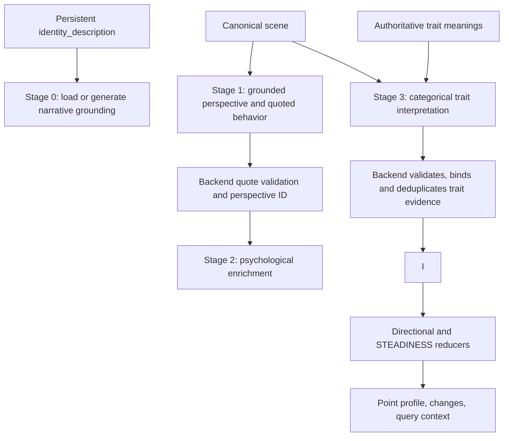

# CharacterAgent dispositional traits

CharacterAgent uses eight directional personality points and a separate
STEADINESS point. The runtime contract is `app/schemas/character_traits.py`;
`GET /character-agents/trait-definitions` supplies names, poles, construct
boundaries, diagnostic situations, and the 1–9 scale. These are narrative
engineering estimates, not population-calibrated personality measurements.

## Constructs

<!-- BEGIN GENERATED TRAIT DEFINITIONS -->

| Slot | Construct | Definition | Left pole | Right pole | Diagnostic situations | Boundaries |
| --- | --- | --- | --- | --- | --- | --- |
| INTEGRITY | Honesty-Humility — HEXACO | Will not gain at someone else's expense even when the gain is free, safe, and untraceable. | Takes available advantage; accepts profitable exploitation and self-serving deception. | Refuses unfair advantage or untraceable exploitation, even at personal cost. | exploitation, self_serving_deception | Not taking unfairly, not giving. Generosity, compassion, friendliness, and forgiveness alone are not evidence. |
| CAUTION | Emotionality — HEXACO | Registers danger early and seeks security or guarantees before exposure or uncertain reliance. | Physically fearless, little worry or need for reassurance; less dependent and sentimental. | Threat-sensitive, anxious, seeks guarantees, protection and support; strong attachments and fear of loss. | uncertain_threat, uncertain_dependence, reliance_without_guarantees | Includes attachment and dependence, not just risk-taking. High values often seek guarantees or withdraw. Low values are not inherently virtuous courage. |
| PRESENCE | eXtraversion — HEXACO | Speaks first, stands at the front, and seeks company and social visibility. | Stays at the edge, avoids attention, and is drained by company. | Takes the floor, joins and approaches others; socially bold and energized by company. | social_visibility, social_approach, voluntary_contact | Not dominance, leadership, warmth, kindness, or cooperation. Forbidden speech is not low presence. |
| FORBEARANCE | Agreeableness — HEXACO | Absorbs insult, obstruction, or betrayal rather than retaliating. | Retaliates, holds grudges, becomes angry quickly, and refuses to bend. | Forgives, compromises, remains mild, lets provocations pass and defuses conflict. | provocation, betrayal, obstruction, retaliation | Response after being wronged, not general compassion or integrity. An honest character can consistently retaliate. |
| DILIGENCE | Conscientiousness — HEXACO | Finishes properly what nobody is checking. | Cuts corners, improvises, abandons tasks, acts impulsively, or is disorganized. | Organizes, persists, deliberates, fulfills obligations, and completes work thoroughly without supervision. | unattended_duty, delayed_payoff, cutting_corners, persistence | Not competence: careful work that fails can be strong high-pole evidence. |
| CURIOSITY | Openness — HEXACO | Goes and looks at the strange thing. | Prefers familiar routes and finds unfamiliar or unconventional things off-putting. | Investigates, seeks information, explores unfamiliar phenomena, and enjoys unconventional ideas. | novelty, exploration, puzzle, unknown_information | Not intelligence or successful understanding. Known fatal danger confounds avoidance. One investigation does not establish restlessness or low caution. |
| SHARING | Social Value Orientation — SVO | When jointly controlled resources are divided, moves the allocation toward the other party, including costless giving. | Keeps the larger share, maximizes own allocation, or values being ahead. | Divides evenly or in the other party's favor; may maximize joint benefit. | resource_allocation, spoils, rewards | Giving/allocating, not refraining from exploitation. Do not automatically infer integrity. |
| RESTLESSNESS | Openness-to-Change vs Conservation — Schwartz values | Values the new and self-chosen over the settled, traditional, and safe. | Values security, order, tradition, conformity, and stability. | Values novelty, autonomy, stimulation, self-direction, and change for its own sake. | value_conflict, recurring_value_preference | A motivational value orientation, not simple exploration. Requires explicit value choices or recurring motivated preferences. |
| STEADINESS | Behavioural consistency / spread of the behavioural distribution | Behaves similarly when genuinely comparable circumstances recur. | Broader variation around the same dispositional centres. | Narrower variation; dispositions predict behavior more tightly in comparable situations. | Repeated comparable behavior only | A second moment, not a situation predictor, morality, calmness, or model temperature. Requires repeated comparable behavior. |

<!-- END GENERATED TRAIT DEFINITIONS -->

## Profile and graph representation

`CharacterAgent.trait_profile` and each `CharacterIdentityRevision.trait_profile`
store versioned JSON with `dispositional_traits` and separate `steadiness`.
Every estimate contains only `point` (strict integer 1–9 or null), `status`
(`unknown|provisional|supported|manual`), `observation_count`, and
`observation_ids`. Unknown means null, never an implicit point 5. Point 5 with
opposing evidence means a mixed or context-dependent record; binary observations
cannot prove an inherently average disposition. The eight directional slots are
always present. `inferred_traits` and `overrides` preserve the underlying estimate
when an administrator sets a manual point. Clearing an override restores the
current inference; actor and reason are recorded in `CharacterIdentityChange`.

Every `observation_id` is an owned `ScenePerspective.id`, never `Scene.id` or a
trait-evidence record ID. `observation_count` equals the number of distinct IDs
used in that estimate. `ScenePerspective-[:PROJECTS_ON]->Scene` retains canonical
scene provenance. `CharacterIdentityRevision.trait_evidence` stores compact
observations; `CharacterIdentityChange` records profile transitions. The backend
preassigns perspective IDs in the draft before aggregation and writes the same
IDs on acceptance. Revision entries hold their assigned revision ID. A referenced
perspective cannot be deleted without regenerating the derived trait history.
The active policy is `point-evidence-v1`. Revision evidence must cite a
`ScenePerspective.id` created in its source batch and that perspective's
canonical scene; the backend rejects mismatched or duplicate references before
writing the timeline. Old z-formatted payloads and profiles
are rejected by the new runtime schema.

## Extraction and evidence


```mermaid
flowchart TD
    A[Persistent identity_description] --> B[Stage 0: load or generate narrative grounding]
    C[Canonical scene] --> D[Stage 1: grounded perspective and quoted behavior]
    C --> F[Stage 3: categorical trait interpretation]
    D --> E[Backend quote validation and perspective ID]
    T[Authoritative trait meanings] --> F
    E --> G[Stage 2: psychological enrichment]
    F --> H[Backend validates, binds and deduplicates trait evidence]
    H --> I
    I --> J[Directional and STEADINESS reducers]
    J --> K[Point profile, changes, query context]
```

`identity_description` contains narrative summaries and trait descriptions,
without points or polarity. It is loaded once per embodiment job, or generated
from the entity and current profile if absent, and supplied to perspective and
psychological stages. Stage 3 receives `identity_summary` and
`psychological_summary` as context, but not `personality_traits`. Trait
observations must be grounded in canonical scenes, using the authoritative
`IDENTITY_TRAIT_DESCRIPTION_CONTRACT` meanings. After all
scenes are processed, the identity description is refreshed once from the final
current state. It never contributes authored trait evidence to the numerical
profile.

Stage 1 binds one perspective to each canonical scene. It records factual
behavior with a source quote. The backend checks that quote against the scene.
Stage 2 handles emotions, beliefs, aspects, and goals in parallel with Stage 3.
Each source is one revision boundary. Its scenes are analyzed in chunks of at
most five, using one shared source-start identity. All perspective chunks finish
before psychological enrichment and trait interpretation run in parallel for
each chunk. The backend merges chunk results in scene order and performs one
deterministic source update. A source with `n` chunks normally makes `3n` LLM
calls. Identity-description generation adds a call if the field is absent and
one refresh call per embodiment job; repairs and provider retries
may add calls.
Stage 3 sees canonical scene facts, the two narrative summaries as context, and
the authoritative trait meanings. It receives no prior `personality_traits` or
generated perspective; summaries cannot establish trait evidence.
Each internal model-facing candidate has `trait`, `diagnostic_situation`,
`relationship`, `stakes`, `polarity`, and a brief grounded `justification`.
The provider receives one flat object schema with all six keys required,
additional keys forbidden, and nullable context values. Trait and polarity
remain finite enums; `relationship` is `friend|enemy|other` and `stakes` is
`ordinary|high_stakes`. Python validates `diagnostic_situation` against
`TRAIT_BY_KEY[trait].diagnostic_situations` and requires `diagnostic_situation`,
`relationship`, and `stakes` to be all non-null or all null. No trait-specific
object union or context-only object branch is sent to the provider. The backend
constructs the persisted `situation_type` (`diagnostic:relationship:stakes` or `unspecified`) after
validating the model contract, then adds `perspective_id`, evidence ID, source
and revision ownership, chronological position, and policy version. The LLM
never supplies a point, intensity, numeric confidence, diagnosticity, or four
choice-condition objects.
The shared `TRAIT_EVIDENCE_CONTRACT` requires clearly demonstrated dispositional
responses; temporary emotional experiences by themselves are not converted into
trait evidence.

Do not extract from compelled or ambiguous action, group-only or witnessed
behavior, an unavailable alternative, or a behavior that does not reveal the
construct. The narrative `identity_description` never creates trait evidence
or a provisional point. The backend admits at most
one observation per trait and perspective; retries and duplicate descriptions
cannot multiply support. Opposing observations are retained. Empty candidate
arrays are normal.

`situation_type` is either `unspecified` or
`<diagnostic>:<relationship>:<stakes>`. The diagnostic value must belong to the
trait registry. Relationship is `friend|enemy|other`; stakes is
`ordinary|high_stakes`. Use `unspecified` if circumstances are insufficient for
comparison. It still contributes to the directional trait but cannot affect
STEADINESS. Distinct friend and enemy contexts are never collapsed into one
consistency group.

## Directional calculation

For one trait, let eligible observations be ordered oldest to newest. The newest
observation of that trait has `k=0`; older ones have `k=1,2,...`. High polarity
has `x=+1`, low polarity has `x=-1`. Defaults are recency `rho=0.9` and smoothing
`lambda=4`:

```text
w_i       = rho^k_i
mu        = sum(w_i * x_i) / sum(w_i)
raw       = 5 + 4 * mu * n / (n + lambda)
point     = clamp(round_half_away_from_5(raw), 1, 9)
```

`n` is the number of distinct eligible perspective IDs for that trait. Recency
sets direction; actual observation count controls movement from point 5. Ties
at an exact half point round away from 5, symmetrically at both poles. With
only same-pole scene observations, 1, 5, 10, and 28 observations yield points
6, 7, 8, and 9 (or 4, 3, 2, and 1 for low). A long run of new opposite choices
can reverse an older personality. With `rho=1`, this becomes
`5 + 4(H-L)/(H+L+4)` before rounding. This scoring rule is versioned policy,
not a validated psychological scale.

Only scene perspective observations contribute to the directional calculation.
With no eligible scene observations, the trait remains `unknown`; one eligible
perspective remains `provisional`; two or more make a directional estimate
`supported`. Legacy `authored_disposition` records do not contribute to points.

## STEADINESS calculation

STEADINESS measures variation *within* comparable contexts, not morality,
calmness, or the average directional trait. Group observations by exact
`(trait, situation_type)`; exclude `unspecified`. Within each group take at most
the newest 12 observations. A group qualifies with at least three independent
perspectives. If none qualify, STEADINESS is unknown. For each group compute
recency-weighted high and low masses `H_g` and `L_g`:

```text
d_g              = 2 * min(H_g, L_g) / (H_g + L_g)
D                = sum((H_g + L_g) * d_g) / sum(H_g + L_g)
raw              = 5 + 4 * (1 - 2 * D) * m / (m + 4)
steadiness_point = clamp(round_half_away_from_5(raw), 1, 9)
```

`m` is the number of distinct contributing perspectives. Three identical
comparable observations yield provisional point 7, not an apparently certain 9.
At least six observations across two qualifying context groups make the estimate
`supported`. A character who always forgives friends and always retaliates
against enemies can therefore be consistent. Binary polarity and a compact
context catalog lose nuance; use `unspecified` when comparison is not grounded.
With enough comparable evidence, the smoothed consistency scale can reach both
points 1 and 9; a three-observation group cannot produce either extreme.
STEADINESS never controls sampling temperature.

## Use, operations, and cutover

The query hydrator receives effective points, statuses, and trusted pole
metadata. Traits bias behavior and do not mandate choices. Unknown values remain
unknown; mixed point-5 evidence is not presented as proof of an average nature.
The administrator evidence endpoint is
`GET /character-agents/{agent_id}/trait-evidence`; its records have
`perspective_id`, `polarity`, `situation_type`, `justification`, and backend
provenance. Each evidence record is stored on its `CharacterIdentityRevision`
with `revision_id`, `source_group_id`, batch ownership, and the originating
perspective plus `scene:<scene_id>` reference. The revision is also connected to
its source entity through `CONSOLIDATED_FROM`. This maps every retained trait
observation back to the source and scene that produced it. STEADINESS is derived
from those same contextual observations and appears as its own trait change and
revision estimate; it does not require a separate model-generated score.
Revisions allow reconstruction and audit. Manual edits use
`{"point": 7, "reason": "..."}`; `point: null` clears an override.

Deployment of this breaking contract requires a backup and regeneration of
traits from authored identity and source scenes/perspectives. Old
`expression_z` records cannot be faithfully converted by rounding. Old-format
revisions may be archived outside the active path but must not supply current
aggregation, API responses, edits, or query context. A character without source
material has unknown traits until regeneration. For an existing old-format
agent, export the graph backup, delete that CharacterAgent through the normal
administrator endpoint, start a new embodiment draft for its canonical entity,
and accept the regenerated agent. Do not append new point revisions to its old
z history. Restore the backup for rollback.
The [redesign plan](Point-Based%20Traits%20Redesign%20Plan.md) records acceptance
criteria and the full verification matrix; the [endpoint page](CharacterAgent%20-%20Endpoints.md)
records HTTP details.
