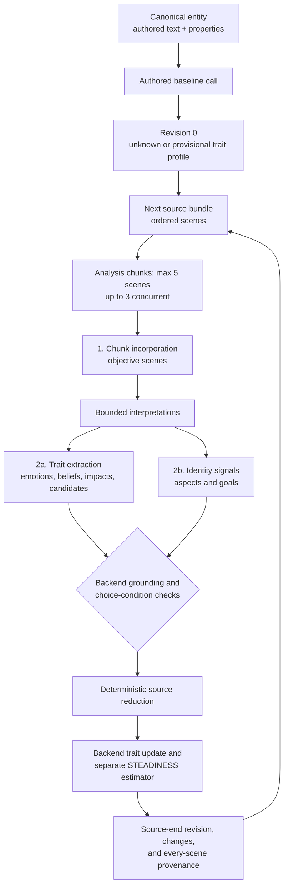
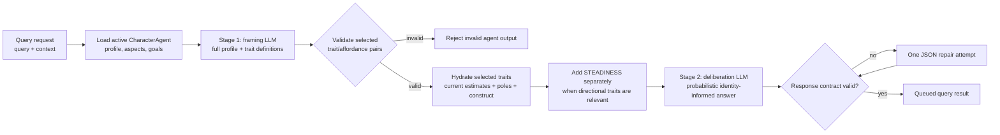

# Evidence-grounded dispositional traits

CharacterAgent personality consists of eight directional dispositions and a separate
STEADINESS estimate. The backend specification is
`app/schemas/character_traits.py`; `GET /character-agents/trait-definitions` exposes
its constructs, poles, boundaries, diagnostic situations, and display scale.
Queries use these definitions directly. The profile is a probabilistic bias, not
a rule that mandates an action.

## Constructs and boundaries

<!-- BEGIN GENERATED TRAIT DEFINITIONS -->

| Slot | Construct | Definition | Left pole | Right pole | Diagnostic situations | Boundaries |
| --- | --- | --- | --- | --- | --- | --- |
| INTEGRITY | Honesty-Humility — HEXACO | Will not gain at someone else's expense even when the gain is free, safe, and untraceable. | Takes available advantage; accepts profitable exploitation and self-serving deception. | Refuses unfair advantage or untraceable exploitation, even at personal cost. | exploitation, self_serving_deception | Not taking unfairly, not giving. Generosity, compassion, friendliness, and forgiveness alone are not evidence. |
| CAUTION | Emotionality — HEXACO | Registers danger early and seeks security or guarantees before exposure or uncertain reliance. | Physically fearless, little worry or need for reassurance; less dependent and sentimental. | Threat-sensitive, anxious, seeks guarantees, protection and support; strong attachments and fear of loss. | uncertain_threat, uncertain_dependence, reliance_without_guarantees | Includes attachment and dependence, not just risk-taking. High values often seek guarantees or withdraw. Low values are not inherently virtuous courage. |
| PRESENCE | eXtraversion — HEXACO | Speaks first, stands at the front, and seeks company and social visibility. | Stays at the edge, avoids attention, and is drained by company. | Takes the floor, joins and approaches others; socially bold and energized by company. | social_visibility, social_approach, voluntary_contact | Not dominance, leadership, warmth, kindness, or cooperation. Forbidden speech is not low presence. |
| FORBEARANCE | Agreeableness — HEXACO | Absorbs insult, obstruction, or betrayal rather than retaliating. | Retaliates, holds grudges, becomes angry quickly, and refuses to bend. | Forgives, compromises, remains mild, lets provocations pass and defuses conflict. | provocation, betrayal, obstruction, retaliation | Response after being wronged, not general compassion or integrity. An honest character can consistently retaliate. |
| DILIGENCE | Conscientiousness — HEXACO | Finishes properly what nobody is checking. | Cuts corners, improvises, abandons tasks, acts impulsively, or is disorganized. | Organizes, persists, deliberates, fulfills obligations, and completes work thoroughly without supervision. | unattended_duty, delayed_payoff, cutting_corners, persistence | Not competence: careful work that fails can be strong high-pole evidence. |
| CURIOSITY | Openness — HEXACO | Goes and looks at the strange thing. | Prefers familiar routes and finds unfamiliar or unconventional things off-putting. | Investigates, seeks information, explores unfamiliar phenomena, and enjoys unconventional ideas. | novelty, exploration, puzzle, unknown_information | Not intelligence or successful understanding. Known fatal danger confounds avoidance. One investigation does not establish restlessness or low caution. |
| SHARING | Social Value Orientation — SVO | When jointly controlled resources are divided, moves the allocation toward the other party, including costless giving. | Keeps the larger share, maximizes own allocation, or values being ahead. | Divides evenly or in the other party's favor; may maximize joint benefit. | resource_allocation, spoils, rewards | Giving/allocating, not refraining from exploitation. Do not automatically infer integrity. |
| RESTLESSNESS | Openness-to-Change vs Conservation — Schwartz values | Values the new and self-chosen over the settled, traditional, and safe. | Values security, order, tradition, conformity, and stability. | Values novelty, autonomy, stimulation, self-direction, and change for its own sake. | value_conflict, recurring_value_preference | A motivational value orientation, not simple exploration. Requires explicit value choices or recurring motivated preferences. |
| STEADINESS | Behavioural consistency / spread of the behavioural distribution | Behaves similarly when genuinely comparable circumstances recur. | Broader variation around the same dispositional centres. | Narrower variation; dispositions predict behavior more tightly in comparable situations. | Repeated comparable behavior only | A second moment, not a situation predictor, morality, calmness, or model temperature. Requires repeated comparable behavior. |

<!-- END GENERATED TRAIT DEFINITIONS -->

## Representation and uncertainty

`trait_profile.dispositional_traits` contains all eight directional keys.
`trait_profile.steadiness` is separate. Every estimate exposes a bounded `z`
value, a status, evidence references/counts, and uncertainty. `z` is the only
numeric trait value returned by the API; there is no rounded 1–9 score. Unknown
is `z=null, status="unknown"`. `z=0` is an evidenced centre, not an implicit
fallback for unknown. Inferred values retain bounded fractional precision, so a
small update such as `z=0.1` remains visible to clients. Manual edits also use a
bounded z value. Invalid, boolean, nonfinite, and out-of-range z values are
rejected. The valid range is `-1.9..1.9`.

## Evidence and update policy

Canonical authored identity is processed once before scene interpretation. An
explicit stable disposition may produce a provisional estimate. Bare adjectives
are insufficient; generated biography is not treated as independent authored
support. Authored-only generation is allowed, including an all-unknown profile.

Scene observations record the directional trait, diagnostic situation, a `left` or
`right` pole, signed non-zero expression z, confidence, diagnosticity, behavior, justification, canonical evidence
IDs, episode ID, availability cutoff, choice conditions, and comparison context.
The backend assigns stable observation IDs, source ownership, chronological
positions, eligibility, and exclusion reasons. Repeated descriptions of one
scene/trait do not increase the evidence count. Expressive character reflections
are excluded from psychological evidence.

The character must know the relevant facts, be capable of either action, have
both options, and be free of compulsion. Unknown or contradicted conditions make
behavioral observations ineligible for score updates. Failed lock-picking is not
integrity; forbidden speech is not low presence; careful failure is not low
diligence; incorrect conclusions do not negate curiosity. Weak, excluded,
contradictory, and no-change evidence remains inspectable in the revision ledger.

The current embodiment pipeline is scene-centric. A source's scenes are divided
into analysis chunks of at most five scenes (therefore always within the
maximum ten-scene window). A source runs a flat Perspective wave for all chunks
against the same source-start identity, then a flat Psychological analysis wave.
The first call receives objective scenes and returns perspectives plus factual
behavioral evidence with a short source quotation. The second receives only
bounded perspectives and produces emotions, beliefs, impacts, and durable
aspect/goal signals. In parallel, the third receives only validated factual
behavioral evidence and the authoritative trait registry to produce candidates.

Character Incorporation uses a separate LLM-only perspective contract. It
contains no `scene_id`, `evidence_ids`, status, database identifier, or other
backend-owned reference. For a chunk of `n` scenes, its native JSON Schema
requires exactly `n` perspectives with `minItems=n` and `maxItems=n`; position
`1` is bound to the first input scene, position `2` to the second, and so on.
Only after LLM validation does the backend attach the canonical `scene_id` and
`scene:<id>` evidence reference. The LLM-owned `summary`, `interpretation`, and
`character_reflection` are capped at 300, 700, and 500 characters respectively.
The prompt further limits them to one 40-word summary sentence, two 80-word
interpretation sentences, and two 60-word first-person reflection sentences.
This stage is structured character-state extraction, never prose narration or
scene reconstruction.

Every embodiment generation request sends its Pydantic JSON Schema through
ShreckLLM as a native strict `response_format` request: authored baseline,
incorporation, psychological analysis, JSON repair, and schema/semantic
corrections. The explicit prompt contract remains present for model readability.
If a configured provider explicitly rejects structured output, the call is
retried once without it under a `structured_fallback` usage tag; backend binding,
validation, and correction policy still apply. The strict model schema is a
separate boundary contract from persistence: an impact writes only a
one-based `target_index`, never a storage `target_id`. The backend resolves it
against the supplied current profile. When no valid target exists, or the model
returns an out-of-range optional impact, that impact is discarded as a no-op;
it cannot fail or mutate the source. The backend binds positional references,
validates the outputs, merges source-local evidence in chronological order, and
performs trait/profile reduction deterministically. A source with `n`
analysis chunks therefore normally makes `3n` LLM calls, excluding the authored
baseline and repair/correction calls. No LLM receives a cumulative evidence
ledger, raw scenes after incorporation, or a source-level profile-update payload.

Psychological analysis treats newly grounded durable facts (identity, role,
affiliation, relationship, capability, status, knowledge, value, preference, or
history) as positive aspect-signal candidates, and active self-adopted objectives
or commitments as positive goal-signal candidates. Existing profile aspects are
impact targets only and cannot be repeated. Generated aspect names are concise,
present-tense first-person self-statements, so the character-facing UI exposes a
meaningful claim rather than an abstract category. A confirmed, important,
character-specific revelation about origin, nature, body, identity, or constructed
status must instead produce a distinct `identity` aspect signal (for example,
`I am a Belshazar-crafted vessel`). The deterministic reducer logs and ignores
any duplicate signal, then caps additions per source. Enrichment emits at most
three distinct scene-local trait candidates. Candidates with
unknown or contradicted choice conditions remain auditable evidence but cannot
move a trait estimate. Each scene may emit at most one durable aspect signal and
one durable goal signal. Signals are evidence, never mutations: they make a
later addition possible. A goal signal may use operation `complete` when a scene
conclusively establishes that an active goal was achieved, resolved, made
impossible, or superseded. Completion must exactly identify the active goal and
is never inferred from silence, delay, uncertainty, or mere progress. A supported
completion takes precedence over a new goal in that source's single goal update.

Every trait-extraction result explicitly contains `emotions`, `beliefs`,
`impacts`, and `trait_candidates`; every identity-signal result explicitly
contains `aspect_signals` and `goal_signals`. `[]` is the valid no-evidence value;
omitting a required array is a structured-output contract error, not an implicit
empty result. This prevents a provider from silently dropping either branch's
fields while still returning valid JSON.

Impacts are separate from candidate signals. An impact can affect only an
existing aspect or goal ID supplied in the input profile. A new aspect or goal
requires a matching durable signal and supporting canonical evidence. The final
update may add at most two aspects and one goal for a source bundle, and only
when that evidence establishes durable character development; ordinary events,
passing emotions, group actions, and assigned tasks do not qualify.
The LLM schema models impact alternatives separately: `goal_change` uses only
`advanced` or `threatened` and indexes the supplied goals; `aspect_change` uses
only `created`, `reinforced`, or `invalidated` and indexes the supplied aspects.
This conditional pairing is enforced before the backend resolves the index to a
persisted target ID.

The perspective stage receives the current profile as input but not the full
trait-definition catalogue: it renders grounded perspectives and does not make
trait inferences. Psychological enrichment remains a compact per-scene contract.
An empty provider response is classified before JSON parsing; it does not trigger
JSON repair or schema correction and results in a recorded no-change source.

For a non-empty response with invalid JSON, the backend attempts JSON repair.
For valid JSON that violates the output schema—for example, by omitting a
required enrichment array—it makes one bounded schema-correction call instead.
If Character Incorporation reaches the completion limit, its partial response is
discarded without JSON repair and the worker makes one compact recovery request.
The recovery uses the same exact-count, bounded-text schema and an explicit
instruction to shorten every perspective. A second truncation fails the draft.
An empty response is classified before parsing and does **not** spend repair or
correction tokens. For all malformed output, worker logs include the stage,
requested completion limit, returned response character count, provider
completion-token count and finish reason (when supplied), plus the Pydantic
validation errors. shreckLLM logs the corresponding requested limit, token usage,
finish reason, and response size for every provider call.

## Backend-owned model references

Embodiment prompts do not ask a model to reproduce canonical scene, evidence,
profile-target, or observation identifiers. Scene-local stages return one output
object per numbered input position; the backend binds position 1 to the first
input scene and assigns that scene’s canonical ID and evidence citation to the
outer result and all nested candidates. Trait-extraction impact targets use a one-based position in the supplied aspect
or goal list, which the backend resolves to the stable ID. Identity signals have
only their chunk-local canonical evidence after backend binding. Persisted drafts,
checkpoints, graph records, and API responses retain the canonical IDs; this is an
internal LLM boundary contract only.

A wrong, duplicated, or reordered identifier in an otherwise complete scene list
cannot mis-associate content: it is overwritten during binding. When a provider
omits only the outer collection wrapper, the backend safely restores it for a raw
array, or for one bare object when the input contains exactly one scene. This
lossless normalization avoids a correction call; it never guesses a missing
multi-scene result. A list with the wrong number of entries, an out-of-range
positional target, or another semantic violation enters the bounded
semantic-correction policy. Correction payloads include the expected and actual
scene-position sequences. Checkpoint payloads must pass the same schema and
grounding checks before reuse.

## Local embodiment debug artifacts

`character_agent_embodiment_debug_artifacts_enabled` is enabled by default. When
enabled, every embodiment request creates one timestamped directory under
`databases/local_test/character_embodiment/`. These files contain full prompt,
payload, raw model response, parsed response, validation error, and correction
payloads; treat them as local diagnostic data rather than application logs.

Each directory begins with `manifest.json`, which identifies the draft, revision,
and artifact directory. A call that fails before the provider returns still writes
its full prompt and payload with `raw_output: null` and the provider error. For
example, `attempt watchdog exceeded 45.0s` is a shreckLLM provider timeout, not a
JSON-schema or embodiment-validation failure. Increase the selected shreckLLM
route's `request_timeout_seconds` only when the provider is expected to complete
reliably beyond that limit; otherwise select a faster model or reduce its prompt.

- `baseline.log` records the authored-baseline LLM call.
- One `bundle_XXX_<source>.log` is written for each source-boundary bundle. It
  contains all analysis-chunk calls, including JSON/semantic corrections,
  truncated incorporation output, and the compact recovery request. A truncated
  incorporation record includes its raw partial output, prompt, payload, model,
  completion limit, scene count, finish reason, and provider metadata. Concurrent
  second-wave branch records are append-only and should not be interpreted as a
  strict call order.
- `final_pipeline.log` captures the source-local inputs and outputs after every
  bundle: interpretations, trait evidence/profile, aspect and goal updates,
  subtitle, deterministic reduction, and timeline projection.

To make the trace complete, an enabled debug request does not reuse embodiment
checkpoints from an earlier attempt; it reruns and records every stage.

Artifact-write failures are logged and do not interrupt a draft. Because these
files can contain full scene text and model-generated explanations/justifications,
enable the flag only in a protected development environment and remove the
request directory when the investigation is complete.

In the Docker Compose deployment, `/data` is bind-mounted to the host's
`shrecknet/databases` directory, so these artifacts appear on the host at
`shrecknet/databases/local_test/character_embodiment/`. Settings are cached by
Celery workers; restart `shrecknet_worker` after changing this flag before
submitting a new embodiment request.

`app/services/character_trait_service.py` centralizes
`evidence-policy-v3-perspective-single-observation`:

- Qualifying confidence and diagnosticity are each at least 0.7.
- One eligible, individually attributed behavioral observation establishes a
  bounded directional estimate. A strong authored stable-disposition statement
  alone may only seed a provisional value.
- RESTLESSNESS still requires an explicit value choice or recurring motivated
  preference; it does not require multiple source contexts.
- A behavioral candidate carries a signed `expression_z`; about 0.3, 0.7, 1.2,
  and 1.9 mean mild, clear, strong, and exceptional expression. It describes
  behavior, not confidence. `update_intensity` remains legacy input only.
- For each trait at a revision cutoff, the backend recomputes the centre from all
  unique eligible behavioral observations: `mean(expression_z)`. Source and chunk
  partitions cannot change a score; replay safety is canonical deduplication.
- Opposing poles retain their calculated centre with `status="contested"` and a
  contradiction note. Authored-only evidence remains provisional; STEADINESS is
  recomputed whenever the evidence ledger changes.
- An LLM may supply an evidence-grounded explanation and citation set, but it
  does not select a numeric estimate or delta. The backend derives and applies
  the transition from validated evidence.
  Aspects and goals keep their separate grounded lifecycle rules and scales.

These thresholds are engineering policy, not claims from psychological literature.
Prompt, specification, and policy versions identify the applicable contracts.
Persisted `dispositions-v1` profiles are read as the current signed-z profile so
existing agents remain listable and queryable. Their historical scene evidence
should be regenerated before relying on the new bipolar extraction or
STEADINESS policy.

## STEADINESS

An LLM cannot extract or propose STEADINESS from a scene. The backend requires
three qualifying behavioral episodes in one repeated comparable group. A group
has the same trait and registry-owned diagnostic situation; free-text
`comparison_context` remains audit prose and is never an equality key. The
latest 30 eligible behavioral observations form the rolling window. Authored
statements and manual values are not behavioral samples.

The estimator pools within-group variance of expression z values, so different
trait centres do not themselves create variability. If pooled standard deviation
is `s`, the engineering display mapping is
`round_half_up(9 - 8 * min(s / 1.9, 1))`. The resulting estimate remains
provisional and includes its contributing observation IDs. It also reports the
qualifying-observation and repeated-context counts plus their thresholds, so a
client can explain why STEADINESS is unknown. Directional changes do not exclude
older samples inside the rolling window.

Consistent retaliation can therefore mean low FORBEARANCE and high STEADINESS.
STEADINESS never means goodness or calmness and never sets model temperature.

## Source-boundary bundles

Scenes are grouped by `DERIVED_FROM` source, then ordered by
`(created_at, scene_id)` within that source. A source remains the atomic
identity-update and revision boundary: all of its eligible scenes contribute to
one merged profile update and one resulting revision. For scene-local LLM work,
the worker partitions the ordered scenes into analysis chunks of at most five;
no scene is silently truncated or dropped. Up to three chunks from the same
source run concurrently, all using the same source-start profile, aspects, and
goals. A scene linked to the character through either `RELATES_TO` directly or a
contained milestone is included. Orphan scenes form one explicit `__orphan__`
source bundle.

Each analysis chunk runs a bounded two-wave LLM pipeline:

1. Incorporation: one interpretation per scene, using the source-start profile
   and only that chunk's objective scenes.
2. In parallel from interpretations only: trait extraction (emotions, beliefs,
   impacts, and grounded trait candidates) and identity-signal extraction
   (bounded aspect/goal candidate signals).

Each malformed non-empty response receives the bounded correction policy
described above. If that correction is exhausted, the affected source fails and
the draft remains unfinalized; the worker does not silently substitute a
different one-scene run. Provider and transport failures also fail the draft.

After all chunks have completed, the worker merges their structured results.
Deterministic trait acceptance, signal deduplication, and separate STEADINESS
computation then create exactly one identity revision associated with every scene
in that source. The normal source call budget is `3 x analysis_chunks`; reduction
makes no model call and never reconstructs a cumulative raw-evidence prompt.

### Trait extraction pipeline

```mermaid
flowchart TD
    A[Canonical entity
authored text + properties] --> B[Authored baseline call]
    B --> C[Revision 0
unknown or provisional trait profile]
    C --> D[Next source bundle
ordered scenes]
    D --> E[Analysis chunks: max 5 scenes
up to 3 concurrent]
    E --> F[1. Chunk incorporation
objective scenes]
    F --> G[Bounded interpretations]
    G --> H[2a. Trait extraction
emotions, beliefs, impacts, candidates]
    G --> I[2b. Identity signals
aspects and goals]
    H --> J{Backend grounding and
choice-condition checks}
    I --> J
    J --> K[Deterministic source reduction]
    K --> L[Backend trait update and
separate STEADINESS estimator]
    L --> M[Source-end revision, changes,
and every-scene provenance]
    M --> D
```

The first baseline call may infer only a provisional authored disposition. Source
bundles run sequentially: a later source starts only after the preceding source's
merged profile is accepted. Within a source, concurrent analysis chunks share its
starting identity; the next source receives the source-end result. The evidence
ledger retains accepted, contradictory, excluded, and no-change observations so
later updates remain explainable.

Initialization adds one normal call. Repairs/corrections may add calls. There are
no mandatory per-scene calls, but a source may require multiple chunk-level calls.
Identity changes take effect only at source end; all its perspectives link to the
actual starting revision through `GENERATED_WITH`. One revision per source also
preserves evidence-only transitions.

Per-scene enrichment can cite only supplied current/earlier scenes within its
analysis chunk. Validators reject unknown IDs, duplicate/missing/reordered scene
outputs, and explicit future citations. Because a chunk's perspective and
enrichment calls read the whole chunk, these checks **cannot prove absence of
uncited semantic hindsight** within that chunk. Prompts forbid it;
later-revelation fixtures must be evaluated against the selected provider/model
before deployment. Creation timestamps are processing chronology, not guaranteed
in-world dates.

Stage checkpoints include source inputs, preceding profile and evidence, model
targets, and prompt/specification/policy versions. Replayed outputs are
validated. Changed earlier inputs invalidate downstream checkpoints. Architect
uses the same timeline/profile helpers and appends from the latest revision with
a stale-writer check. Processed scene digests detect edited history; backdated,
edited, or removed processed scenes require regeneration rather than an append.

## Query pipeline

An identity-grounded query deliberately does not send every trait to the final
LLM call. The framing stage receives the complete profile and the authoritative
trait registry, then selects only directional traits whose diagnostic situation
matches the decision. This prevents unrelated dispositions from being treated as
generic personality adjectives.

```mermaid
flowchart LR
    A[Query request\nquery + context] --> B[Load active CharacterAgent\nprofile, aspects, goals]
    B --> C[Stage 1: framing LLM\nfull profile + trait definitions]
    C --> D{Validate selected\ntrait/affordance pairs}
    D -->|invalid| E[Reject invalid agent output]
    D -->|valid| F[Hydrate selected traits\ncurrent estimates + poles + construct]
    F --> G[Add STEADINESS separately\nwhen directional traits are relevant]
    G --> H[Stage 2: deliberation LLM\nprobabilistic identity-informed answer]
    H --> I{Response contract valid?}
    I -->|no| J[One JSON repair attempt]
    J --> I
    I -->|yes| K[Queued query result]
```

The framing schema permits only the eight directional keys and checks each
selected `situation_type` against that trait's registry definition. STEADINESS
cannot be selected as a decision trait. It reaches deliberation only as a global
consistency modifier: high STEADINESS narrows expression around relevant trait
centres; low STEADINESS permits broader expression. It never changes model
temperature. Unknown estimates remain unknown rather than being presented as
z=0. Generic queries bypass the identity profile entirely.

See [CharacterAgent Query](Query/Query.md) for request and response envelopes.

Configuration:

- `character_agent_embodiment_max_aspects` / `character_agent_embodiment_max_goals`:
  active capacities; each source bundle proposes at most two aspect and one goal operation.
- `character_agent_embodiment_debug_artifacts_enabled`: default `true`; writes
  complete local embodiment traces as described in
  [Local embodiment debug artifacts](#local-embodiment-debug-artifacts).

## Persistence, editing, and inspection

The current profile and every revision snapshot are JSON properties on their
existing Neo4j owners. Each revision stores newly introduced `trait_evidence`;
no separate evidence-node label or SQL table is needed. Changes contain old/new
estimate objects, observation IDs, canonical evidence IDs, policy version, and
justification. Manual changes additionally record the actor.

Administrator writes use `trait_edits`, for example
`{"integrity":{"z":1.2,"reason":"Authored character sheet."}}`. The backend
accepts the supplied z. Omitted entries retain their values. `z:null` clears a
manual override and restores the inferred estimate. Evidence continues developing
in `inferred_traits` while `overrides` remain effective. Manual STEADINESS is an
explicit author setting, not fabricated empirical evidence.

Draft acceptance uses the server-owned generated profile. Identical submitted
points preserve generated provenance; changed points create a final manual
revision. Creation and incremental writes commit each graph aggregate/source
bundle atomically. Retry identity is based on processed scenes/source bundles,
not just source ID.

`GET /character-agents/{agent_id}/trait-evidence` is administrator-only and supports
`trait`, `revision`, `skip`, and `limit`. Public profile/revision reads expose
estimates and references, not the raw narrative observation ledger. Existing
visibility, ontology/instance boundaries, retrieval isolation, and canonical
scene immutability remain applicable.

Timeline persistence validates consecutive revisions, matching batch provenance, and unique ordered scenes. It rechecks scene ontology/instance membership and the embodied-entity relationship in the write transaction; changed scope rejects the timeline with HTTP 409.

Hydrated timeline display references (`source_group`, perspective `scene` and
`evidence`, impact `target`, and trait-change `evidence`) are draft/API data,
not Neo4j node properties. The graph persists their stable IDs through the
existing source, scene, evidence, and `AFFECTS` relationships; this prevents
Neo4j map-property errors while retaining the display payload in the draft.

## Breaking deployment

No legacy trait conversion is provided. Coordinate backend, worker, SDK, and UI
consumers. Stop new embodiment submissions and drain/cancel old queued work;
back up recoverable data; delete old CharacterAgent aggregates and their old
SQL drafts/checkpoints; deploy matching versions and regenerate. Preserve canonical
entities/scenes and unrelated agents. No SQL schema migration is required for
these JSON-property contracts. Rollback requires matching software and backup or
regeneration, not reverse conversion.

See [CharacterAgent endpoints](CharacterAgent%20-%20Endpoints.md),
[query behavior](Query/Query.md), and the [design record](Dispositional%20Traits%20Plan.md).
