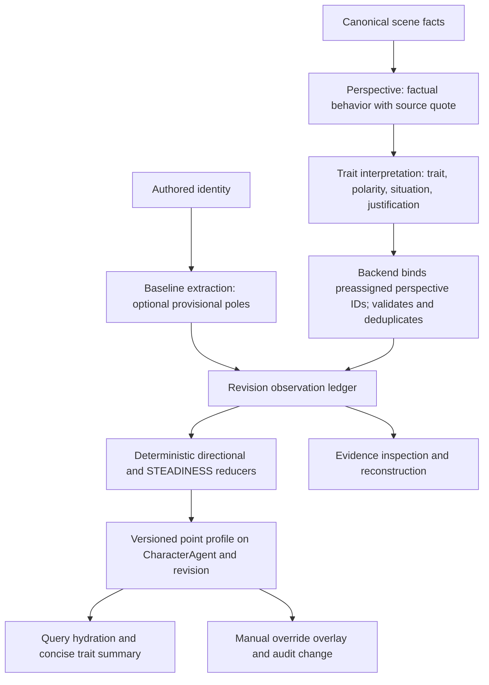

# CharacterAgent point based traits: implementation record

# Implementation record

**Status:** implemented. The authoritative running contract is
[Dispositional Traits](Dispositional%20Traits.md). This record explains the
replacement of trait representation, extraction, aggregation, persistence,
edits, and query consumption. Its numbers
are engineering defaults to evaluate against narrative examples, not calibrated
personality measurements.

## Goal and scope

Keep the current eight directional constructs and the separate STEADINESS construct.
Make an integer `point` from 1 through 9 the canonical sheet value. Preserve each
independent observation so every inferred point can be reconstructed. Remove z,
LLM chosen intensity, diagnosticity, confidence, choice condition objects, and
profile bookkeeping from the new trait contract. Keep aspects, goals, emotions,
beliefs, and query temperature outside this change.

The existing `CharacterAgent.trait_profile` and
`CharacterIdentityRevision.trait_profile` are JSON properties. Revisions also hold
`trait_evidence` JSON; `CharacterIdentityChange` records trait changes. No
additional Neo4j nodes are needed for this design. Every trait observation refers
to the `ScenePerspective` in which the behavior was interpreted. That perspective
links to its canonical `Scene` through `PROJECTS_ON`; the scene is source grounding,
not the profile's observation identity.

## Ownership and flow



`app/schemas/character_traits.py` owns the trait registry and strict wire types.
`app/jobs/character_agent/embody_agent.py` and its adjacent prompts own extraction;
`app/services/character_trait_service.py` owns grounding, replay, aggregation, and
STEADINESS. `app/services/character_agent_service.py` owns graph transactions,
revision history, manual edits, and evidence reads. Query code only consumes the
resulting profile and trusted registry metadata. The API and SDK expose matching
types. No LLM outputs a point or a numeric increment.

## New graph and API contract

Each of the eight entries in `trait_profile.dispositional_traits`, plus the
separate `trait_profile.steadiness`, has exactly the public estimate fields:

```json
{"point": 7, "status": "supported", "observation_count": 2,
 "observation_ids": ["perspective-uuid-1", "perspective-uuid-2"]}
```

`point` is an integer 1–9 or `null`. `status` is `unknown`, `provisional`,
`supported`, or `manual`. Unknown has `point: null` and no eligible observations.
`observation_ids` are **ScenePerspective.id values**, ordered by the perspective's
canonical narrative chronology; they are not `Scene.id` or trait-evidence record
IDs. `observation_count` is the number of distinct eligible perspective IDs in
that estimate, and must equal the length of `observation_ids`. At most one
observation for a given trait may come from a perspective. Authored baseline
assertions are separate and never inflate this count. For a manual value, these
fields still refer to the underlying inferred evidence, not
to evidence fabricated by the edit. The graph must store a versioned inferred
profile and manual overrides separately, then project the effective estimate;
clearing an override reveals the current inference. Manual actor, reason, and
previous/new values remain in `CharacterIdentityChange`, not in each estimate.

The LLM outputs only `trait`, `polarity: low|high`, `situation_type`, and a brief
`justification`, tied by array position to the validated behavior supplied from
one perspective. The backend adds a trait-evidence record ID, `perspective_id`,
source/revision IDs, chronological position, and extraction policy version.
Stored observation content is limited to these semantic fields and provenance.
The record's `perspective_id` must resolve to a perspective owned by this agent;
the perspective's `PROJECTS_ON` link supplies the canonical scene for audit.
One perspective may contribute at most one observation for a given trait.
Retries and repeated descriptions of one act cannot multiply evidence.
Contradictory observations remain. Because the current graph writer assigns
perspective UUIDs only after profile reduction, implementation must assign and
retain each perspective ID in the draft projection before trait grounding.
Commit those same IDs to `ScenePerspective`; do not substitute new UUIDs at
persistence time. Keep this binding stable across retries, acceptance, and
revision reconstruction. Deleting or replacing a referenced perspective must
invalidate and rebuild its derived observations and later estimates, or be
rejected until regeneration; dangling profile references are never valid.
The new `situation_type` catalog must be specific enough for comparison, rather
than reusing today's broad diagnostic labels without review. For example,
responses to an enemy and responses to a friend may need distinct context values
even when both concern retaliation. If the scene does not establish a comparable
context, keep the directional observation but make `situation_type` explicitly
`unspecified`; that observation cannot enter STEADINESS. The trait registry owns
the allowed context values and their meanings.

Authored baseline evidence uses its own provenance kind and authored source ID;
it is not a perspective observation. Store it in the same revision ledger with a
separate `evidence_kind`, or in a distinct baseline field, but use one authoritative
reducer. A bare adjective is insufficient. An explicit stable disposition may
give a provisional prior without inventing scene choices.

## Extraction rule

Keep the existing factual perspective stage and its source quote validation.
Pass only validated behavior to trait interpretation. The interpretation prompt
must include the complete trait definitions, diagnostic situation values,
neighboring-trait boundaries, and its exact small output JSON contract. Emit `[]`
when the action is compelled, ambiguous, merely witnessed, lacks a meaningful
alternative, or does not reveal the named trait. The LLM makes this categorical
judgment in prose; it no longer scores knowledge, capability, options, freedom,
confidence, or strength. Backend validation checks perspective ownership and
its canonical scene binding, allowed trait and situation pair, nonblank grounded
justification, uniqueness, and exact output
shape. It cannot independently prove freedom from compulsion; review that failure
mode with negative examples and source quotes. Do not extract from generated
reflection, an earlier inferred profile, silence, or behavior of other characters.

## Directional point equation

For one trait, sort eligible perspective observations by canonical source/scene
order, oldest to newest. Let `k=0` for the newest observation of **that trait**, `k=1`
for the next oldest, etc. Let `x_i=+1` for `high` and `x_i=-1` for `low`.
Initial policy values: recency factor `rho=0.9`, smoothing mass `lambda=4`.

```text
w_i       = rho^k_i
mu        = sum(w_i * x_i) / sum(w_i)
raw       = 5 + 4 * mu * n / (n + lambda)
point     = clamp(round_half_away_from_5(raw), 1, 9)
```

Here `n` is the number of distinct eligible perspective observations. This formulation
uses recency for direction and `n` for smoothing strength. It preserves the
suggested equal-weight result when `rho=1`: `5 + 4(H-L)/(H+L+4)`. It also avoids
the unintended ceiling of applying `0.9^k` directly to that denominator: the
total geometric weight is less than 10, so with `lambda=4` even unlimited
same-pole observations could never reach point 9. The tradeoff is that a long
history makes the estimate confident even after a recent reversal; expose the
recent polarity mix in an evidence summary and validate this behavior with
story fixtures before adopting these defaults. Round only once, at the end;
exact half-point ties round away from point 5 so high and low are symmetric.

| Scene observations | Point with this policy |
| --- | ---: |
| None | `null` |
| One high | 6 |
| Five high | 7 |
| Ten high | 8 |
| Twenty-eight high | 9 |
| Twenty-eight low | 1 |
| Five high, then five low | 4 (recency favors low) |
| Alternating, equal and equally recent | near 5; exact result depends on order |

An authored baseline prior is separate: before any scene evidence, an explicit
high/low assertion gives provisional point 6/4. After scenes arrive, it may
contribute a low-strength pseudo-observation with current weight `b * rho^n`,
e.g. `b=0.5`, and polarity `x_b`. For that case replace the directional `mu`
above with `(sum(w_i * x_i) + b * rho^n * x_b) /
(sum(w_i) + b * rho^n)`. Leave `n`, `observation_count`, and STEADINESS based
only on perspectives. The baseline influence then decays toward zero as same-trait
observations accumulate. This prior weight and its initial point require fixture
evaluation; store the policy version so reconstruction uses the original
parameters.

`supported` means at least two independent eligible perspective observations;
one scene or authored-only support is `provisional`. These thresholds indicate
provenance, not probability of correctness. A score of 5 from opposing binary
observations must be summarized as **mixed or context-dependent evidence**,
never automatically as a measured average personality. The evidence read API
can compute high/low counts and recent mix without adding counters to the
profile. Binary observations cannot prove an inherently average disposition.

## STEADINESS equation and limits

STEADINESS is never extracted directly. For each `(trait, situation_type)` group,
use its most recent 12 eligible perspective observations. A group qualifies with
at least three independent perspectives. Require at least one qualifying group;
otherwise STEADINESS is `unknown`. Within each group, apply the same `rho=0.9` recency
weights and compute high and low masses `H_g` and `L_g`. Let `m` be the number
of distinct contributing perspective IDs across qualifying groups and use
`lambda_s=4` as the initial STEADINESS smoothing mass:

```text
d_g              = 2 * min(H_g, L_g) / (H_g + L_g)
D                = sum((H_g + L_g) * d_g) / sum(H_g + L_g)
steadiness_raw   = 5 + 4 * (1 - 2 * D) * m / (m + lambda_s)
steadiness_point = clamp(round_half_away_from_5(steadiness_raw), 1, 9)
```

This measures disagreement **within** comparable situations. Consistent
retaliation toward enemies and consistent forgiveness toward friends can both
support high STEADINESS when those have distinct context values. `unspecified`
observations are excluded from this calculation. Three comparable perspectives
with identical polarity produce provisional point 7, not point 9. At least six
observations across two qualifying groups give `supported`. These are proposed
evidence thresholds; a `supported` status still does not claim psychometric
certainty. The estimate's `observation_ids` list exactly the distinct
`ScenePerspective.id` values in qualifying groups and `observation_count` equals
their number. A recent reversal temporarily lowers consistency until the older pattern leaves the
window; a sustained new pattern can then become steady. Binary polarity cannot
measure subtle variation or establish that two circumstances with the same
registry category truly had similar stakes. Fixture review must test
relationship/stakes confounds. If a compact context catalog still proves too
coarse, STEADINESS should remain unknown in those cases rather than pretending
that broad trait situations establish comparability.

## Query summary

The query hydrator passes the effective point, status, pole definitions, and a
compact backend-derived evidence description for relevant traits. Point 5 with
balanced opposite poles is described as mixed; an unknown is explicitly unknown.
Include STEADINESS only as a consistency cue for relevant directional traits.
Neither value mandates an action or changes sampling temperature. Keep raw
justifications and scene text out of routine query prompts; an authorized
evidence-inspection path supplies provenance when needed.

## Cutover plan

1. **Freeze the contract.** Set exact JSON field names, status thresholds,
   baseline prior, context catalog, STEADINESS window, and policy version. Use a
   fixed narrative fixture set to evaluate the equations and extraction omissions.
2. **Build the new schema and reducer.** Replace z-based types in backend and SDK;
   make reconstruction from ordered perspective observations deterministic and
   independent of source bundle partitioning. Keep manual overrides as an overlay.
3. **Simplify prompts and job boundary.** Change baseline and perspective trait
   outputs; remove inactive profile-update prompt and obsolete schemas/validators
   after verifying all callers. Keep the parallel psychological branch.
4. **Change graph writes and reads atomically.** Preassign perspective IDs before
   reduction, persist those IDs on `ScenePerspective`, and store the point profile,
   small observations, and audit changes in the same revision transaction. Enforce
   perspective ownership and revision cutoff on evidence reads. Preserve exact
   chronology and source isolation.
5. **Replace existing trait data.** Old `expression_z` observations cannot be
   converted faithfully by rounding z. Back up affected graph data, then
   regenerate trait evidence and profiles from canonical authored identity and
   scenes/perspectives under the new policy. Historical old-format revisions may
   be archived outside the active trait read path, but must not feed aggregation,
   API responses, query prompts, or manual edits. If source material is unavailable,
   surface unknown point values until regeneration; never serve a converted z
   fallback. Plan deployment/rollback from the backup before the breaking cutover.
6. **Remove the legacy runtime contract.** Delete z-based estimate/edit/evidence
   fields, `expression_z`, numeric LLM intensity, diagnosticity/confidence gates,
   choice-condition objects, conversion anchors, compatibility validators,
   obsolete prompt fragments, and old scoring branches after tracing all callers.
   The point schema is the only supported runtime representation. Reject stale
   payloads clearly rather than accepting aliases or silently translating them.
7. **Update consumers and documentation.** Update endpoint examples and auth,
   `python_sdk/shrecknet_client/{character_traits,models,resources}.py`, SDK docs
   and examples, `CharacterAgent.md`, `Dispositional Traits.md`, endpoint and query
   pages, architecture/graph notes, and `Documentation/README.md`. Put the final
   flowchart and equations in the canonical traits page; this file remains the
   decision record. Mark any old plan as historical.

## Verification gates

- Boundary tests: exact small extraction JSON, invalid trait/context, blank
  justification, compulsion/ambiguity omissions, duplicate perspective/trait,
  source quote, perspective ownership and scene binding, revision cutoff,
  deletion/invalidation, and cross-agent isolation.
- Reducer tests: unknown versus point 5, 1/5/10 same-pole observations, opposite
  evidence in both orders, 28 same-pole observations reaching both point 1 and
  point 9, long histories, sustained behavioral changes, complete reversals,
  source partition independence, replay idempotence, rounding, and policy-version
  reconstruction.
- STEADINESS tests: one act remains unknown; repeated same-context choices,
  friend/enemy context consistency, `unspecified` context exclusion from STEADINESS
  while retaining directional evidence, genuine within-context reversal, window
  aging, three same-pole observations remaining provisional and below point 9,
  and all-low-forbearance/high-steadiness.
- Lifecycle tests: authored-only baseline, regeneration/backfill path, manual
  override and clearing while inferred evidence grows, preassigned perspective
  IDs surviving draft acceptance and retries, graph transaction/audit, endpoint
  authorization, SDK serialization, query summary, stale z payload rejection,
  and full embodiment pipeline. Run focused tests from `shrecknet/` and
  `python_sdk/`, then affected suites when practical. Review final docs against
  actual behavior before cutover.

## Mandatory acceptance criteria

1. Recency decay cannot block either endpoint of the 1–9 scale. With the initial
   policy, 28 independent same-pole perspective observations reach point 1 or 9;
   long histories and complete reversals have deterministic fixture tests.
2. STEADINESS compares only sufficiently described circumstances. Different
   relationship/context categories cannot create false inconsistency, while
   `unspecified` observations still affect directional traits.
3. Small evidence sets cannot yield an extreme STEADINESS score with apparent
   certainty. Three identical comparable observations yield provisional point 7
   under the initial smoothing policy.
4. Every profile `observation_id` resolves to an owned `ScenePerspective`, never a
   canonical `Scene` or trait-evidence ID, and the count equals the number of
   unique IDs used in that estimate.
5. All active writers, readers, prompts, API/SDK models, manual edits, and query
   consumers use only the new point contract. Old z contracts are absent from
   runtime paths after cutover.
