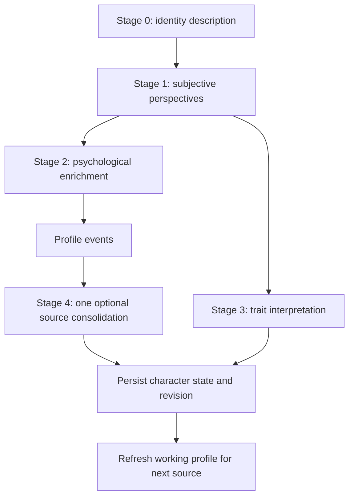

# Psychological enrichment and consolidation implementation record

**Status:** implemented. This record describes the target contract and its
implementation. The current runtime details are maintained in
[CharacterAgent](CharacterAgent.md), its
[endpoint reference](CharacterAgent%20-%20Endpoints.md), and the
[Python SDK guide](../../../python_sdk/docs/character_agents.md).

## Goal

Keep identity description, subjective perspective extraction, and trait
interpretation. Replace per-scene profile signals and deterministic signal
reduction with sparse scene enrichment followed by one source-level
psychological consolidation. Preserve the historical record while limiting the
current psychological focus to ten aspects and ten goals per character.

The design must keep scene emotions and beliefs attached to their originating
`ScenePerspective`, retain historical profile transitions, and avoid cumulative
full-history LLM input. Source bundles remain chronological; chunks within a
source may run concurrently for scene-level stages.

## Target contracts

### Scene-owned emotional interpretations and beliefs

- `EmotionalInterpretation` remains connected to its source
  `ScenePerspective`. Its generated fields are `description`, `arousal` (integer
  0–100), and `valence` (integer 0–100, where 0 is negative, 50 neutral, and
  100 positive). IDs, ontology, provenance, and timestamps remain backend-owned.
- `CharacterBelief` remains connected to its source `ScenePerspective` and has
  `statement` and `confidence` (integer 0–100). Remove belief `status` from the
  target contract. Keep apparently contradictory beliefs from separate scenes;
  consumers use scene chronology rather than rewriting old beliefs.
- Existing `CharacterImpact` records remain readable as legacy history during
  cutover. New embodiment does not create them. Retire their API only in a
  separately verified compatibility step; this redesign does not require
  deleting old graph data.

### Character-specific aspects and goals

`CharacterAspect` and `CharacterGoal` remain reusable ontology-scoped
definitions. The character-specific lifecycle moves to `HAS_ASPECT` and
`PURSUES` relationship properties, respectively.

| Assignment | Target character-specific fields | Removed from generated profile |
| --- | --- | --- |
| Aspect | first-person `name`, `description`, existing `category`, `status` (`active` / `inactive`), `in_focus` | `importance`, `intensity`, `confidence` |
| Goal | `title`, `description`, existing `goal_type`, `status` (`active` / `completed` / `abandoned` / `superseded`), `in_focus` | `priority`, `commitment`, `confidence`, `basis` |

Definitions must not carry character-specific status or focus. Existing
assignment status and definition fields require a deliberate legacy projection
and migration policy; do not let a shared definition's state leak between
characters. `in_focus` is independent from lifecycle status. A record leaving
focus remains historical and its status does not change. Keep source-scene
links, evidence provenance, identity revisions, and timestamps backend-managed.

Enforce at most ten focused aspects and ten focused goals for each character.
There is no limit on historical records or active records outside focus. Focus
changes never delete or implicitly resolve records.

### Stage 2: Psychological Enrichment

Run after Stage 1 perspective extraction, in parallel with Stage 3 trait
interpretation. Input includes ordered canonical scenes, each validated
character perspective, and the established identity description. Return one
position-bound enrichment for each input scene, containing:

- `emotions`: zero or more `{description, arousal, valence}` records.
- `beliefs`: zero or more `{statement, confidence}` records, limited to newly
  expressed or meaningfully changed beliefs.
- `profile_events`: usually empty; significant, concise, evidence-grounded
  `{kind: aspect|goal, description}` candidates only.

Stage 2 does not write final aspects or goals, infer their statuses, attach
graph IDs, duplicate the subjective perspective, or score profile events.
Backend schemas enforce the shape, bounds, list limits, order, and scene binding.
The backend binds perspectives, scenes, and evidence references by position.
Remove the `impacts`, `aspect_signals`, and `goal_signals` generation fields.

### Stage 4: Psychological Consolidation

After all Stage 2 chunks for one chronological source bundle finish, make one
consolidation call if that source has any profile events. Skip the call when
there are none. The call receives the identity description, deduplicated source
events with backend references, and the current profile needed for comparison:
stable IDs, descriptions, status/focus, plus historical out-of-focus items.
It does not receive full scene history.

The model returns ordered `aspect_operations` and `goal_operations`, plus
`focused_aspects` and `focused_goals`. Add operations declare an `in_focus`
preference; focus arrays reference only pre-existing items. Operation targets
use a request-local existing/new reference. Each operation gives a short
justification and cites supporting event references. The backend generates
candidate IDs, resolves references, and uses the shared profile reducers to
validate operations, lifecycle transitions, and focus limits. It persists the
result through the existing identity-revision/change-provenance infrastructure.

The operation vocabulary must cover add, material description update,
reinforcement without duplication, and lifecycle transitions. Aspect lifecycle
supports active/inactive. Goal lifecycle supports active/completed/abandoned/
superseded. Reactivation is an explicit transition. A source may introduce and
resolve an item in the same ordered operation list. Preserve each transition in
chronological history even when the final state is resolved. Silence alone
cannot resolve a goal or deactivate an enduring aspect. The backend derives
final focus from existing-item selections, each addition's `in_focus` preference,
and the final lifecycle state; inactive/resolved items cannot remain focused.

## Intended execution flow

Process source bundles in chronological order. Within each source, preserve the
existing bounded parallel scene-chunk processing. Wait for all enrichment
chunks before consolidating once against the latest working profile. Keep trait
aggregation deterministic and independent. Apply profile operations in source
chronology, then supply that resulting state to the next source. This provides
one optional consolidation call per source, not one call per chunk or per scene,
and avoids full-history reprocessing.

## Code and contract ownership map

This is a planning map based on the current repository; implementation should
confirm exact call sites before edits.

| Concern | Current owner(s) to update |
| --- | --- |
| Stage orchestration, output validation, event references, prompt contracts | `shrecknet/app/jobs/character_agent/embody_agent.py`, `embody_agent_prompts.py`, `schemas.py` |
| Source/chunk merge, per-source working profile, revision ordering | `shrecknet/app/tasks/character_embodiment.py` and `shrecknet/app/jobs/character_agent/profile.py` |
| Graph creation, assignment lifecycle/focus, revision/change history, query snapshot | `shrecknet/app/services/character_agent_service.py`, `character_embodiment_service.py`, and graph schema setup in `shrecknet/app/graph/neo4j.py` |
| HTTP and boundary contracts | `shrecknet/app/schemas/character_agent.py`, `shrecknet/app/api/routers/character_agents.py`, and `shrecknet/app/services/ontology_instance_service.py` |
| Query memory and response projection | `shrecknet/app/jobs/character_agent/query.py`, `memory.py`, `profile.py`, plus the query snapshot readers |
| SDK types, resource methods, examples/docs | `python_sdk/shrecknet_client/models.py`, `resources.py`, `python_sdk/docs/character_agents.md`, and focused SDK tests |
| Canonical docs and endpoint contract | `Documentation/Agents/CharacterAgent/CharacterAgent.md`, `CharacterAgent - Endpoints.md`, `Query/Query.md`, and `python_sdk/docs/character_agents.md` |

Do not create a parallel profile service if the existing embodiment/profile
owners can own consolidation cleanly. Keep prompts beside the CharacterAgent
job, document stage order and complete JSON contracts in prompt headers, and
keep schemas, validators, tests, and canonical docs synchronized.

## Migration and compatibility sequence

1. **Inventory and baseline.** Record existing graph relationship/node shapes,
   API response fields, SDK use, query ordering, revision/change serialization,
   and current embodiment draft compatibility. Preserve unrelated working-tree
   edits during implementation.
2. **Add relationship-owned projection.** Teach graph reads and writes to
   project status/focus from `HAS_ASPECT` / `PURSUES`. For legacy relationships,
   define deterministic fallback from existing relationship properties and
   shared-node properties. Backfill only character-specific values; never copy
   one shared definition's lifecycle into another character's assignment.
   Make the migration idempotent and verify counts and representative shared
   definitions before considering legacy cleanup.
3. **Change strict API/SDK schemas.** Remove generated score fields from
   embodiment proposals and expose assignment lifecycle/focus consistently in
   create, update, list, query snapshot, and SDK models. Remove belief status
   from new outputs while safely projecting old persisted beliefs. Preserve
   legacy impact read paths until data and client compatibility are verified.
4. **Replace Stage 2 contract.** Add `profile_events`, remove old signals and
   impacts from new generation, and keep emotion/belief provenance attached to
   the correct perspective. Update repair handling and all strict output
   schemas so obsolete fields cannot silently re-enter generation.
5. **Implement Stage 4 and source sequencing.** Consolidate after all chunks,
   validate operation references and chronological transitions on the backend,
   enforce focus caps without deleting records, persist source-level revisions,
   and refresh the working profile between source bundles. Keep trait
   aggregation independent.
6. **Cut over and observe.** Exercise migration on a copy/fixture graph, compare
   old/new API and query projections, inspect revision provenance, and verify
   no new `CharacterImpact` nodes are written. Remove deprecated write support
   only after compatibility is confirmed; do not delete legacy history as part
   of the initial rollout.

The graph migration must be reversible from a recorded pre-migration snapshot.
Rollback should restore legacy projections and disable the new writer before
any destructive cleanup. No destructive cleanup is part of this plan.

## Verification

Add focused backend, graph/query, API, and SDK tests for these cases:

1. Ordinary scenes yield no unnecessary profile events or profile operations.
2. A major revelation produces a new aspect tied to the correct source scene.
3. Repeated evidence reinforces one existing item rather than duplicating it.
4. A goal can be added, retained while pursued, completed, and preserved
   historically.
5. A goal or aspect can be introduced and resolved in one source with ordered
   transitions retained.
6. More than ten historical items can exist; focus rotates to at most ten,
   while out-of-focus active goals remain active and can later return.
7. Old foundational aspects remain eligible for focus without recent mention.
8. Emotions and contradictory historical beliefs remain perspective-linked and
   chronologically ordered.
9. Assignment status/focus is character-specific when two agents share one
   definition, and query snapshots return the same values as API reads.
10. A 600-scene fixture uses bounded scene chunks, one optional consolidation
    per source with events, no consolidation for event-free sources, and no
    full-history input.

Also verify malformed IDs, invalid transitions, duplicate candidate
references, more than ten requested focus IDs, missing event provenance,
truncated/invalid LLM output, and persistence failure. Checkpoint/retry behavior
must not duplicate historical operations or scene-owned memories.

## Documentation and release completion

When implementation begins, update the canonical CharacterAgent contract,
endpoint reference, query behavior, SDK model/resource docs and examples, and
`Documentation/README.md` if pages are added or moved. Document relationship
ownership, migration/backfill and rollback, legacy `CharacterImpact` handling,
call frequency, and historical chronology semantics. Add a changelog entry only
if the release process for the implementation requires it. The feature is
complete only when code, tests, graph projection, API/SDK contracts, and these
canonical docs agree.

## Related documentation

- [CharacterAgent current contract](CharacterAgent.md)
- [CharacterAgent endpoints](CharacterAgent%20-%20Endpoints.md)
- [CharacterAgent query](Query/Query.md)
- [Change and Documentation Policy](../../Engineering/CHANGE_AND_DOCUMENTATION_POLICY.md)
- [Python SDK CharacterAgent guide](../../../python_sdk/docs/character_agents.md)
