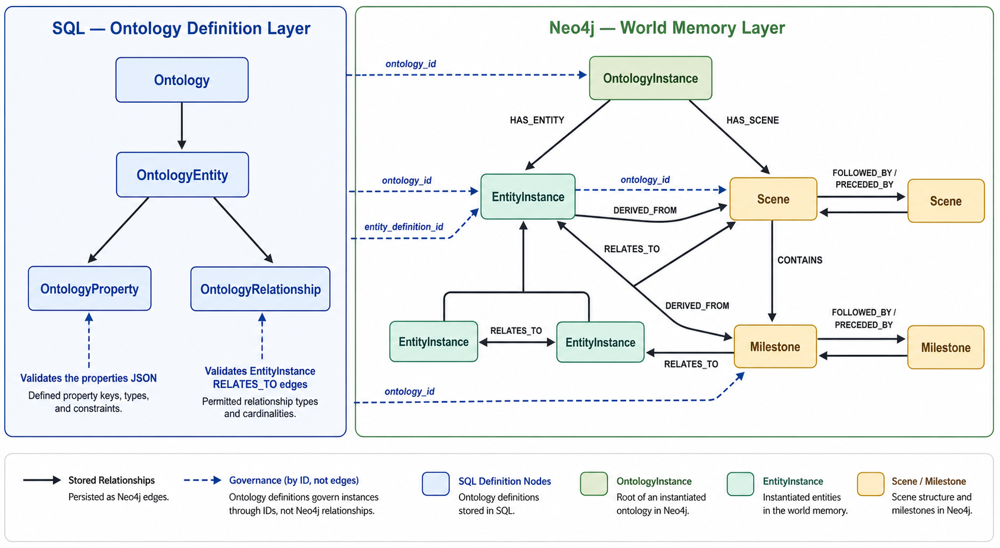
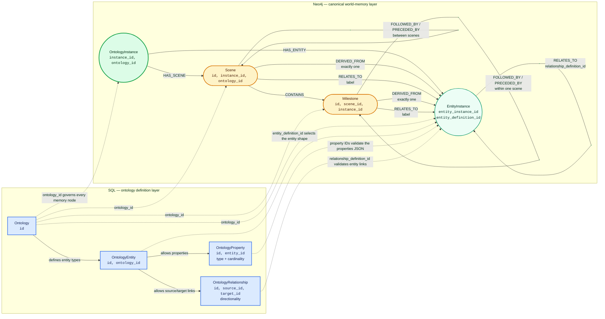

# Scene-Centric Memory: Neo4j Data Structure

This document describes the canonical world-memory graph currently persisted in Neo4j. It focuses on the domain structure itself: ontology instances, entity instances, scenes, milestones, their properties, and their relationships.

Embedding documents, vector indexes, Elder retrieval, and answer synthesis are separate concerns and are not part of this data-structure reference. See [Ontology-Aware Semantic Embedding V2](../Embedding/SCENE_EMBEDDING.md).

## 1. Two Layers: Ontology Definition and World Memory

Shrecknet separates the definition of a world model from the graph data created from that definition.

### Definition layer (SQL)

The ontology definition is stored in the relational database:

- `Ontology` defines the world model and has an integer `id`.
- `OntologyEntity` defines an allowed entity type, such as character, location, faction, or item.
- `OntologyProperty` defines a property allowed on an entity type, including its data type and cardinality.
- `OntologyRelationship` defines an allowed relationship from one entity type to another, including whether it is bidirectional.

Scenes and milestones are built-in temporal memory types. They are not user-defined ontology entity types.

### Instance layer (Neo4j)

Neo4j stores actual world memory:

- `OntologyInstance` is one concrete world, campaign, continuity, or generated instance of an ontology.
- `EntityInstance` is one concrete occurrence of an SQL-defined entity type.
- `Scene` is a bounded narrative segment inside an ontology instance.
- `Milestone` is a temporal beat or anchor contained by a scene.
- `ScenePerspective` is a CharacterAgent-owned subjective projection onto a
  canonical scene; it does not modify that scene.

Neo4j does not currently create graph nodes for the SQL `Ontology`, `OntologyEntity`, `OntologyProperty`, or `OntologyRelationship` definitions. Graph nodes and relationships refer back to those definitions through integer ID properties.

## 2. Canonical Graph Shape

The diagram below shows both persistence layers. Blue nodes are definitions stored in SQL; green and amber nodes are canonical Neo4j world memory. Dashed arrows are governance references through stored IDs, not Neo4j relationships. Solid arrows are relationships physically stored in Neo4j.



<details>
<summary>Editable Mermaid source</summary>



</details>

### How to read the diagram

- SQL owns the vocabulary and validation rules. The blue definition records are not duplicated as Neo4j nodes.
- `OntologyInstance` is the root of a concrete world. Its `HAS_ENTITY` and `HAS_SCENE` relationships establish canonical ownership.
- `Scene` and `Milestone` are built-in temporal types. The ontology scopes them through `ontology_id`, but does not define their node type.
- `EntityInstance` is ontology-shaped: its type, property keys, and entity-to-entity relationships must resolve to definitions belonging to the same SQL ontology.
- `DERIVED_FROM` identifies provenance, while `RELATES_TO` identifies participants or other relevant entities; they are intentionally separate edges.
- Every canonical memory node repeats `ontology_id` and instance scope, allowing the service to reject cross-ontology and cross-instance links.

## 3. `OntologyInstance`

An `OntologyInstance` is the root of one concrete memory graph. Multiple instances may follow the same SQL ontology while containing different entities, scenes, and histories.

### Stored properties

| Property | Type | Meaning |
| --- | --- | --- |
| `instance_id` | string UUID | Application identifier for this concrete instance. |
| `ontology_id` | integer | ID of the SQL `Ontology` that defines the instance. |
| `name` | string | Human-readable instance name. |
| `created_at` | datetime-compatible value | Creation timestamp. |
| `updated_at` | datetime-compatible value | Last instance update timestamp. |

### Outgoing relationships

| Relationship | Target | Meaning |
| --- | --- | --- |
| `HAS_ENTITY` | `EntityInstance` | The entity belongs to this instance. |
| `HAS_SCENE` | `Scene` | The scene belongs to this instance. |

The root relationship is the canonical ownership link. The child nodes also repeat `instance_id` and `ontology_id` as properties to support scoped validation and access.

## 4. `EntityInstance`

An `EntityInstance` is a concrete entity whose shape is governed by an SQL `OntologyEntity` definition.

For example, if SQL ontology entity definition `17` represents a character, an `EntityInstance` with `entity_definition_id = 17` is a particular character in one ontology instance.

### Stored properties

| Property | Type | Meaning |
| --- | --- | --- |
| `entity_instance_id` | string UUID | Canonical entity-instance identifier. |
| `instance_id` | string UUID | Owning `OntologyInstance.instance_id`. |
| `ontology_id` | integer | Governing SQL `Ontology.id`. |
| `entity_definition_id` | integer | Governing SQL `OntologyEntity.id`. |
| `alias` | string | Instance-local display/reference name. |
| `properties` | JSON string | Map from SQL `OntologyProperty.id`, serialized as a string key, to its value. |
| `text` | string or null | Authored descriptive text. |
| `text_linked` | string or null | Linked/processed form of `text`; initially copied from `text`. |
| `autogenerated_text` | string or null | Agent-generated descriptive text. |
| `autogenerated_text_linked` | string or null | Linked/processed generated text; initially copied from `autogenerated_text`. |
| `node_avatar_url` | string or null | Optional image/avatar URL. |
| `created_date` | datetime-compatible value | Domain-level creation date supplied for the entity. |
| `last_updated_date` | datetime-compatible value | Domain-level last modification date. |
| `author_type` | `human` or `agent` | Type of author responsible for the entity. |
| `author_id` | string | Author identifier. |
| `created_at` | datetime-compatible value | Graph record creation timestamp. |
| `updated_at` | datetime-compatible value | Graph record update timestamp. |

The node can also carry maintenance properties such as `is_embedded` and `last_embedded_date`. Those properties describe derived retrieval state, not the domain meaning of the entity.

### Entity properties and ontology validation

Entity property values are not separate Neo4j nodes. They are stored together in the `properties` JSON string:

```json
{
  "31": "Captain",
  "32": 42,
  "33": ["strategist", "veteran"]
}
```

Each key is an SQL `OntologyProperty.id`. Before persistence, the service validates that:

- `entity_definition_id` belongs to the selected ontology;
- every property definition belongs to that entity definition;
- relationship definitions are allowed for the source entity type;
- relationship targets have the expected destination entity type.

### Entity-to-entity `RELATES_TO`

Entity relationships are stored directly as Neo4j relationships:

```text
(source:EntityInstance)-[r:RELATES_TO]->(target:EntityInstance)
```

Stored relationship properties are:

| Property | Meaning |
| --- | --- |
| `relationship_instance_id` | UUID for this concrete relationship occurrence. |
| `relationship_definition_id` | SQL `OntologyRelationship.id` defining the relationship. |
| `destiny_entity_definition_id` | Expected SQL entity type of the target. |
| `data` | Relationship-specific payload stored as a JSON string. |
| `created_at` | Creation timestamp. |
| `updated_at` | Update timestamp. |

If the SQL relationship definition is bidirectional, persistence creates a second `RELATES_TO` edge in the reverse direction with its own `relationship_instance_id`.

## 5. `Scene`

A `Scene` is a bounded narrative segment belonging to exactly one ontology instance. It can describe what happened, connect the segment to relevant entities, and contain zero or more milestones.

### Stored properties

| Property | Type | Meaning |
| --- | --- | --- |
| `id` | string UUID or caller-supplied string | Globally unique scene identifier. |
| `instance_id` | string UUID | Owning ontology instance. |
| `ontology_id` | integer | Governing SQL ontology. |
| `name` | string | Scene name. |
| `description` | string | Scene description. |
| `created_by_type` | `human` or `agent` | Creator type. |
| `created_by_author` | string | Creator identifier. |
| `created_at` | datetime-compatible value | Creation timestamp. |
| `updated_at` | datetime-compatible value | Last update timestamp. |

As with entities, embedding maintenance may add `is_embedded` and `last_embedded_date`; these are not scene-domain fields.

### Scene relationships

#### Ownership

```text
(instance:OntologyInstance)-[:HAS_SCENE]->(scene:Scene)
```

The instance is the canonical owner of the scene.

#### Provenance: `DERIVED_FROM`

```text
(scene:Scene)-[:DERIVED_FROM]->(entity:EntityInstance)
```

Every scene must have exactly one `DERIVED_FROM` entity. The service validates that this entity belongs to the same ontology instance. This is the scene's primary provenance or source anchor; it is not a general participant list.

#### Relevant entities: `RELATES_TO`

```text
(scene:Scene)-[:RELATES_TO {label: "related_to"}]->(entity:EntityInstance)
```

A scene can relate to zero or more entities. The edge's `label` is a normalized lowercase token containing letters, numbers, or underscores. Scene relations default to `related_to`.

`DERIVED_FROM` and `RELATES_TO` have different semantics. An entity may be the provenance anchor, a related participant, or both.

#### Scene ordering

```text
(sceneA)-[:FOLLOWED_BY]->(sceneB)
(sceneB)-[:PRECEDED_BY]->(sceneA)
```

Scene order is stored as reciprocal edges. `FOLLOWED_BY` points forward; `PRECEDED_BY` records the same adjacency in reverse. The `local_order` object exposed by the API is reconstructed from these relationships and is not stored as a node property.

#### Milestone containment

```text
(scene:Scene)-[:CONTAINS]->(milestone:Milestone)
```

Containment is the canonical scene-to-milestone ownership link.

## 6. `Milestone`

A `Milestone` is a temporal or narrative beat inside one scene. It carries both semantic temporal classification and optional adjacency to other milestones in the same scene.

### Stored properties

| Property | Type | Meaning |
| --- | --- | --- |
| `id` | string UUID or caller-supplied string | Globally unique milestone identifier. |
| `scene_id` | string | Owning `Scene.id`. |
| `instance_id` | string UUID | Owning ontology instance. |
| `ontology_id` | integer | Governing SQL ontology. |
| `name` | string | Milestone name. |
| `description` | string | Milestone description. |
| `created_by_type` | `human` or `agent` | Creator type. |
| `created_by_author` | string | Creator identifier. |
| `temporal_type` | `beginning`, `ending`, or `other` | Semantic position/type of the beat. |
| `boundary_type` | `begin`, `end`, or `none` | Whether the milestone marks a scene boundary. |
| `relates_to_json` | JSON string | Compatibility copy of the submitted related-entity objects. Canonical relations are the graph edges described below. |
| `created_at` | datetime-compatible value | Creation timestamp. |
| `updated_at` | datetime-compatible value | Last update timestamp. |

Embedding maintenance can additionally add `is_embedded` and `last_embedded_date`.

### Milestone relationships

#### Ownership

```text
(scene:Scene)-[:CONTAINS]->(milestone:Milestone)
```

A milestone is created under a scene and repeats its `scene_id`, `instance_id`, and `ontology_id` on the node.

#### Provenance: `DERIVED_FROM`

```text
(milestone:Milestone)-[:DERIVED_FROM]->(entity:EntityInstance)
```

Every milestone must have one provenance entity belonging to the same ontology instance.

#### Relevant entities: `RELATES_TO`

```text
(milestone:Milestone)-[:RELATES_TO {label: "participant"}]->(entity:EntityInstance)
```

A milestone can relate to zero or more existing entities. Each edge has a required normalized `label`. The edges are the canonical representation used when reading milestone relations; `relates_to_json` is redundant compatibility data.

#### Milestone ordering

```text
(milestoneA)-[:FOLLOWED_BY]->(milestoneB)
(milestoneB)-[:PRECEDED_BY]->(milestoneA)
```

Milestone adjacency is stored in both directions. Ordering targets must belong to the same scene. Payload validation prevents self-links, multiple outgoing `FOLLOWED_BY` targets, and multiple incoming predecessors when a complete scene payload is processed.

The API's `local_order.followed_by_milestone_id` and `local_order.preceded_by_milestone_id` values are reconstructed from these edges rather than stored on the milestone node.

## 7. Current Structural Rules

The active persistence service enforces these rules:

- An ontology instance references an existing SQL ontology.
- Every entity follows an `OntologyEntity` definition from that ontology.
- Entity property and entity-relationship definition IDs are validated against the SQL ontology.
- A scene belongs to an ontology instance through `HAS_SCENE`.
- A scene has exactly one readable `DERIVED_FROM` entity from the same instance.
- A milestone belongs to a scene through `CONTAINS`.
- A milestone has a required `DERIVED_FROM` entity from the same instance.
- Scene and milestone ordering is represented with paired `FOLLOWED_BY` and `PRECEDED_BY` relationships.
- Scene IDs and milestone IDs have Neo4j uniqueness constraints.
- A canonical scene may be projected by multiple CharacterAgents, but each
  CharacterAgent may own at most one `ScenePerspective` for that scene.
- Deleting a scene cascades its projecting `ScenePerspective` aggregates and
  their owned emotions, beliefs, and impacts.

The following stronger narrative rules are **not currently enforced** by the service:

- A scene is not required to contain at least two milestones.
- A scene is not required to contain any milestone at all.
- A scene is not required to have exactly one `boundary_type = begin` milestone.
- A scene is not required to have exactly one `boundary_type = end` milestone.
- Milestones are not automatically ordered merely by their creation order; order exists only when adjacency relationships are supplied or generated.

These may be desirable authoring conventions, but they must not be described as graph invariants until validation enforces them.

## 8. Neo4j Constraints and Indexes

The scene-centric graph startup currently ensures:

- unique `Scene.id`;
- unique `Milestone.id`;
- an index on `Scene(instance_id, ontology_id)`;
- an index on `Milestone(scene_id, temporal_type, boundary_type)`.

Application code treats `OntologyInstance.instance_id` and `EntityInstance.entity_instance_id` as canonical identifiers, but this scene-centric constraint initializer does not currently create uniqueness constraints for those two labels.

## 9. Legacy `Event` Nodes

Legacy `Event` nodes can remain in existing graphs and some compatibility reads or cleanup paths still recognize them. They are not part of the canonical scene-centric write model.

New temporal memory should be represented as:

```text
OntologyInstance -> Scene -> Milestone
```

rather than as new `Event` nodes.

## 10. Derived Semantic Projection

`SemanticDocument` is not canonical world memory. It is a disposable, rebuildable V2 retrieval projection connected from an `EntityInstance`, `Scene`, or `Milestone` through `HAS_SEMANTIC_DOCUMENT`. Ontology vocabulary documents are ontology-scoped because their canonical definitions live in SQL.

Canonical graph writes must never depend on semantic documents being present. See the V2 embedding reference for its properties, indexes, rendering rules, and lifecycle.
