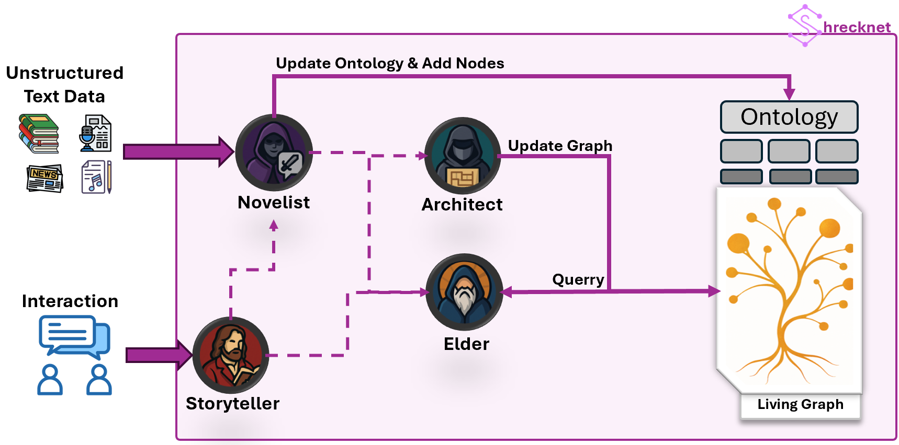

# Shrecknet


Shrecknet is an event-driven memory engine for storytelling. It incrementally builds longitudinal episodic memory through an agentic architecture where events are first-class citizens and structure can evolve over time.

## Introducing Shrecknet

Shrecknet is an agentic architecture for incremental construction of longitudinal episodic memory under controlled ontology evolution. Its core principle is explicit separation and coordinated co-evolution of three representational layers: Ontology, Graph, and Knowledge.

Instead of treating memory as plain text or a frozen knowledge base, Shrecknet models memory as a dynamic system: every new observation can update entity state, append new timeline events, and, when needed, evolve the schema itself.

Architecture diagram:



Detailed architecture note: [Documentation/Architecture/SHRECKNET_ARCHITECTURE.md](Documentation/Architecture/SHRECKNET_ARCHITECTURE.md)

## Event-Centric Mental Model

Shrecknet is built around event-centric memory. The core question is not only what exists, but what happened, when, and how one event relates to another.

### The Triad: Ontology, Graph, Knowledge

1. Ontology layer
   Defines the world grammar: entity types, properties, and relationships.
   Example: Character, Location, Faction, Session, CombatEncounter.

2. Graph layer
   Stores world state and event topology in connected form.
   Event nodes and entity nodes are linked, enabling causal and temporal traversals.

3. Knowledge layer
   Contains narrative text, chunks, summaries, and embeddings used by retrieval and generation agents.

### Ontologies and Event Types

In Shrecknet, an ontology is the schema for a world. It includes:

- Entity definitions: what kinds of things can exist.
- Property definitions: what attributes those entities can carry.
- Relationship definitions: how entities can connect.

Event types are represented through ontology definitions and timeline events, so they can evolve with the world. As campaigns change, new event categories or relation patterns can be introduced without destroying historical memory.

### Why This Matters for Storytelling

- You preserve chronology, not just snippets.
- You can recover causes, consequences, and continuity.
- Agents can reason over both structure and narrative evidence.

## Agents

### Elder

Conversational memory agent. Elder answers questions by retrieving context from graph and embedded knowledge, then synthesizing grounded responses with optional trace/context modes.

### Librarian

Document intelligence agent. Librarian searches embedded PDF/library content and returns contextual answers with chunk-level source metadata for rulebooks and canon material.

### Architect

Ontology and structure evolution agent. Architect analyzes existing instances/events and proposes additions, updates, and merges to keep ontology and world state coherent as memory grows.

### Novelist

Narrative generation agent. Novelist turns unstructured notes or session text into polished prose and can generate event timelines for existing entities.

## Functionalities by Group

### Core memory and world modeling

- Ontology CRUD with entities, properties, and relationships
- Ontology instances with entity-level state
- Timeline event creation, update, retrieval, and relation linking
- Event emission endpoint for event-driven integration flows

### Retrieval and reasoning

- GraphRAG semantic retrieval over Neo4j
- Embedding workflows for ontology and library assets
- Context-first query modes for explainable responses

### Agentic workflows

- Elder query orchestration with chat continuity
- Librarian retrieval over embedded library items
- Architect async analysis and proposal validation loops
- Novelist async draft generation and timeline generation

### Platform and operations

- JWT-based authentication
- Role-based permissions (admin, world_builder, writer, player)
- Background jobs with Celery + Redis
- Backup/export/import endpoints
- Media serving and upload validation

## Run Shrecknet Step by Step

### 1. Prerequisites

- Docker Engine with Docker Compose v2
- Optional: OpenAI API key for LLM-powered agent features

### 2. Configure environment variables

Create a .env file in the repository root.

```env
# Required in practice for stable local runs
SHRECKNET_NEO4J_PASSWORD=ChangeMeStrong123

# Required for Elder/Librarian/Architect/Novelist LLM workflows
SHRECKNET_OPENAI_API_KEY=sk-...

# Strongly recommended for production-like auth
SHRECKNET_JWT_PRIVATE_KEY_PEM=
SHRECKNET_JWT_PUBLIC_KEY_PEM=

# Optional overrides (defaults exist, shown for clarity)
SHRECKNET_MEDIA_PUBLIC_URL=http://localhost:8100/media
SHRECKNET_CORS_ALLOW_ORIGINS=["http://localhost:3000","http://127.0.0.1:3000","http://localhost:5173","http://127.0.0.1:5173","http://localhost:8100","http://127.0.0.1:8100"]
SHRECKNET_CONTAINER_UID=1000
SHRECKNET_CONTAINER_GID=1000
```

Parameter explanation:

- SHRECKNET_NEO4J_PASSWORD: password used by Neo4j and API graph connectivity.
- SHRECKNET_OPENAI_API_KEY: enables agent jobs that call LLMs.
- SHRECKNET_JWT_PRIVATE_KEY_PEM / SHRECKNET_JWT_PUBLIC_KEY_PEM: optional in dev, recommended for controlled signing and verification.
- SHRECKNET_MEDIA_PUBLIC_URL: absolute URL returned in media payloads.
- SHRECKNET_CORS_ALLOW_ORIGINS: JSON array of allowed browser origins.
- SHRECKNET_CONTAINER_UID / SHRECKNET_CONTAINER_GID: keeps mounted file permissions aligned with host user.

### 3. Build and start

```bash
docker compose up --build
```

### 4. Verify health and docs

```bash
curl -s http://localhost:8100/health
curl -s http://localhost:8100/openapi.json | head
```

Expected:

- Health returns status ok
- OpenAPI document is reachable
- Swagger UI loads at http://localhost:8100/docs
- Neo4j browser is reachable at http://localhost:7475

## Service Lifecycle: From Zero to Event-Driven Story Memory

Below is a practical sequence to initialize and use Shrecknet through the API.

### 1. Set up users

First registered user becomes admin automatically.

```python
import requests

BASE = "http://localhost:8100"

# Register first user (auto-admin if database is empty)
admin = requests.post(
    f"{BASE}/users/",
    json={
        "username": "keeper",
        "full_name": "World Keeper",
        "email": "keeper@example.com",
        "timezone": "UTC",
        "role": "admin",
        "password": "change-me-strong",
        "entity_ids": [],
    },
)
admin.raise_for_status()

# Login and get bearer token
token_resp = requests.post(
    f"{BASE}/auth/token",
    json={"username": "keeper", "password": "change-me-strong"},
)
token_resp.raise_for_status()
token = token_resp.json()["access_token"]
headers = {"Authorization": f"Bearer {token}"}
```

### 2. Set up ontologies

Create ontology, then evolve it with entities/properties/relationships as your event model matures.

```python
# Create ontology
ontology = requests.post(
    f"{BASE}/ontologies/",
    headers=headers,
    json={
        "name": "Chronicles of Marshfall",
        "description": "Event-centric ontology for campaign memory",
        "image_url": None,
    },
)
ontology.raise_for_status()
ontology_id = ontology.json()["id"]

# Optional: bootstrap default worlds
default_worlds = requests.post(
    f"{BASE}/setup/default-worlds",
    headers=headers,
    json={"worlds": ["fantasy"]},
)
default_worlds.raise_for_status()
```

### 3. Set up agents

Create one agent per job and attach ontologies they should reason over.

```python
def create_agent(name, job, ontology_ids):
    resp = requests.post(
        f"{BASE}/agents/",
        headers=headers,
        json={
            "name": name,
            "avatar_url": None,
            "description": f"{job} specialist",
            "writing_style": "Clear, grounded, and lore-consistent",
            "job": job,
            "active": True,
            "ontology_ids": ontology_ids,
        },
    )
    resp.raise_for_status()
    return resp.json()["id"]

elder_id = create_agent("Elder One", "elder", [ontology_id])
librarian_id = create_agent("Librarian One", "librarian", [ontology_id])
architect_id = create_agent("Architect One", "architect", [ontology_id])
novelist_id = create_agent("Novelist One", "novelist", [ontology_id])
```

### 4. Build event-centric memory with ontology instances and events

```python
# Create ontology instance with initial entities
instance_resp = requests.post(
    f"{BASE}/ontology-instances/",
    headers=headers,
    json={
        "name": "Session 01 - The Broken Oath",
        "ontology_id": ontology_id,
        "entities": [
            {
                "definition_id": 1,
                "alias": "Arin",
                "text": "A ranger tracking marsh anomalies.",
                "author_type": "human",
                "author_id": "1",
                "properties": [],
                "relationships": [],
            }
        ],
        "events": [],
    },
)
instance_resp.raise_for_status()
instance_id = instance_resp.json()["instance_id"]

# Add timeline event
event_resp = requests.post(
    f"{BASE}/ontology-instances/{instance_id}/events",
    headers=headers,
    json={
        "title": "Ambush at Reed Bridge",
        "description": "Arin discovers a staged ambush tied to the Black Lantern guild.",
        "source": "session_notes",
        "source_entity_id": "Arin",
        "involves_entity_ids": ["Arin"],
        "relations": [],
    },
)
event_resp.raise_for_status()
event_id = event_resp.json()["event_id"]

# Emit integration event for external consumers/webhooks
emit = requests.post(
    f"{BASE}/events/emit",
    headers=headers,
    json={
        "event_type": "story.event.created",
        "payload": {"instance_id": instance_id, "event_id": event_id},
    },
)
emit.raise_for_status()
```

### 5. Use each agent

```python
# Elder: memory-grounded Q&A
elder = requests.post(
    f"{BASE}/jobs/elder/{elder_id}/query",
    headers=headers,
    json={"query": "What changed after the Reed Bridge ambush?", "mode": "both"},
)
elder.raise_for_status()

# Librarian: PDF/library grounded Q&A
librarian = requests.post(
    f"{BASE}/jobs/librarian/{librarian_id}/query",
    headers=headers,
    json={"query": "Summarize stealth rules for marsh terrain.", "mode": "both"},
)
librarian.raise_for_status()

# Architect: propose ontology/entity evolution from an instance
architect = requests.post(
    f"{BASE}/jobs/architect/{architect_id}/analyze",
    headers=headers,
    json={"ontology_instance_id": instance_id, "max_chunks": 40},
)
architect.raise_for_status()
architect_run_id = architect.json()["id"]

# Novelist: generate prose from raw notes
novelist = requests.post(
    f"{BASE}/jobs/novelist/{novelist_id}/runs",
    headers=headers,
    json={
        "unstructured_text": "Arin reached Reed Bridge at dusk. An ambush unfolded...",
        "language": "en",
        "instructions": "Write in close third person with tense pacing.",
    },
)
novelist.raise_for_status()
novelist_run_id = novelist.json()["id"]
```

Tip: use http://localhost:8100/docs to inspect exact payloads and all endpoint variants in your running version.

## Project Scope as a Single Product

Shrecknet is presented and operated as one product: one API surface, one memory model, one event-centric architecture, and one set of agents orchestrated through shared ontology and graph state.

## Documentation

- Main docs index: [Documentation/README.md](Documentation/README.md)
- Architecture diagram page: [Documentation/Architecture/SHRECKNET_ARCHITECTURE.md](Documentation/Architecture/SHRECKNET_ARCHITECTURE.md)

## License

This project is licensed under GPLv3. See [LICENSE](LICENSE).
