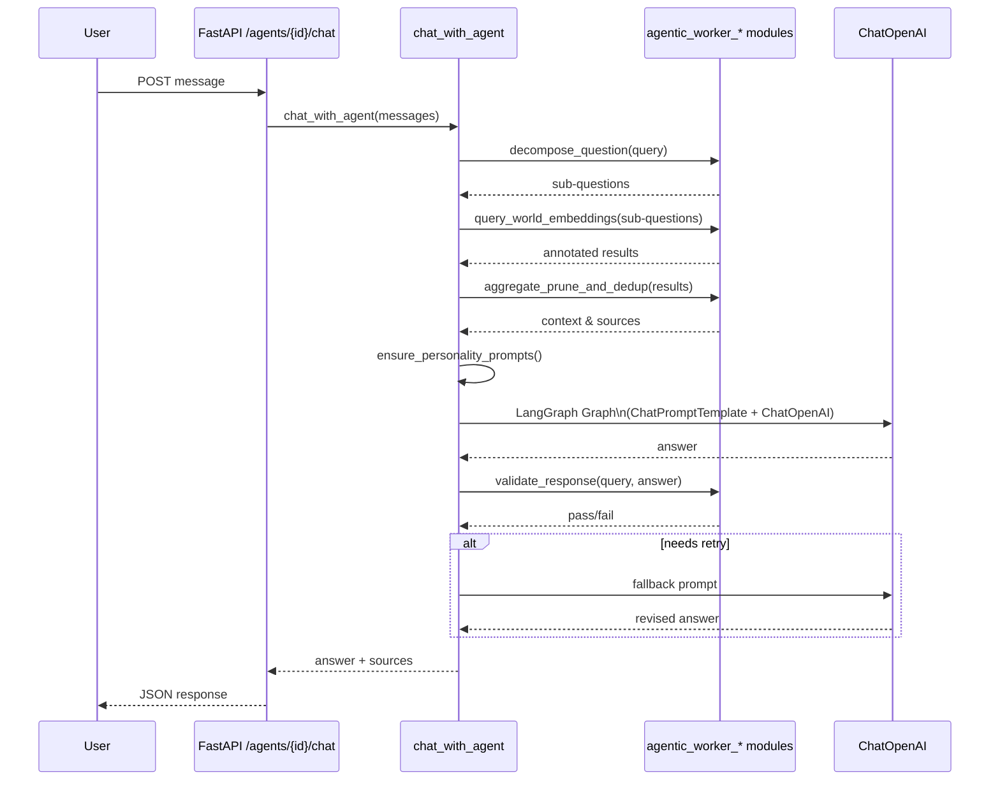

# Conversational Agent Flow

This diagram outlines the flow of a chat request through the backend conversational agent, showing which functions and classes are invoked.

* **chat_with_agent** orchestrates the conversation pipeline.
* **agentic_worker_llm** and **agentic_worker_shrecknet** modules provide `decompose_question`, `query_world_embeddings`, `aggregate_prune_and_dedup`, and `validate_response` helpers.
* **ChatPromptTemplate**, **ChatOpenAI**, and **LangGraph Graph** compose the LLM call.
